# Analog Devices MSDK User Guide

[TOC]

## Overview

The Maxim Microcontrollers SDK (MSDK), now a part of [Analog Devices](https://www.analog.com/en/index.html), contains the necessary software and tools to develop firmware for the [MAX32xxx and MAX78xxx Microcontrollers](https://www.analog.com/en/parametricsearch/10984).  That includes register files and system startup files to enable low-level development for its [supported parts](#supported-parts).  It also provides higher level peripheral driver APIs (written in C) alongside various utilities, third-party libraries, Board Support Packages (BSPs) and a set of example programs for each microcontroller.

Additionally, a GCC-based toolchain is included and builds are managed by a system of Makefiles (See [GNU Make](https://www.gnu.org/software/make/manual/)).  Flashing and debugging are enabled by a [custom fork of OpenOCD](https://github.com/Analog-Devices-MSDK/openocd).  The MSDK's toolchain and build system offers a Command Line Interface (CLI), and project files for [supported development environments](#supported-development-environments) are maintained that build on top of that CLI.

This document describes the MSDK's installation, setup, and usage.

### Supported Operating Systems

- Windows (Windows 10 only)

- Linux (Ubuntu only)

- MacOS

### Supported Parts

The following microcontrollers and evaluation platforms are officially supported by the MSDK.

* [**MAX32520**](https://www.analog.com/en/products/max32520.html): ChipDNA Secure Microcontroller with Secure Boot for IoT Applications

    - [MAX32520-KIT](https://www.analog.com/en/design-center/evaluation-hardware-and-software/evaluation-boards-kits/max32520-kit.html)

    - [MAX32520FTHR](https://www.analog.com/en/design-center/evaluation-hardware-and-software/evaluation-boards-kits/max32520fthr.html)

---

* [**MAX32570**](https://www.analog.com/en/products/max32570.html):  Low-Power Arm Cortex-M4 Microcontroller with Contactless Radio for Secure Applications **(Available by NDA only**)

    - [MAX32570-QNKIT](https://www.analog.com/en/design-center/evaluation-hardware-and-software/evaluation-boards-kits/max32570-qnkit.html)

    - [MAX32570-MNKIT](https://www.analog.com/en/design-center/evaluation-hardware-and-software/evaluation-boards-kits/max32570-mnkit.html)

---

* [**MAX32650**](https://www.analog.com/en/products/max32650.html):  Ultra-Low-Power Arm Cortex-M4 with FPU-Based Microcontroller (MCU) with 3MB Flash and 1MB SRAM

    - [MAX32650-EVKIT](https://www.analog.com/en/design-center/evaluation-hardware-and-software/evaluation-boards-kits/max32650-evkit.html)

    - [MAX32650FTHR](https://www.analog.com/en/design-center/evaluation-hardware-and-software/evaluation-boards-kits/max32650fthr.html)

---

* [**MAX32655**](https://www.analog.com/en/products/max32655.html): Low-Power, Arm Cortex-M4 Processor with FPU-Based Microcontroller and Bluetooth 5.2

    - [MAX32655EVKIT](https://www.analog.com/en/design-center/evaluation-hardware-and-software/evaluation-boards-kits/max32655evkit.html)

    - [MAX32655FTHR](https://www.analog.com/en/design-center/evaluation-hardware-and-software/evaluation-boards-kits/max32655fthr.html)

---

* [**MAX32660**](https://www.analog.com/en/products/max32660.html):  Tiny, Ultra-Low-Power Arm Cortex-M4 Processor with FPU-Based Microcontroller (MCU) with 256KB Flash and 96KB SRAM

    - [MAX32660-EVSYS](https://www.analog.com/en/design-center/evaluation-hardware-and-software/evaluation-boards-kits/max32660-evsys.html)

---

* **MAX32662** **(Not Yet Publicly Available)**
    - MAX32662EVKIT **(Not Yet Publicly Available)**

---

* [**MAX32665-MAX32668 Family**](https://www.analog.com/en/products/max32665.html):  Low-Power ARM Cortex-M4 with FPU-Based Microcontroller with Bluetooth 5 for Wearables

    - [MAX32666EVKIT](https://www.analog.com/en/design-center/evaluation-hardware-and-software/evaluation-boards-kits/max32666evkit.html)

    - [MAX32666FTHR](https://www.analog.com/en/design-center/evaluation-hardware-and-software/evaluation-boards-kits/max32666fthr.html)

    - MAX32666FTHR2 (Product Page Not Yet Available)

---

* [**MAX32670**](https://www.analog.com/en/products/max32670.html):  High-Reliability, Ultra-Low-Power Microcontroller Powered by Arm Cortex-M4 Processor with FPU for Industrial and IoT

    - [MAX32670EVKIT](https://www.analog.com/en/design-center/evaluation-hardware-and-software/evaluation-boards-kits/max32670evkit.html)

---

* [**MAX32672**](https://www.analog.com/en/products/max32672.html): High-Reliability, Tiny, Ultra-Low-Power Arm Cortex-M4F Microcontroller with 12-Bit 1MSPS ADC

    - [MAX32672EVKIT](https://www.analog.com/en/design-center/evaluation-hardware-and-software/evaluation-boards-kits/max32672evkit.html)

---

* [**MAX32675**](https://www.analog.com/en/products/max32675.html):  Ultra-Low-Power Arm Cortex-M4F with Precision Analog Front-End for Industrial and Medical Sensors

    - [MAX32675EVKIT](https://www.analog.com/en/design-center/evaluation-hardware-and-software/evaluation-boards-kits/max32675evkit.html)

    - MAX32675FTHR (Product Page Not Yet Available)

---

* [**MAX32680**](https://www.analog.com/en/products/max32680.html):  Ultra-Low-Power Arm Cortex-M4F with Precision Analog Front-End and Bluetooth LE 5.2

    - [MAX32680EVKIT](https://www.analog.com/en/design-center/evaluation-hardware-and-software/evaluation-boards-kits/max32680evkit.html)

---

* MAX32690 **(Not Yet Publicly Available)**
    - MAX32690EVKIT **(Not Yet Publicly Available)**

---

* [**MAX78000**](https://www.analog.com/en/products/max78000.html):  Artificial Intelligence Microcontroller with Ultra-Low-Power Convolutional Neural Network Accelerator

    - [MAX78000EVKIT](https://www.analog.com/en/design-center/evaluation-hardware-and-software/evaluation-boards-kits/max78000evkit.html)

    - [MAX78000FTHR](https://www.analog.com/en/design-center/evaluation-hardware-and-software/evaluation-boards-kits/max78000fthr.html)

    - [MAXREFDES178](https://www.analog.com/en/design-center/reference-designs/maxrefdes178.html)

---

* [**MAX78002**](https://www.analog.com/en/products/max78002.html):  Artificial Intelligence Microcontroller with Low-Power Convolutional Neural Network Accelerator

    - [MAX78002EVKIT](https://www.analog.com/en/design-center/evaluation-hardware-and-software/evaluation-boards-kits/max78002evkit.html)

---

### Supported Development Environments

- Visual Studio Code
- Eclipse
- IAR
- Keil
- Command-line Development
    - Supported shells (Windows):
        - [MSYS2](https://www.msys2.org/)

    - Supported shells (Ubuntu & MacOS):
        - [Bash](https://tiswww.case.edu/php/chet/bash/bashtop.html)
        - [Zsh](https://www.zsh.org/)

### Supported Languages

- C
- Assembly (ARM and/or RISC-V instruction set depending on microcontroller)

## Installation

### Prerequisites

- Administrator rights
- (On MacOS) - [Homebrew](https://brew.sh/)

### Download

The MSDK installer is available for supported Operating Systems via the links below.

- [Windows 10](https://www.analog.com/en/design-center/evaluation-hardware-and-software/software/software-download.html?swpart=sfw0010820a)

- [Linux (Ubuntu)](https://www.analog.com/en/design-center/evaluation-hardware-and-software/software/software-download.html?swpart=sfw0018720a)

    - This file must be made executable before it can be run (`chmod +x MaximMicrosSDK_linux.run`). Alternatively, set `Allow executing as program” in the Ubuntu GUI.  

        

- [MacOS](https://www.analog.com/en/design-center/evaluation-hardware-and-software/software/software-download.html?swpart=sfw0018610a)

    - On MacOS the installer is distributed inside of a .dmg disk image file. Double click the downloaded file to mount it. Afterwards, the installer executable will be made available inside the mounted drive.

### Setup

1. [Download](#download) the installer executable to an accessible location and launch it.

2. Click **Next** to proceed from the Welcome screen.

3. Choose the installation location. By default, the MSDK will install to the `MaximSDK` folder off of the root of your filesystem.  It's recommended to install to the default location.

    

4. Select the components to install.  It's recommended to install all components.

    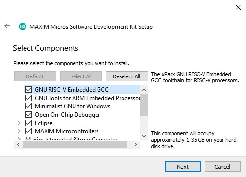

5. Continue to the installation page, and click **install** to begin.  Installation can be safely cancelled at any time.

    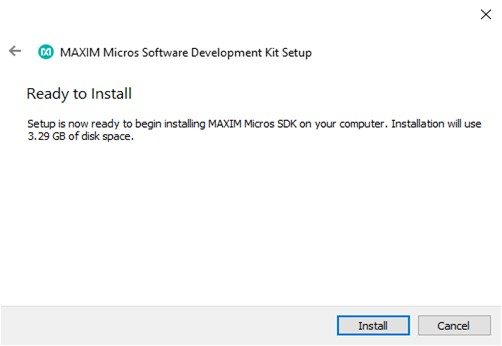

    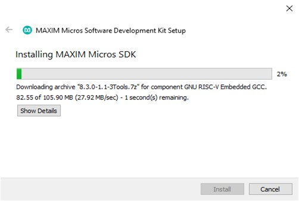

6. Click Finish to complete the installation.

    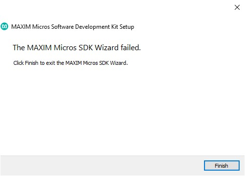

7. You should now see the contents of the installation directory populated with the MSDK.  
   **Note:** On MacOS, some [additional steps](#completing-the-installation-on-macos) are required.

    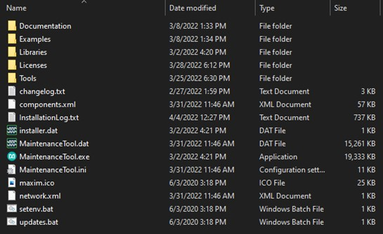

#### Completing the Installation on MacOS

On MacOS, some additional missing packages must be manually installed via [Homebrew](https://brew.sh/).

**For non-M1 platforms:**

1. Follow the instructions on the [Homebrew home page](https://brew.sh/) to install Homebrew on your system.

2. Then, open a terminal and run the command...

        brew install libusb-compat libftdi hidapi libusb

**For M1 platforms**:

The MSDK's OpenOCD binaries ship pre-compiled for Intel Silicon (i386).  As a result, you should use a [Rosetta](https://developer.apple.com/documentation/apple-silicon/about-the-rosetta-translation-environment) terminal on M1 platforms to install the _i386 version_ of Homebrew and retrieve OpenOCD's dependencies with it. This ensures OpenOCD gets the packages with the architecture it needs.  From there, Rosetta will handle the rest and allow running the binaries on the M1 platform's arm64 architecture.

The i386 version of Homebrew can be installed in parallel with the arm64 version, and typically installs into a separate filesystem.

1. Open a terminal and update Rosetta.

        softwareupdate --install-rosetta --agree-to-license

2. Close the terminal.

3. Run a new terminal in Rosetta:

    1. Go to Finder > Applications and find your Terminal

    2. Right-Click Terminal and Duplicate it.  Rename it to "Terminal i386".

    3. Rich-Click "Terminal i386" > Get Info > Enable "Open using Rosetta"

    4. Launch the new "Terminal i386" and type `arch` to verify that it says `i386` now.

4. From your Rosetta terminal follow the instructions on the [Homebrew home page](https://brew.sh/) to install Homebrew on your system.

5. Verify the correct version of Homebrew is running from your Rosetta terminal using the `which brew` command.  This should return a path beginning with `/usr/local`.

    **Note:** On systems with multiple or pre-existing Homebrew installations, the arm64 version of Homebrew may still take precendence over the newly installed x86_64 version.  If `which brew` contains `/opt/homebrew` instead, you may need to edit your terminal profile's startup script.  Alternatively, you can run the correct Homebrew binary directly using its absolute path.

6. Run the command...

        :::bash
        brew install libusb-compat libftdi hidapi libusb

    (or, if you need to use the absolute path)

        :::shell
        /usr/local/homebrew/bin/brew install libusb-compat libftdi hidapi libusb

### Maintenance

An MSDK installation contains a `MaintenanceTool` executable program in the root directory.  This program can be used to retrieve updates, manage components, and uninstall the MSDK.

#### Updates

MSDK updates are typically released on a quarterly basis, and the Maintenance Tool will retrieve the latest release when **Update components** is run.

#### Development Resources

Development copies of the MSDK resources can be obtained via [Github](https://github.com/Analog-Devices-MSDK/msdk), and instructions on how to work from the development repository can be found in the repository's [README](https://github.com/Analog-Devices-MSDK/msdk/blob/main/README.md).

#### Older Versions and Offline Installer

Older versions of the MSDK are available as an **_offline installer_** for each release tag.  They are available on the [Releases page](https://github.com/Analog-Devices-MSDK/msdk/releases) of the MSDK Github and can be used to roll back to a specific MSDK release.

## Getting Started

The MSDK is designed for both evaluation and end-application development.  The typical **evaluation** cycle usually involves setting up the development environment, running demos, and exercising the peripheral driver API on an _evaluation platform_.  The typical **development** cycle typically involves building a prototype application on an _evaluation platform_ first, then porting the application to a custom board.  This section describes how to get started with the MSDK focusing on the _evaluation_ cycle.

**First**, review the [Key Concepts](#key-concepts) below.  Then, proceed to the section for your preferred IDE.  Each of these sub-sections is written as a self-contained quick-start with links to additional documentation on important topics.

- [Getting Started with Visual Studio Code](#getting-started-with-visual-studio-code)
- [Getting Started with Eclipse](#getting-started-with-eclipse)
- [Getting Started with Command-Line Development](#getting-started-with-command-line-development)

### Key Concepts

The MSDK offers support for multiple development environments to support the user's preference.  Regardless of which is used, there are a few key concepts to keep in mind.

- **Target Microcontroller**:  The _target microcontroller_ refers to the base part number of the microcontroller being used for development.  The MSDK contains register-level support and startup files for each of its [supported parts](#supported-parts), and it's important to note that support files for a target microcontroller and its _Board Support Packages_ are distinct from each other.

    For example, if the [MAX78000EVKIT](https://www.analog.com/en/design-center/evaluation-hardware-and-software/evaluation-boards-kits/max78000evkit.html) _or_ [MAX78000FTHR](https://www.analog.com/en/design-center/evaluation-hardware-and-software/evaluation-boards-kits/max78000fthr.html) is being used, the _Target Microcontroller_ is the MAX78000.

- **Board Support Package (BSP)**:  The MSDK supports evaluation platforms for target microcontrollers via _Board Support Packages_.  For microcontrollers with multiple evaluation platforms, multiple BSPs are available.  These can be found in the `Libraries/Boards` folder of the MSDK installation.

    By default, most projects in the MSDK come pre-configured for the "EVKIT"-type BSP, which is generally the largest "traditional" evaluation platform for that device.  It's important to note that the active BSP may need to be reconfigured for a project, and this is done slightly differently for each development environment.  This is covered in more detail below.

- **System Environment**:  Your system's _environment_ is a broad term that encapsulates the programs and variables that are available to your system's shell on the command-line.  It's expected that the user has some basic familiarity with this concept.

- **System Path**:  Your system's _Path_ is a special environment variable that tells it where to search for program binaries.   It's also expected that the user has some familiarity with this concept, and how to modify the system Path if necessary.

- **Integrated Development Environment (IDE)**:  An IDE offers a higher level user interface (typically with a GUI) that manages the tools for **editing** source code, **building** source code, **flashing** program binaries, and **debugging**.  The abbreviation is frequently used in this document, and the MSDK supports _multiple_ IDEs that can be used depending on preference.  (See ["Supported Development Environments"](#supported-development-environments))

- **Build Configuration vs Project Configuration**: An MSDK project is primarily made up of two complementary systems:  The _Build System_ and the _Integrated Development Environment (IDE)_.  These systems each offer their own configuration interfaces, and it's important to note what each is used for.

    The **Build System** manages the compilation of source code into program binaries and offers a **Command-Line Interface (CLI)** for setting **Build Configuration Variables**.

    The **IDE** offers a higher level user interface (typically with a GUI) for managing a project and sits _on top_ of the build system's _CLI_.  Each IDE offers its own settings for managing fundamental aspects of the build such as:

    - Setting the _Target Microcontroller_
    - Setting the _Board Support Package_
    - Configuring the _Environment_ and _System Path_ for use with the MSDK toolchain

### Getting Started with Visual Studio Code

The MSDK includes Visual Studio Code (“VS Code”) support via the [VSCode-Maxim](https://github.com/MaximIntegratedTechSupport/VSCode-Maxim) project.

This section walks through setup, opening, and running an example project with VS Code.  This material is also available in video form targeting the MAX78000 in ["Understanding Artificial Intelligence Episode 8.5 - Visual Studio Code"](https://www.analog.com/en/education/education-library/videos/6313212752112.html).  For full documentation, see the [Visual Studio Code](#visual-studio-code) section of this User Guide.

#### Setup (VS Code)

The setup below only needs to be done once per MSDK [installation](#installation).

1. Download & install Visual Studio Code for your OS [here](https://code.visualstudio.com/Download).

2. Launch Visual Studio Code.

3. Install the Microsoft [C/C++ extension](https://marketplace.visualstudio.com/items?itemName=ms-vscode.cpptools).

4. Use **`CTRL + SHIFT + P`** (or **`COMMAND + SHIFT + P`** on MacOS) to open the developer prompt.

5. Type "open settings json" and select the **"Preferences: Open Settings (JSON)"** option.

    

6. Add the entries below into your user settings.json file.

        :::json
        // There may be other settings up here...        

        "MAXIM_PATH":"C:/MaximSDK", // Set this to the installed location of the MaximSDK.  Only use forward slashes '/' when setting this path!
        "update.mode": "manual",
        "extensions.autoUpdate": false,
        
        // There may be other settings down here...

7. Save your changes to the file with **`CTRL + S`** and restart VS Code.

#### Opening Example Projects

Visual Studio Code is built around a "working directory" paradigm.  The editor is always rooted in a working directory, and the main mechanism for changing that directory is **File -> Open Folder...**

As a result, you'll notice that there is no "New Project" mechanism.  A "project" in VS Code is simply a folder.  It will look inside of the opened folder for a `.vscode` _sub_-folder to load project-specific settings from.

_(Note:  You may need to enable viewing of hidden items in your file explorer to see the .vscode sub-folder)._

To open a project:

1. Launch Visual Studio Code.

2. Select **File -> Open Folder...**

3. Navigate to an example project for the target microcontroller in the MSDK's [Examples folder](Examples) and open it with **Select Folder**.

4. VS Code will prompt for trust the first time.  Select _Trust folder and enable all features_

    

5. The opened project should look something like this.

    

6. Set the **Board Support Package** to match your evaluation platform.  In VS Code, this is done by editing the `.vscode/settings.json` file and setting the `"board"`  project configuration option.  

    See [Board Support Packages](#board-support-packages) for more details.

    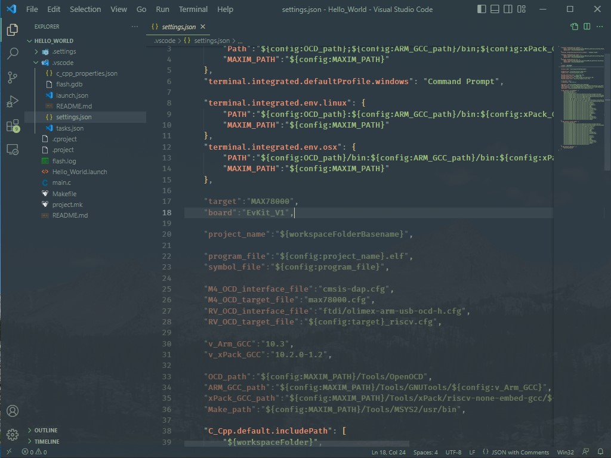

7. Save your changes to `settings.json` with `CTRL+S`.

8. Reload the VS Code window.  A reload is necessary after changing any options in `settings.json` to force it to re-index its Intellisense engine.

    VS Code can be conveniently re-loaded with the **Reload Window** developer command accessed with **`CTRL + SHIFT + P`** (or **`COMMAND + SHIFT + P`** on MacOS).

    

#### Building and Running a Project

Once a project is opened 4 available [build tasks](https://github.com/Analog-Devices-MSDK/VSCode-Maxim#build-tasks) will become available via **Terminal > Run Build task...** or the shortcut **`Ctrl+Shift+B`**.  These are the primary interface to the build system.

1. Run the **"build"** task to compile the project for the configured _Target Microcontroller_ and _BSP_.  Notice the `TARGET` and `BOARD` Build Configuration Variables being set on the command-line, and the program binary successfully compiled into the `.elf` program binary in the **build** sub-folder of the project.

    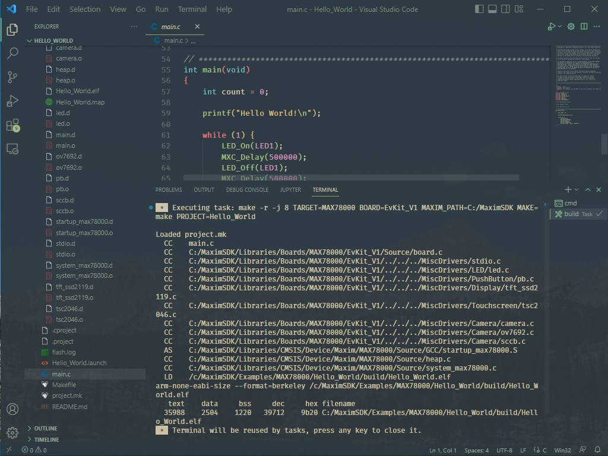

2. Connect a debug adapter between the host PC and the evaluation platform.  For more detailed instructions on this hardware setup refer to the evaluation platforms Datasheet and Quick-Start Guide.

3. Run the **`flash`**  build task.  Running this task will automatically build the project if needed, flash the program binary, and halt the program execution to await a debugger connection.

    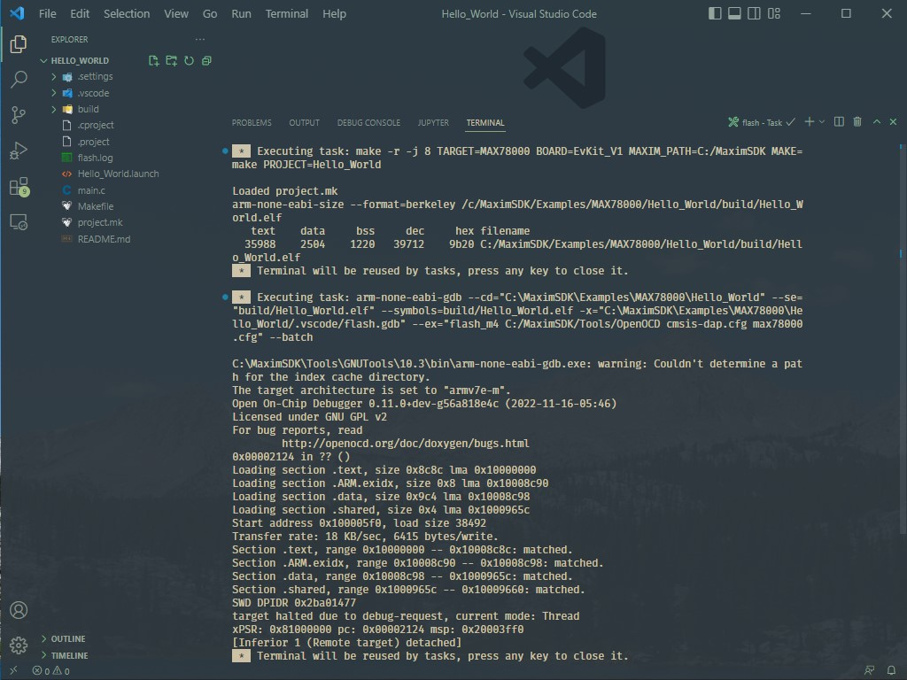

4. Open the **Run and Debug** window (**`CTRL+SHIFT+D`**) and launch the debugger (**`F5`**).

    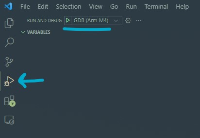

5. Verify the program counter enters `main` successfully.

    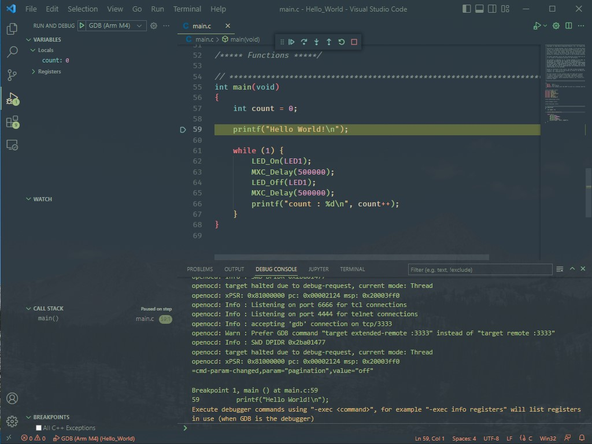

6. Press **Continue** (**`F5`**) to run the program.

    

        Continue | Step Over | Step Into | Step Out | Restart | Stop

7. Exercise the debugger, and press stop to disconnect when finished.

---

### Getting Started with Eclipse

The only setup required to use Eclipse is to ensure that the “Eclipse” component has been selected during the [MSDK installation](#installation). If the MSDK is already installed the Eclipse can be retrieved using the [Maintenance Tool](#maintenance).  

This section is an Eclipse "quick-start" that walks through creating, building, and running a project.  For full documentation, see the [Eclipse](#eclipse) section of this User Guide.

#### Creating a New Project

1. Launch Eclipse with its start menu shortcut.

    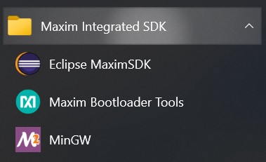

2. Ensure that the Eclipse is set to the **C/C++ perspective** in the top right corner. Otherwise, the new project wizard will not show up.

3. Navigate to **File -> New -> Maxim Microcontrollers**.

    

4. Enter the project name and hit **Next**.

    

5. Follow the new project wizard.

    - Chip type selects the _Target Microcontroller_
    - Board type selects the [_Board Support Package (BSP)_](#board-support-packages)
    - Example type selects the example project to be copied as the template for the new project.
    - Adapter type selects the debug adapter to use.

    

6. Select **Finish** to create the new project.

#### Importing Examples

1. [Launch](#running-eclipse) Eclipse.

2. Use **File -> Import** to open the import wizard.

3. Select **General -> Existing Projects into Workspace** and hit **Next**.

    

4. **Browse** to the [`Examples`](Examples) folder in the MSDK installation for your target microcontroller and select the example projects to import into the workspace.

    

5. Ensure that **Copy projects into workspace** is selected. This will copy the projects out of the MSDK, and leave the originals unmodified.

6. Select **Finish** to import the project(s).

7. The projects should now show up in the Project Explorer.

    

#### Building and Running Examples

1. Ensure that the Eclipse is set to the **C/C++ perspective** (top right).  

2. Select the correct project in the **Launch Configuration** dropdown and ensure it's set to **Debug** mode.

3. Use the **Build** hammer button (top left) to build the project.

    

4. Use the **Debug** button (top left) to flash the program binary and connect the debugger.

     

5. The Eclipse view will switch to debug mode, and the debugger will break on entry into main.

    

6. **Resume** the program (**`F8`**) using the top control bar and exercise the debugger.

    

7. **Terminate** the debugger (**`CTRL+F2`**) when finished.

---

### Getting Started with Command-Line Development

This section demonstrates how to build MSDK example projects for on the command line. It also demonstrates how to flash and debug over the command-line.  The [MAX78002EVKIT](https://www.analog.com/en/design-center/evaluation-hardware-and-software/evaluation-boards-kits/max78002evkit.html) will be used as an example, but the same concepts apply to all parts.

For more detailed documentation, see the [Command-Line Development](#command-line-development) section of this User Guide.

#### Setup (Command-Line)

##### Windows

On Windows, the MinGW shortcut should be used to launch a MSYS2/MinGW terminal.  Alternatively, the `Tools/MSYS2/msys.bat` file can be launched directly.

##### Linux/MacOS

1. On Linux and MacOS, copy the following contents into your shell's terminal profile/startup script.  Depending on your system and shell this could be `~/.profile`, `~/.zprofile`, `~/.bashrc`, `~/.zshrc`, etc.

        # Set MAXIM_PATH to point to the MSDK
        export MAXIM_PATH=#changeme!
        
        # Add Arm Embedded GCC to path (v10.3)
        export ARM_GCC_ROOT=$MAXIM_PATH/Tools/GNUTools/10.3
        export PATH=$ARM_GCC_ROOT/bin:$PATH
        
        # Add xPack RISC-V GCC to path (v10.2)
        export XPACK_GCC_ROOT=$MAXIM_PATH/Tools/xPack/riscv-none-embed-gcc/10.2.0-1.2
        export PATH=$XPACK_GCC_ROOT/bin:$PATH
        
        # Add OpenOCD to path
        export OPENOCD_ROOT=$MAXIM_PATH/Tools/OpenOCD
        export PATH=$OPENOCD_ROOT:$PATH

2. Change `export MAXIM_PATH=#changeme!` to the installation location of the MSDK.  This will make the toolchain accessible from the command-line by adding it to your *system's path*.

        # Set MAXIM_PATH environment variable
        export MAXIM_PATH=$HOME/MaximSDK

##### Verification

The following commands can be used to verify that the toolchain is accessible.  They should display version numbers successfully.

- `arm-none-eabi-gcc -v`
- `arm-none-eabi-gdb -v`
- `make -v`
- `openocd -v`

#### Building and Running an Example

1. First, copy an [example project](Examples) to an accessible directory outside of the SDK. It is strongly recommended to keep the MSDK examples unmodified in case they need to be referenced again later.

2. Launch your terminal.  On Windows, use the MinGW shortcut or `Tools/MSYS2/msys.bat` file to launch the MSYS2 terminal.

3. `cd` into the location of the copied example project.

4. Run the following command to build the example:

        make -r -j

    - `-r` is an option that improves build speed.
    - `-j` enables parallel execution of the build in the maximum number of threads.

    Expected output:

        :::bash
        Loaded project.mk
        CC    main.c
        CC   /home/msdk/Libraries/Boards/MAX78002/EvKit_V1/Source/board.c
        CC    /home/msdk/Libraries/Boards/MAX78002/EvKit_V1/../../../MiscDrivers/stdio.c
        CC    /home/msdk/Libraries/Boards/MAX78002/EvKit_V1/../../../MiscDrivers/LED/led.c
        CC    /home/msdk/Libraries/Boards/MAX78002/EvKit_V1/../../../MiscDrivers/PushButton/pb.c
        CC    /home/msdk/Libraries/Boards/MAX78002/EvKit_V1/../../../MiscDrivers/Display/adafruit_3315_tft.c
        CC    /home/msdk/Libraries/Boards/MAX78002/EvKit_V1/../../../MiscDrivers/Touchscreen/adafruit_3315_touch.c
        CC    /home/msdk/Libraries/Boards/MAX78002/EvKit_V1/../../../MiscDrivers/Camera/camera.c
        CC    /home/msdk/Libraries/Boards/MAX78002/EvKit_V1/../../../MiscDrivers/Camera/mipi_camera.c
        CC    /home/msdk/Libraries/Boards/MAX78002/EvKit_V1/../../../MiscDrivers/Camera/ov7692.c
        CC    /home/msdk/Libraries/Boards/MAX78002/EvKit_V1/../../../MiscDrivers/Camera/sccb.c
        AS    /home/msdk/Libraries/CMSIS/Device/Maxim/MAX78002/Source/GCC/startup_max78002.S
        CC    /home/msdk/Libraries/CMSIS/Device/Maxim/MAX78002/Source/heap.c
        CC    /home/msdk/Libraries/CMSIS/Device/Maxim/MAX78002/Source/system_max78002.c
        LD    /home/msdk/Examples/MAX78002/Hello_World/build/max78002.elf
        arm-none-eabi-size --format=berkeley /home/msdk/Examples/MAX78002/Hello_World/build/max78002.elf
        text    data     bss     dec     hex filename
        35708    2504    1156   39368    99c8 /home/msdk/Examples/MAX78002/Hello_World/build/max78002.elf

5. Connect a debug adapter between the host PC and the evaluation platform.  For more detailed instructions on this hardware setup refer to the evaluation platforms Datasheet and Quick-Start Guide.

6. Run the command below to launch an **OpenOCD _server_**, **flash** the program binary, and **halt** the program execution.

        openocd -s $MAXIM_PATH/Tools/OpenOCD/scripts -f interface/cmsis-dap.cfg -f target/max78002.cfg -c "program build/max78002.elf verify; init; reset halt"

    Expected output:

        :::bash
        Open On-Chip Debugger 0.11.0+dev-g4cdaa275b (2022-03-02-09:57)
        Licensed under GNU GPL v2
        For bug reports, read
            http://openocd.org/doc/doxygen/bugs.html
        DEPRECATED! use 'adapter driver' not 'interface'
        Info : CMSIS-DAP: SWD supported
        Info : CMSIS-DAP: Atomic commands supported
        Info : CMSIS-DAP: Test domain timer supported
        Info : CMSIS-DAP: FW Version = 0256
        Info : CMSIS-DAP: Serial# = 044417016af50c6500000000000000000000000097969906
        Info : CMSIS-DAP: Interface Initialised (SWD)
        Info : SWCLK/TCK = 1 SWDIO/TMS = 1 TDI = 0 TDO = 0 nTRST = 0 nRESET = 1
        Info : CMSIS-DAP: Interface ready
        Info : clock speed 2000 kHz
        Info : SWD DPIDR 0x2ba01477
        Info : max32xxx.cpu: Cortex-M4 r0p1 processor detected
        Info : max32xxx.cpu: target has 6 breakpoints, 4 watchpoints
        Info : starting gdb server for max32xxx.cpu on 3333
        Info : Listening on port 3333 for gdb connections
        Info : SWD DPIDR 0x2ba01477
        target halted due to debug-request, current mode: Thread
        xPSR: 0x81000000 pc: 0x0000fff4 msp: 0x20003ff0
        ** Programming Started **
        ** Programming Finished **
        ** Verify Started **
        ** Verified OK **
        Info : Listening on port 6666 for tcl connections
        Info : Listening on port 4444 for telnet connections 
        # Note: OpenOCD is now waiting for a GDB client

7. Launch a **_new_ separate terminal**. On Windows, use the MinGW shortcut or `Tools/MSYS2/msys.bat` file to launch the MSYS2 terminal.

8. `cd` into the location of the copied example project.

9. Run the following command to launch a **GDB *client***.

        arm-none-eabi-gdb --se=build/max78002.elf

    - `--se` sets the symbol and executable file to the compiled program file. By default, the output filename matches the target microcontroller.

    Expected output:

        :::bash
        GNU gdb (GNU Arm Embedded Toolchain 10.3-2021.10) 10.2.90.20210621-git
        Copyright (C) 2021 Free Software Foundation, Inc.
        License GPLv3+: GNU GPL version 3 or later <http://gnu.org/licenses/gpl.html>
        This is free software: you are free to change and redistribute it.
        There is NO WARRANTY, to the extent permitted by law.
        Type "show copying" and "show warranty" for details.
        This GDB was configured as "--host=i686-w64-mingw32 --target=arm-none-eabi".
        Type "show configuration" for configuration details.
        For bug reporting instructions, please see:
        <https://www.gnu.org/software/gdb/bugs/>.
        Find the GDB manual and other documentation resources online at:
        <http://www.gnu.org/software/gdb/documentation/>.
        
        For help, type "help".
        Type "apropos word" to search for commands related to "word"...
        Reading symbols from build/max78002.elf...
        (gdb)

10. Connect the GDB Client to the OpenOCD server with the following command.

        target extended-remote localhost:3333

    Expected output:

        :::bash
        Remote debugging using localhost:3333
        0x0000fff4 in ?? () # Note: ?? may be present at this stage, which is OK.

11. Reset the target microcontroller.

        monitor reset halt

    Expected output:

        :::bash
        SWD DPIDR 0x2ba01477
        target halted due to debug-request, current mode: Thread
        xPSR: 0x81000000 pc: 0x0000fff4 msp: 0x20003ff0

12. Set a breakpoint on main.

        b main

    Expected output:

        :::bash
        Breakpoint 1 at 0x10000224: file main.c, line 62.
        Note: automatically using hardware breakpoints for read-only addresses.

13. Continue the debugger.

        continue

    Expected output (for the Hello World example):

        :::bash
        Continuing.
        
        Breakpoint 1, main () at main.c:62
        62     printf("Hello World!\n");

14. (Optional) Continue exercising the debugger.

    Run `help` for GDB help, or see [Common GDB Commands](#common-gdb-commands).

15. Quit GDB.

        quit

    Expected output:

        :::shell
        A debugging session is active.
        
        Inferior 1 [Remote target] will be detached.
        
        Quit anyway? (y or n) [answered Y; input not from terminal]
        Detaching from program: C:\Users\User\codespace\Hello_World\build\max78002.elf, Remote target
        [Inferior 1 (Remote target) detached]

16. In the terminal window running the OpenOCD _server_, press `CTRL + C` to issue the shutdown command and quit.

## Development Guide

This section offers detailed usage info on the entire MSDK focusing on the typical _development_ cycle.  It expands on the info presented in ["Getting Started"](#getting-started) with more detailed usage info for each of the MSDK's supported IDEs.  Additionally, advanced topics that users will encounter as they proceed into custom application and/or hardware development are also covered.

### Board Support Packages

The MSDK supports multiple parts and evaluation platforms (see [supported parts](#supported-parts)) through **"Board Support Packages" (BSPs)**.

The role of a _BSP_ is to provide a hardware abstraction layer for the initialization and management of board-level hardware such as serial interfaces, pushbuttons, LEDs, external peripheral devices, TFT displays, etc. which will vary between evaluation platforms.  The BSP abstraction layer also improves code portability to custom devices.  

This topic is presented _first_ because the first task when opening or creating any project is to set the BSP correctly.

Available BSPs are located in the `Libraries/Boards` folder for each _Target Microcontroller_.

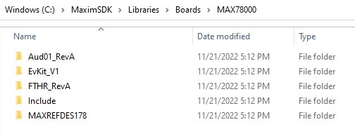

The name of each folder is the BSP's _internal_ string for use with the `BOARD` [build configuration variable](#build-configuration-variables).  The table below can be used to match these _internal_ strings to _external part numbers_.

| External Part Number                                         | `BOARD`        |
| ------------------------------------------------------------ | -------------- |
| [MAX32520-KIT](https://www.analog.com/en/design-center/evaluation-hardware-and-software/evaluation-boards-kits/max32520-kit.html) | `EvKit_V1`     |
| [MAX32520FTHR](https://www.analog.com/en/design-center/evaluation-hardware-and-software/evaluation-boards-kits/max32520fthr.html) | `MAX32520FTHR` |
| [MAX32650-EVKIT](https://www.analog.com/en/design-center/evaluation-hardware-and-software/evaluation-boards-kits/max32650-evkit.html) | `EvKit_V1`     |
| [MAX32650FTHR](https://www.analog.com/en/design-center/evaluation-hardware-and-software/evaluation-boards-kits/max32650fthr.html) | `FTHR_APPS_A`  |
| [MAX32655EVKIT](https://www.analog.com/en/design-center/evaluation-hardware-and-software/evaluation-boards-kits/max32655evkit.html) | `EvKit_V1`     |
| [MAX32655FTHR](https://www.analog.com/en/design-center/evaluation-hardware-and-software/evaluation-boards-kits/max32655fthr.html) | `FTHR_Apps_P1` |
| [MAX32660-EVSYS](https://www.analog.com/en/design-center/evaluation-hardware-and-software/evaluation-boards-kits/max32660-evsys.html) | `EvKit_V1`     |
| MAX32662EVKIT                                                | `EvKit_V1`     |
| [MAX32666EVKIT](https://www.analog.com/en/design-center/evaluation-hardware-and-software/evaluation-boards-kits/max32666evkit.html) | `EvKit_V1`     |
| [MAX32666FTHR](https://www.analog.com/en/design-center/evaluation-hardware-and-software/evaluation-boards-kits/max32666fthr.html) | `FTHR`         |
| MAX32666FTHR2                                                | `FTHR2`        |
| [MAX32670EVKIT](https://www.analog.com/en/design-center/evaluation-hardware-and-software/evaluation-boards-kits/max32670evkit.html) | `EvKit_V1`     |
| [MAX32672EVKIT](https://www.analog.com/en/design-center/evaluation-hardware-and-software/evaluation-boards-kits/max32672evkit.html) | `EvKit_V1`     |
| [MAX32672FTHR](https://www.analog.com/en/design-center/evaluation-hardware-and-software/evaluation-boards-kits/max32672fthr.html) | `FTHR`         |
| [MAX32675EVKIT](https://www.analog.com/en/design-center/evaluation-hardware-and-software/evaluation-boards-kits/max32675evkit.html) | `EvKit_V1`     |
| MAX32675FTHR                                                 | `FTHR_Apps_B`  |
| [MAX32680EVKIT](https://www.analog.com/en/design-center/evaluation-hardware-and-software/evaluation-boards-kits/max32680evkit.html) | `EvKit_V1`     |
| MAX32690EVKIT                                                | `EvKit_V1`     |
| [MAX78000EVKIT](https://www.analog.com/en/design-center/evaluation-hardware-and-software/evaluation-boards-kits/max78000evkit.html) | `EvKit_V1`     |
| [MAX78000FTHR](https://www.analog.com/en/design-center/evaluation-hardware-and-software/evaluation-boards-kits/max78000fthr.html) | `FTHR_RevA`    |
| [MAXREFDES178](https://www.analog.com/en/design-center/reference-designs/maxrefdes178.html) | `MAXREFDES178` |
| [MAX78002EVKIT](https://www.analog.com/en/design-center/evaluation-hardware-and-software/evaluation-boards-kits/max78002evkit.html) | `EvKit_V1`     |

To set the BSP for a project:

- In **VS Code**:  [How to Set the BSP (VS Code)](#how-to-set-the-bsp-vs-code)
- In **Eclipse**:  [How to Set the BSP (Eclipse)](#how-to-set-the-bsp-eclipse)
- **Command-Line** Development:  [How to Set the BSP (Command-Line)](#how-to-set-the-bsp-command-line)

### Visual Studio Code

Support for [Visual Studio Code](https://code.visualstudio.com/) is maintained for the MSDK and developed on the [VSCode-Maxim](https://github.com/Analog-Devices-MSDK/VSCode-Maxim) Github repository.

For setup/quick-start instructions, see ["Getting Started with Visual Studio Code"](#getting-started-with-visual-studio-code) first.

#### Opening Example Projects

Visual Studio Code is built around a "working directory" paradigm.  The editor is always rooted in a working directory, and the main mechanism for changing that directory is **File -> Open Folder...**

As a result, you'll notice that there is no "New Project" mechanism.  A "project" in VS Code is simply a folder.  It will look inside of the opened folder for a `.vscode` _sub_-folder to load project-specific settings from.

_(Note:  You may need to enable viewing of hidden items in your file explorer to see the .vscode sub-folder)._

To open a project:

1. Launch Visual Studio Code.

2. Select **File -> Open Folder...**

3. Navigate to an example project for the target microcontroller in the MSDK's [Examples folder](Examples) and open it with **Select Folder**.

4. VS Code will prompt for trust the first time.  Select _**Trust folder and enable all features**_.

    

5. The opened project should look something like this.

    

6. Verify the **_Board Support Package_** for the project is set correctly.  See [How to Set the BSP (VS Code)](#how-to-set-the-bsp-vs-code) below.

#### How to Set the BSP (VS Code)

To set the BSP for an opened project:

1. Set the `"board"` [project configuration](https://github.com/Analog-Devices-MSDK/VSCode-Maxim/tree/main#project-configuration) option in `.vscode/settings.json`, which maps to the `BOARD` _[Build Configuration Variable](#build-configuration-variables-reference-table)_.

    See [Board Support Packages](#board-support-packages) for a table of possible values.

    

2. **Reload the VS Code window** to re-index its Intellisense engine.

    VS Code can be conveniently re-loaded with the **Reload Window** developer command accessed with **`CTRL + SHIFT + P`** (or **`COMMAND + SHIFT + P`** on MacOS).

    

#### Building a Project

An opened project will present 4 available [build tasks](https://github.com/Analog-Devices-MSDK/VSCode-Maxim#build-tasks) via **Terminal > Run Build task...** or the shortcut **`Ctrl+Shift+B`**.

Run the **"build"** task to compile the project for the configured _Target Microcontroller_ and _BSP_.  Notice the **`TARGET`**, **`BOARD`** , and **`PROJECT`** Build Configuration Variables being set on the command-line, and the program binary successfully compiled into the `.elf` program binary in the **build** sub-folder of the project.

#### Cleaning a Project

To **clean** a project, run the _clean_ [build task](https://github.com/Analog-Devices-MSDK/VSCode-Maxim#build-tasks).  This will delete the build folder and its contents.  The next time the project is built, it will be re-built from scratch.

It should be noted that _clean_ will only remove the _project's_ build output.  The **clean-periph** task can be used to clean the project _and_ the peripheral driver libraries.

#### Flashing and Debugging

This section assumes a debugger is connected between the host PC and the evaluation platform.  For more detailed instructions on this hardware setup refer to the evaluation platforms Datasheet and Quick-Start Guide, which are available on each evaluation platform's product page.

##### Arm Core Debugging

1. Run the **`flash`**  [build task](https://github.com/Analog-Devices-MSDK/VSCode-Maxim#build-tasks).  Running this task will automatically build the project if needed, flash the program binary, and halt the program execution to await a debugger connection.  

    **Flashing does not happen automatically when launching the debugger**.  This is an intentional design choice for VS Code to allow the debugger to quickly restart the program under debug without a lengthy re-flash procedure.

    

2. Open the **Run and Debug** window (**`CTRL+SHIFT+D`**) and launch the debugger (**`F5`**).  Use the **_Arm M4_** profile.

    

3. Verify the program counter enters `main` successfully.

    

4. Press **Continue** (**`F5`**) to run the program.  The debugger control bar can be used to exercise the debugger further.

    

        Continue | Step Over | Step Into | Step Out | Restart | Stop

##### Breakpoints

Breakpoints can be set by clicking next to a line number in VS Code's editor.  They are removed by clicking on them again.

Additionally _conditional_ breakpoints can be added by _right-clicking_ on a line.

The condition and condition type can be modified with the dropdown.  This is useful for setting breakpoint on a certain value in a `for` loop iterator or when a specific bit in a register is set, for example.

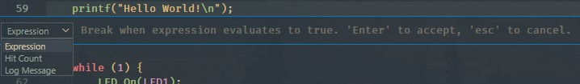

##### Peripheral Browsing

A peripheral browser lets you quickly view the formatted register-level contents of the peripheral blocks on a target microcontroller under debug.  Currently, VSCode-Maxim does not feature a true peripheral browser.  Instead, *watch expressions* can be used to inspect peripherals at the register level.

Watch expressions can be set for all registers.  (For example, the `sysctrl` register below).

- Adding **`,b`** lets you print out the value in **binary**
- Adding **`,x`** prints the value in **hex**.
- Standard **logical** and **bitwise** operations are supported inside the watch expression.
- **Register** and **variable** values can be **modified** through these same watch-points.  _(Right click -> Set Value)_

It should be noted that the debugger's watch-points are *contextual*, meaning that its symbol look-ups will depend on the active point in your program.

##### Dual Core Debugging

For microcontrollers with _both_ an Arm M4 and a RISC-V core, the _GDB (RISC-V)_ launch profile is provided to enable RISC-V debugging.  The RISC-V core requires setup and handoff from the Arm M4 core.  As a result, this is an advanced configuration requiring a unique combination of the project's source code, Makefiles, and VSCode-Maxim project settings.  Such projects are appended with the `-riscv` suffix in the project's folder name.

This section demonstrates how to debug `-riscv` projects in VS Code using the [mnist-riscv](Examples/MAX78000/CNN/mnist-riscv) project for the MAX78000 as an example.

1. Connect _both_ your Arm (SWD) and RISC-V (JTAG) debuggers.  VSCode-Maxim projects come pre-configured to use the [ARM-USB-OCD-H](https://www.olimex.com/Products/ARM/JTAG/ARM-USB-OCD-H/) + [ARM-JTAG-20-10](https://www.olimex.com/Products/ARM/JTAG/ARM-JTAG-20-10/) adapters for the RISC-V JTAG port.  Ex:

    

2. Make sure your Olimex debugger drivers are installed correctly.  Sometimes they need to be updated using the "zadig" tool.  See Section 3.3.3 of the [Olimex User Manual](https://www.olimex.com/Products/ARM/JTAG/_resources/ARM-USB-OCD_and_OCD_H_manual.pdf), and use the [Zadig](https://zadig.akeo.ie/) tool to install WinUSB drivers.

3. Download the [max78000_riscv.cfg](https://github.com/Analog-Devices-MSDK/VSCode-Maxim/files/9587266/max78000_riscv.zip) file and place it inside the `Tools/OpenOCD/scripts/target` folder of your MSDKinstallation.

4. [Open](#opening-example-projects) the project in VS Code.

5. Run the "Flash" task.

    

6. Launch the debugger using the **GDB (Arm M4)** profile **first**:

    

    ... which should hit the breakpoint in `main.c`...
    

7. **Continue** the debugger.  The code in `main.c` will boot up the RISC-V core.  You can optionally set a breakpoint on `WakeISR` to see when the RISC-V core has signaled it's ready.

    

8. Now, switch the debugger profile to the **GDB (RISC-V) profile** and launch it.  This will launch an additional instance on a separate port and connect to the Olimex adapter.

    

    The "Signal 0" exception below is a known issue caused by a reset bug on the RISC-V core. The exception message is harmless and can be safely ignored.

    

9. From here, the debugger should be fully functional.  The Arm vs RISC-V debugger instance can be selected with the dropdown on the debugger control bar.

    

---

### Eclipse

#### Running Eclipse

Eclipse _must_ be launched via the **Eclipse MaximSDK** shortcut which points to the `Tools/Eclipse/cdt/eclipse(.bat/.sh)` file.  This file can be used directly to launch Eclipse as well.  It calls`setenv(.bat/.sh)` script in the root directory of the MSDK to properly configure Eclipse's system environment for use with the toolchain.

When Eclipse is launched, it will prompt for a **_workspace_** location.  This is a local folder that Eclipse will copy its projects into.

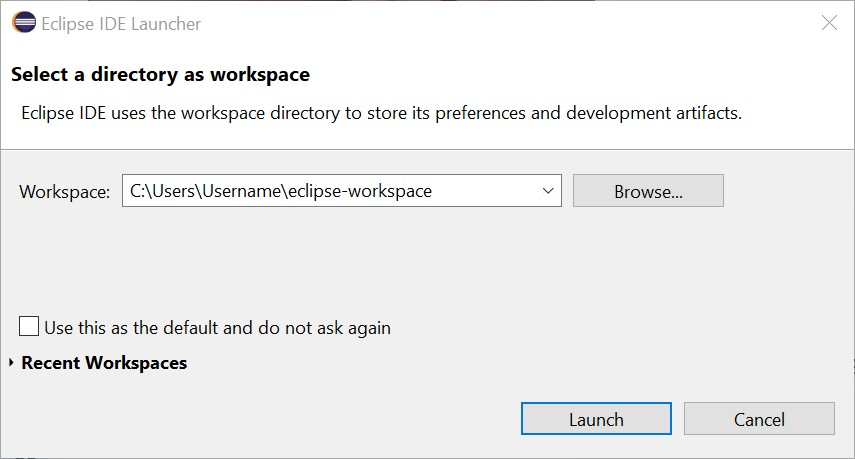

#### Creating a New Project

1. [Launch](#running-eclipse) Eclipse.

2. Ensure that the Eclipse is set to the **C/C++ perspective** in the top right corner. Otherwise, the new project wizard will not show up.

3. Navigate to **File -> New -> Maxim Microcontrollers**.

    

4. Enter the project name and hit **Next**.

    

5. Follow the new project wizard.

    - Chip type selects the _Target Microcontroller_
    - Board type selects the [_Board Support Package (BSP)_](#board-support-packages)
    - Example type selects the example project to be copied as the template for the new project.
    - Adapter type selects the debug adapter to use.

    

6. Select **Finish** to create the new project.

#### Importing Examples

1. [Launch](#running-eclipse) Eclipse.

2. Use **File -> Import** to open the import wizard.

3. Select **General -> Existing Projects into Workspace** and hit **Next**.

    

4. **Browse** to the [`Examples`](Examples) folder in the MSDK installation for your target microcontroller and select the example projects to import into the workspace.

    

5. Ensure that **Copy projects into workspace** is selected. This will copy the projects out of the MSDK, and leave the originals unmodified.

6. Select **Finish** to import the project(s).

7. The projects should now show up in the Project Explorer.

    

#### How to Set the BSP (Eclipse)

[Imported](#importing-examples) Eclipse projects files are configured for the **EVKIT**-type _BSP_ by default. To set the BSP:

1. Open (right click) the **project properties** and navigate to **C/C++ Build -> Environment**.  
2. Set the **`BOARD`** _[Build Configuration Variable](#build-configuration-variables-reference-table)_ to match the target evaluation platform.

    See [Board Support Packages](#board-support-packages) for a table of possible values.

    

3. **clean** and rebuild the project.

#### Building a Project

1. Ensure that the Eclipse is set to the **C/C++ perspective** (top right).  

2. Select the correct project in the **Launch Configuration** dropdown. 

3. Use the **Build** hammer button (top left) to build the project.

    

#### Flashing and Debugging

1. Connect a debug adapter between the host PC and the evaluation platform.  For more detailed instructions on this hardware setup refer to the evaluation platforms Datasheet and Quick-Start Guide.

2. Ensure the correct project in the **Launch Configuration** dropdown is selected in **Debug** mode.

3. Use the **Debug** button (top left) to flash the program binary and connect the debugger.

    

4. The Eclipse view will switch to debug mode, and the debugger will break on entry into main.

    

5. **Resume** the program (**`F8`**) using the top control bar and exercise the debugger.

    

6. **Terminate** the debugger (**`CTRL+F2`**) when finished.

---

### Command-Line Development

This section offers more detailed info on command-line development.

For setup/quick-start see ["Getting Started with Command-Line Development"](#getting-started-with-command-line-development)

#### How to Set the BSP (Command-Line)

- To _persistently_ the BSP, set the **`BOARD`** _[Build Configuration Variable](#build-configuration-variables-reference-table)_. by editing the **project.mk** that can be found inside each project.

        :::makefile
        # This file can be used to set build configuration
        # variables.  These variables are defined in a file called 
        # "Makefile" that is located next to this one.
        
        # For instructions on how to use this system, see
        # https://analog-devices-msdk.github.io/msdk/USERGUIDE/
        
        # **********************************************************
        
        # Add your config here!
        
        BOARD=FTHR_RevA # Set the BSP for the MAX78000FTHR

- Alternatively, set **`BOARD`** on the command-line when building (ie. `make -r -j BOARD=FTHR_RevA`) to set/override the BSP for a single build.

#### Building on the Command-Line

1. `cd` into the project folder.

2. Run `make` 

   - **Parallel Build** (fastest build, but console message formatting may be mangled):

        make -r -j

   - **Serial Build**

        make -r

3. Take note of the output filename and location, which by default is the lowercase name of the _Target microcontroller_ and created in the `build` folder.

#### Cleaning on the Command-Line

1. `cd` into the project folder.
2. Run `make clean`
   - **Project clean**: `make clean` deletes the project `build` folder and all of its contents.
   - **Library clean**: `make distclean` can be used to clean out _all_ build products, including the project `build` folder and all [peripheral driver](#peripheral-driver-api) libraries.

#### Flashing on the Command-Line

1. [Build](#building-on-the-command-line) the project.  

2. Connect a debug adapter between the host PC and the evaluation platform.  For more detailed instructions on this hardware setup refer to the evaluation platforms Datasheet and Quick-Start Guide.

3. Flash the program using `openocd`.

    - **Flash and exit:**  Use this command if you just want to flash the program _but **not debug**_.  OpenOCD will **flash** the program and **exit** on completion.

            openocd -s $MAXIM_PATH/Tools/OpenOCD/scripts -f interface/cmsis-dap.cfg -f target/max78002.cfg -c "program build/max78002.elf verify exit"

        - `-f target/max78002.cfg` sets the OpenOCD config file for the _Target microcontroller_.  Supported options can be found in the [Tools/OpenOCD/scripts/target](Tools/OpenOCD/scripts/target) folder.  **Change this to match the target microcontroller**.
        - `-c "program build/max78002.elf verify exit"` flashes the program binary.  Change `build/max78002.elf` to match the correct filename.

        Expected output:

            :::bash
            Open On-Chip Debugger 0.11.0+dev-g4cdaa275b (2022-03-02-09:57)
            Licensed under GNU GPL v2
            For bug reports, read
                http://openocd.org/doc/doxygen/bugs.html
            DEPRECATED! use 'adapter driver' not 'interface'
            Info : CMSIS-DAP: SWD supported
            Info : CMSIS-DAP: Atomic commands supported
            Info : CMSIS-DAP: Test domain timer supported
            Info : CMSIS-DAP: FW Version = 0256
            Info : CMSIS-DAP: Serial# = 044417016af50c6500000000000000000000000097969906
            Info : CMSIS-DAP: Interface Initialised (SWD)
            Info : SWCLK/TCK = 1 SWDIO/TMS = 1 TDI = 0 TDO = 0 nTRST = 0 nRESET = 1
            Info : CMSIS-DAP: Interface ready
            Info : clock speed 2000 kHz
            Info : SWD DPIDR 0x2ba01477
            Info : max32xxx.cpu: Cortex-M4 r0p1 processor detected
            Info : max32xxx.cpu: target has 6 breakpoints, 4 watchpoints
            Info : starting gdb server for max32xxx.cpu on 3333
            Info : Listening on port 3333 for gdb connections
            Info : SWD DPIDR 0x2ba01477
            target halted due to debug-request, current mode: Thread
            xPSR: 0x81000000 pc: 0x0000fff4 msp: 0x20003ff0
            ** Programming Started **
            ** Programming Finished **
            ** Verify Started **
            ** Verified OK **
            shutdown command invoked

    - **Flash and hold:**  Use this if you want to also **debug** the program. OpenOCD will **flash** the program, **reset** the MAX78002, **halt** program execution, and **wait** for a GDB debugger client connection.

            openocd -s $MAXIM_PATH/Tools/OpenOCD/scripts -f interface/cmsis-dap.cfg -f target/max78002.cfg -c "program build/max78002.elf verify; init; reset halt"

        - `-f target/max78002.cfg` sets the OpenOCD config file for the _Target microcontroller_.  Supported options can be found in the [Tools/OpenOCD/scripts/target](Tools/OpenOCD/scripts/target) folder.  **Change this to match the target microcontroller**.
        - `-c "program build/max78002.elf verify exit"` flashes the program binary.  Change **`build/max78002.elf`** to match the correct filename.

        Expected output:

            :::bash
            Open On-Chip Debugger 0.11.0+dev-g4cdaa275b (2022-03-02-09:57)
            Licensed under GNU GPL v2
            For bug reports, read
                http://openocd.org/doc/doxygen/bugs.html
            DEPRECATED! use 'adapter driver' not 'interface'
            Info : CMSIS-DAP: SWD supported
            Info : CMSIS-DAP: Atomic commands supported
            Info : CMSIS-DAP: Test domain timer supported
            Info : CMSIS-DAP: FW Version = 0256
            Info : CMSIS-DAP: Serial# = 044417016af50c6500000000000000000000000097969906
            Info : CMSIS-DAP: Interface Initialised (SWD)
            Info : SWCLK/TCK = 1 SWDIO/TMS = 1 TDI = 0 TDO = 0 nTRST = 0 nRESET = 1
            Info : CMSIS-DAP: Interface ready
            Info : clock speed 2000 kHz
            Info : SWD DPIDR 0x2ba01477
            Info : max32xxx.cpu: Cortex-M4 r0p1 processor detected
            Info : max32xxx.cpu: target has 6 breakpoints, 4 watchpoints
            Info : starting gdb server for max32xxx.cpu on 3333
            Info : Listening on port 3333 for gdb connections
            Info : SWD DPIDR 0x2ba01477
            target halted due to debug-request, current mode: Thread
            xPSR: 0x81000000 pc: 0x0000fff4 msp: 0x20003ff0
            ** Programming Started **
            ** Programming Finished **
            ** Verify Started **
            ** Verified OK **
            Info : Listening on port 6666 for tcl connections
            Info : Listening on port 4444 for telnet connections
            # Note: OpenOCD is now waiting for a GDB client connection

#### Debugging on the Command-Line

1. [Flash](#flashing-on-the-command-line) the program using the **Flash and Hold** command.

2. Launch an **_new_ separate terminal**. On Windows, use the MinGW shortcut or `Tools/MSYS2/msys.bat` file to launch the MSYS2 terminal.

3. `cd` into the location of the copied example project.

4. Run the following command to launch a **GDB *client***.

        arm-none-eabi-gdb --se=build/max78002.elf

    - `--se` sets the symbol and executable file to the compiled program file. **Change this to match the build output filename.**

    Expected output:

        :::bash
        GNU gdb (GNU Arm Embedded Toolchain 10.3-2021.10) 10.2.90.20210621-git
        Copyright (C) 2021 Free Software Foundation, Inc.
        License GPLv3+: GNU GPL version 3 or later <http://gnu.org/licenses/gpl.html>
        This is free software: you are free to change and redistribute it.
        There is NO WARRANTY, to the extent permitted by law.
        Type "show copying" and "show warranty" for details.
        This GDB was configured as "--host=i686-w64-mingw32 --target=arm-none-eabi".
        Type "show configuration" for configuration details.
        For bug reporting instructions, please see:
        <https://www.gnu.org/software/gdb/bugs/>.
        Find the GDB manual and other documentation resources online at:
            <http://www.gnu.org/software/gdb/documentation/>.
        
        For help, type "help".
        Type "apropos word" to search for commands related to "word"...
        Reading symbols from build/max78002.elf...
        (gdb)

5. Connect the GDB Client to the OpenOCD server with the following command.

        target extended-remote localhost:3333

    Expected output:

        :::bash
        Remote debugging using localhost:3333
        0x0000fff4 in ?? () # Note: ?? may be present at this stage, which is OK.

6. Reset the target microcontroller.

        monitor reset halt

    Expected output:

        :::bash
        SWD DPIDR 0x2ba01477
        target halted due to debug-request, current mode: Thread
        xPSR: 0x81000000 pc: 0x0000fff4 msp: 0x20003ff0

7. Set a breakpoint on main.

        b main

    Expected output:

        :::bash
        Breakpoint 1 at 0x10000224: file main.c, line 62.
        Note: automatically using hardware breakpoints for read-only addresses.

8. Continue the debugger.

        continue

    Expected output (for the Hello World example):

        :::bash
        Continuing.
        
        Breakpoint 1, main () at main.c:62
        62     printf("Hello World!\n");

9. (Optional) Continue exercising the debugger. 

   Run `help` for GDB help, or see [Common GDB Commands](#common-gdb-commands).

10. Quit GDB.

        quit

    Expected output:

        :::bash
        A debugging session is active.
        
        Inferior 1 [Remote target] will be detached.
        
        Quit anyway? (y or n) [answered Y; input not from terminal]
        Detaching from program: C:\Users\User\codespace\Hello_World\build\max78002.elf, Remote target
        [Inferior 1 (Remote target) detached]

11. Quit OpenOCD. In the terminal window running the OpenOCD _server_, press `CTRL + C` to issue the shutdown command.

#### Common GDB Commands

| **Command**                     | **Short Command** | **Description**                                              |
| ------------------------------- | ----------------- | ------------------------------------------------------------ |
| `monitor halt`                  |                   | Halt the microcontroller.                                    |
| `monitor reset halt`            |                   | Reset the microcontroller and immediately halt.              |
| `monitor max32xxx mass_erase 0` |                   | Mass erase the flash.                                        |
| `file <filename>`               |                   | Set the program file to `<filename>`                         |
| `load`                          |                   | Flash the current program file                               |
| `continue`                      | `c`               | Continue execution.                                          |
| `break <arg>`                   | `b <arg>`         | Set a breakpoint. `<arg>` can be a function name, file:line\_number, or address. |
| `print <variable>`              | `p`               | Print the value of a variable. Variable must be in current scope. |
| `backtrace`                     | `bt`              | Print contents of the stack frame.                           |
| `step`                          | `s`               | Execute the next instruction.                                |
| `next`                          | `n`               | Execute the next line of code.                               |
| `finish`                        | `f`               | Continue to the end of the current function.                 |
| `info reg`                      |                   | Print the values of the ARM registers.                       |
| `help`                          |                   | Print descriptions for available commands                    |
| `help <cmd>`                    |                   | Print description for given command.                         |
| `quit`                          | `q`               | Quit the GDB client                                          |

## Build System

### Build System Overview

The **Build System** manages the compilation of source code into program binaries and offers a **Command-Line Interface (CLI)** for setting **Build Configuration Variables**.  All IDEs interface with this system.

The Build System is managed by two files found in a project's root directory, one called **Makefile** and one called **project.mk**.  These files are used by the [GNU Make](https://www.gnu.org/software/make/) program (which is a part of the MSDK toolchain) to locate and build a project's source code.

* **Makefile** is the "core" file, and should not be edited directly.  Instead, it exposes the **CLI** that can be accessed in the _project.mk_ file, on the command-line, in your system's environment, or via your IDE.  It also comes with a default configuration that is suitable for most projects.
* **project.mk** offers a convenient and stable access point for advanced build configuration, and this is the file that should be edited if necessary.

When the command...

    make

... is run from inside of a project folder, the program `make` will resolve any project-specific settings and then build the project's source code.

### Default Build Behavior

By default, when `make` is run the build system will **auto-search** the **root** project directory for _source code_ (**`*.c`**) and _header files_ (**`*.h`**) to compile into a program binary.  The _optional_ **include** and **src** directories are also searched if they exist.

    :::bash
    Root Project Directory
    ├─ project.mk
    ├─ Makefile
    ├─ *.h
    ├─ *.c
    ├─include  # <-- Optional
    └─ *.h
    ├─src      # <-- Optional
    └─ *.c

Additionally, a project's build system will come pre-configured for a specific _Target Microcontroller_ and its primary _BSP_.

The default configuration is suitable for most use-cases, but a system of _Build Configuration Variables_ are available if additional configuration is needed for a project.

### Build Configuration Variables

A **Build Configuration Variable** is a [Makefile variable](https://www.gnu.org/software/make/manual/make.html#Using-Variables), and therefore follows the same rules.  However, they have been streamlined to be made much easier to use, so most of the [official GNU Make documentation](https://www.gnu.org/software/make/manual/make.html) is only needed for extremely advanced use-cases.

#### How to Set a Build Configuration Variable

To set a **standard** configuration variable, **use the `=` syntax**...

    VARIABLE=VALUE

The **`=`** operater is used for _most_ configuration variables with a few exceptions (documented in the [reference table](#build-configuration-variables-reference-table)) when a variable should contain a **_list_ of values**.  In such cases, **use `+=` the syntax** to _add_ values to the list.

    VARIABLE+=VALUE1
    VARIABLE+=VALUE2

#### Where to Set a Build Configuration Variable

For most variables, you should set them in the **project.mk** file (exceptions are documented in the [reference table](#build-configuration-variables-reference-table) and IDE-specific sections).

For example, to enable hardware floating-point acceleration for a project, the **`MFLOAT_ABI`** configuration variable can be used with a value of **`hard`**.  The contents of **project.mk** might then look as follows:

(_Inside project.mk_)

    :::Make
    # This file can be used to set build configuration
    # variables.  These variables are defined in a file called 
    # "Makefile" that is located next to this one.
    
    # For instructions on how to use this system, see
    # https://analog-devices-msdk.github.io/msdk/USERGUIDE/
    
    # **********************************************************
    
    MFLOAT_ABI=hard # Enable hardware floating point acceleration

It should also be noted that configuration variables can be set on the **command-line** as well.  For example...

    make MFLOAT_ABI=hard

... will have the same effect.

Additionally, **environment variables** can be used.  For example (on linux)...

    export MFLOAT_ABI=hard

... will set the hardware floating point acceleration as the default for all projects with an environment variable.

However, there is a _precedence hierarchy_ that should be taken into consideration.

#### Precedence Hierarchy

The precedence hierarchy for the value of a configuration variable is:

- **IDE/command-line > project.mk > environment variable > default value**

...meaning if a value is set in an IDE _and_ project.mk, the IDE's value will take precedence.  However, the ["override" directive](https://www.gnu.org/software/make/manual/make.html#Override-Directive) can be used in project.mk to give it max precedence.

#### Build Configuration Variables Reference Table

| Configuration Variable | Description                                                | Details                                                      |
| ---------------------- | ---------------------------------------------------------- | ------------------------------------------------------------ |
|                        |                                                            |                                                              |
| `TARGET`               | Set the _Target Microcontroller_                           | **If you are using an IDE, set this variable in the IDE's settings instead of project.mk** |
| `BOARD`                | Set the _Board Support Package (BSP)_                      | **If you are using an IDE, set this variable in the IDE's settings instead of project.mk.**  See [Board Support Packages](#board-support-packages) for more details.  When you change this option, it's usually a good idea to fully clean your project, then re-build. |
|                        |                                                            |                                                              |
| `MAXIM_PATH`           | (Optional) Specify the location of the MSDK                | This optional variable can be used to change where the Makefile looks for the MSDK installation.  By default, the build system will attempt to locate the MSDK with a relative path.  If a project is moved _outside_ of the SDK this variable must be set to the absolute path of the MSDK installation. |
| `CAMERA`               | (Optional) Set the Camera drivers to use                   | This option is only useful for the MAX78000 and MAX78002, and sets the camera drivers to use for the project.  Permitted values are `HM01B0`, `HM0360_MONO`, `HM0360_COLOR`, `OV5642`, `OV7692` (default), or `PAG7920`.  Camera drivers can be found in the [`Libraries/MiscDrivers/Camera`](Libraries/MiscDrivers/Camera) folder.  Depending on the selected camera, a compiler definition may be added to the build. See the `board.mk` file for the active BSP for more details. |
|                        |                                                            |                                                              |
| `VPATH`                | Where to search for source (.c) files                      | **Use the `+=` operator with this variable**.  This controls where the Makefile will look for **source code** files.  If `AUTOSEARCH` is enabled (which it is by default) this controls which paths will be searched.  If `AUTOSEARCH` is disabled, this tells the Makefile where to look for the files specified by `SRCS`. |
| `IPATH`                | Where to search for header (.h) files                      | **Use the `+=` operator with this variable**.  This controls where the Makefile will look for **header** files.  _Unlike_ the `VPATH` option, this is not related to `AUTOSEARCH`.  Individual header files are _not_ ever manually added into the build.  Instead, you only need to specify the _location_ of your header files. |
| `AUTOSEARCH`           | Automatically search for source (.c) files                 | Enable or disable the automatic detection of .c files on `VPATH` (enabled by default).  Set to `0` to disable, or `1` to enable.  If auto-search is disabled, source files must be manually added to `SRCS`. |
| `SRCS`                 | List of source (.c) files to add to the build              | **Use the `+=` operator with this variable**.  All of the files in this list will be added to the build.  If `AUTOSEARCH` is enabled, this is most useful for adding the full absolute path to a singular source file to selectively add to the build.  If `AUTOSEARCH` is disabled, _all_ of the source files for the project must be added to `SRCS`, and they must also all be located on an entry in `VPATH`.  Otherwise, a full path relative to the Makefile must be used. |
| `PROJECT`              | Set the output filename                                    | This controls the output filename of the build.  File extensions should _not_ be included in the filename.  **For VS Code, you should use the [project_name](#project_name) advanced config option instead of project.mk.** |
|                        |                                                            |                                                              |
| `MXC_OPTIMIZE_CFLAGS`  | Set the optimization level                                 | See [Optimize Options](https://gcc.gnu.org/onlinedocs/gcc/Optimize-Options.html) for more details.  Normal builds will default to `-Og`, which is good for debugging, while release builds will default to `-O2`. |
| `PROJ_CFLAGS`          | Add a compiler flag to the build                           | **Use the `+=` operator with this variable**.  Compiler flags can be added with this option, including compiler definitions.  For each value, the same syntax should be used as if the compiler flag was passed in via the command-line.  These can include standard [GCC options](https://gcc.gnu.org/onlinedocs/gcc-10.4.0/gcc/Option-Summary.html#Option-Summary) and/or [ARM-specific](https://gcc.gnu.org/onlinedocs/gcc/ARM-Options.html) options. |
| `PROJ_AFLAGS`          | Add an assembler flag to the build                         | **Use the `+=` operator with this variable**.  Assembler flags can be added with this option. |
| `MFLOAT_ABI`           | Set the floating point acceleration level                  | Sets the floating-point acceleration level.  Permitted values are `hard`, `soft`, `softfp` (default).  To enable full hardware acceleration instructions use `hard`, but keep in mind that _all_ libraries your source code uses must also be compiled with `hard`.  If there is any conflict, you'll get a linker error.  For more details, see `-mfloat-abi` under [ARM Options](https://gcc.gnu.org/onlinedocs/gcc/ARM-Options.html). |
|                        |                                                            |                                                              |
| `LINKERFILE`           | Set the linkerfile to use                                  | Set the linkerfile with this option.  The file should exists in `Libraries/CMSIS/Device/Maxim/TARGET/Source/GCC` in the MSDK, or it should be placed inside the root directory of the project. |
| `PROJ_LDFLAGS`         | Add a linker flag to the build                             | **Use the `+=` operator with this variable**.  Flags can be passed to the linker with this option.  See [GCC Options for Linking](https://gcc.gnu.org/onlinedocs/gcc/Link-Options.html#Link-Options) |
|                        |                                                            |                                                              |
| `LIB_BOARD`            | Include the BSP library (enabled by default)               | Inclusion of the Board-Support Package (BSP) library, which is enabled by default, can be toggled with this variable.  Set to `0` to disable, or `1` to enable. |
| `LIB_PERIPHDRIVERS`    | Include the peripheral driver library (enabled by default) | The peripheral driver library can be toggled with this option.  If disabled, you'll lose access to the higher-level driver functions but still have access to the register-level files.  Set to `0` to disable, or `1` to enable. |
| `LIB_CMSIS_DSP`        | Include the CMSIS-DSP library                              | The [CMSIS-DSP library](https://www.keil.com/pack/doc/CMSIS/DSP/html/index.html) can be enabled with this option.  Set to `0` to disable, or `1` to enable. |
| `LIB_CORDIO`           | Include the Cordio library                                 | The Cordio BLE library can be included with this option.  This is only applicable towards microcontrollers with an integrated BLE controller. |
| `LIB_FCL`              | Include the Free Cryptographic Library (FCL)               | This option toggles the Free Cryptographic Library (FCL), which is a collection of software-implemented common cryptographic functions can be included with this option.  Set to `0` to disable, or `1` to enable. |
| `LIB_FREERTOS`         | Include the FreeRTOS library                               | The [FreeRTOS](https://freertos.org/) library can be enabled with this option, which is an open-source Real-Time Operating System (RTOS).  Set to `0` to disable, or `1` to enable. |
| `LIB_LC3`              | Include the LC3 codec library                              | This option enables the inclusion of the Low Complexity Communication Codec (LC3), which is an efficient low latency audio codec.  Set to `0` to disable, or `1` to enable. |
| `LIB_LITTLEFS`         | Include the littleFS library                               | This option toggles the ["Little File System"](https://github.com/littlefs-project/littlefs) library - a small filesystem library designed for microcontrollers.  Set to `0` to disable, or `1` to enable. |
| `LIB_LWIP`             | Include the lwIP library                                   |                                                              |
| `LIB_MAXUSB`           | Include the MaxUSB library                                 | This option toggles the inclusion of the MAXUSB library, which facilitates the use of the native USB peripherals on some microcontrollers.  Set to `0` to disable, or `1` to enable. |
| `LIB_SDHC`             | Include the SDHC library                                   | This options toggles the Secure Digital High Capacity (SDHC) library, which can be used to interface with SD cards.  Additionally, it enables the [FatFS](http://elm-chan.org/fsw/ff/00index_e.html) library, which implements a generic FAT filesystem. |
|                        |                                                            |                                                              |
| `SBT`                  | Toggle SBT integration                                     | Toggles integration with the [Secure Boot Tools (SBTs)](https://www.analog.com/en/design-center/evaluation-hardware-and-software/software/software-download.html?swpart=SFW0015360C).  These are a suite of applications designed for use with microcontrollers that have secure bootloaders.  When this is enabled, some additional rules become available such as `make sla` and `make scpa`.  Set to `0` to disable or `1` to enable. |
| `MAXIM_SBT_DIR`        | Where to find the SBTs                                     | This option can be used to manually specify the location of the SBTs.  Usually, this is not necessary.  By default, the `Tools/SBT` directory of the MaximSDK will be searched.  If the [SBT installer](https://www.analog.com/en/design-center/evaluation-hardware-and-software/software/software-download.html?swpart=SFW0015360C) is used, it will set the `MAXIM_SBT_DIR` environment variable to point to itself automatically. |
| `TARGET_SEC`           | Secure part number to use                                  | Some secure microcontrollers have multiple secure variants, and this option can be used to specify the variant to use with the SBTs.  Defaults are intelligently selected, and can be found in `$(MAXIM_SBT_DIR)/SBT-config.mk` |
| `SCP_PACKETS`          | Where to build the scp_packets folder                      | Defaults to `build/scp_packets`                              |
| `TEST_KEY`             | Which test key to sign applications with                   | Defaults to `$(MAXIM_SBT_DIR)/devices/$(TARGET_SEC)/keys/maximtestcrk.key`, which is the Maxim test key that can be used for development. |

## Peripheral Driver API

A microcontroller is made up of a Central Processing Unit (CPU) that is surrounded by additional _peripheral_ hardware blocks such as timers, memory controllers, UART controllers, ADCs, RTCs, audio interfaces, and many more.  The **Peripheral Driver API** is an important core library in the MSDK that allows the CPU to utilize the microcontroller's hardware blocks over a higher-level **_Application Programming Interface (API)_**.

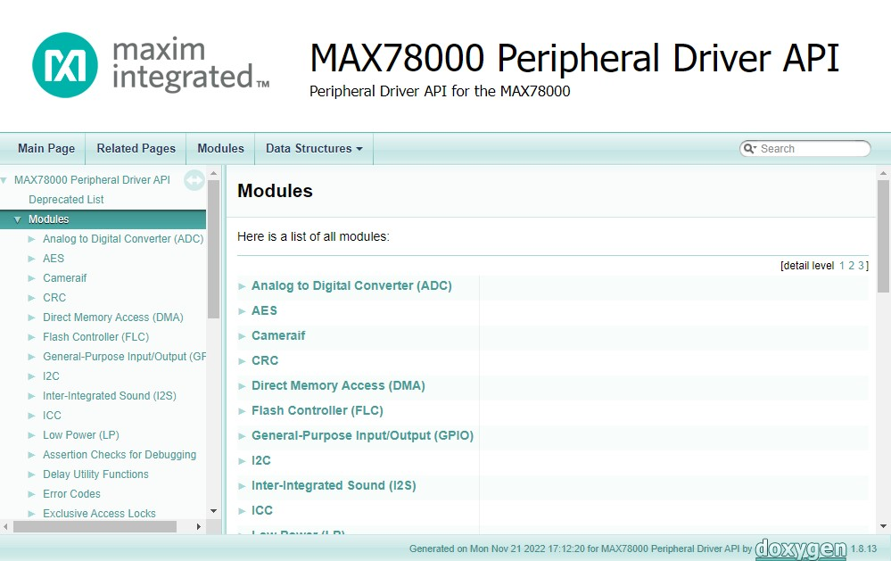

A detailed API reference can be found in the [Documentation](Documentation) folder of the MSDK installation for each microcontroller.  See the links below for online copies.

- [MAX32520 API](Libraries/PeriphDrivers/Documentation/MAX32520/index.html)

- [MAX32650 API](Libraries/PeriphDrivers/Documentation/MAX32650/index.html)

- [MAX32655 API](Libraries/PeriphDrivers/Documentation/MAX32655/index.html)

- [MAX32660 API](Libraries/PeriphDrivers/Documentation/MAX32660/index.html)

- [MAX32665-MAX32668 API](Libraries/PeriphDrivers/Documentation/MAX32665/index.html)

- [MAX32670 API](Libraries/PeriphDrivers/Documentation/MAX32670/index.html)

- [MAX32672 API](Libraries/PeriphDrivers/Documentation/MAX32672/index.html)

- [MAX32675 API](Libraries/PeriphDrivers/Documentation/MAX32675/index.html)

- [MAX32680 API](Libraries/PeriphDrivers/Documentation/MAX32680/index.html)

- [MAX78000 API](Libraries/PeriphDrivers/Documentation/MAX78000/index.html)

- [MAX78002 API](Libraries/PeriphDrivers/Documentation/MAX78002/index.html)

### Examples

The MSDK contains examples on how to use the Peripheral Driver API in the [`Examples`](https://github.com/Analog-Devices-MSDK/msdk/tree/main/Examples) folder.  They are organized primarily by part number, then by peripheral block.

### Organization

The Peripheral Driver API's source code is organized as follows:

- **Header files _(.h)_** can be found in the [`Libraries/PeriphDrivers/Include`](Libraries/PeriphDrivers/Include) folder.
    - These files contain function _declarations_ for the API, describing the function prototypes and their associated documentation.
- **Source files _(.c)_** can be found in the [`Libraries/PeriphDrivers/Source`](Libraries/PeriphDrivers/Source) folder.
    - These file contain the function _definitions_ for the API - the _implementations_ of the functions declared by the header files.

The _**implementation**_ files are further organized based on _**die type**_ and **_hardware revision_**.  This is worthy to note when browsing or debugging through the drivers.  

- The **_die type_** files follow the **`_MEXX`** or **`_AIXX`** naming convention
    - These file's responsibility is to manage microcontroller-specific implementation details that may interact with other peripheral APIs _before_ ultimately calling the revision-specific files.
- The **_hardware** revision_ files follow the **`_revX`** naming convention.  
    - These files contain the _pure_ driver implementation for a peripheral block, and typically interact with the hardware almost entirely at the register level.

## Libraries

The MSDK contains a large number of **libraries**, both third-party and in-house.  These libraries are an extension to the "core" SDK resources and contain drivers for miscellaneous _**external**_ components such as TFT displays, cameras, accelerometers, audio codecs, and other devices.  The MSDK also contains libraries for more advanced _**internal**_ hardware peripherals that provide an _additional_ higher-level abstraction layer above the [Peripheral Driver API](#peripheral-driver-api) such as USB, the SDHC interface, and the Cordio BLE stack.

These libraries may also offer their _own_ Build Configuration Variables in addition to those already available in the [Build System](#build-system).  These additional build options are enabled alongside the library itself via a convenient *toggle switch* (See the **"Libraries"** section of the _[Build Configuration Variables](#build-configuration-variables-reference-table)_).

Source code is located in the [Libraries](Libraries) folder of the SDK and managed with the `Libraries/libs.mk` file, which comes pre-included in each example project.

### CMSIS-DSP

The CMSIS-DSP library provides a suite of common **Digital Signal Processing _(DSP)_** functions that take advantage of hardware accelerated _Floating Point Unit (FPU)_ available on microcontrollers with Arm Cortex-M cores.  This library is distributed in the MSDK as a pre-compiled static library file and the MSDK maintains a port of the official code examples in the **ARM-DSP** [Examples](Examples) folder for each microcontroller.

Please refer to the [CMSIS-DSP official documentation](https://www.keil.com/pack/doc/CMSIS/DSP/html/index.html) for more detailed documentation on the library functions and usage.

#### CMSIS-DSP Supported Parts

- All microcontrollers with a Cortex M4 core are supported.

---

### Cordio Bluetooth Low Energy

The Cordio Bluetooth Low Energy (BLE) library provides a full BLE stack for microcontrollers with an integrated BLE controller.

#### Cordio Supported Parts

- MAX32655
- MAX32665
- MAX32680
- MAX32690

---

### MAXUSB

The MAXUSB library provides a higher-level interface for utilizing the built-in USB controller hardware available on some microcontrollers.  This allows the microcontroller to enumerate as a USB device without the need for an external USB controller IC.

#### MAXUSB Supported Parts

- MAX32570
- MAX32650
- MAX32655 & MAX32656
- MAX32665-MAX32668
- MAX32690
- MAX78002

---

### Miscellaneous Drivers

The [`Libraries/MiscDrivers`](Libraries/MiscDrivers) folder of the MSDK contains drivers for miscellaneous external components such as TFT displays, cameras, audio codecs, PMICs, pushbuttons, etc.  These resources are usually closely tied with the [Board Support Packages](#board-support-packages).

---

### SDHC

The **Secure Digital High Capacity *(SDHC)*** library offers a higher-level interface built on top of the SDHC [Peripheral Driver API](#peripheral-driver-api) that includes a [FatFS File System](http://elm-chan.org/fsw/ff/00index_e.html) implementation for managing files on SD cards.

#### SDHC Supported Parts

- MAX32650
- MAX32570
- MAX32665-MAX32668
- MAX78002
