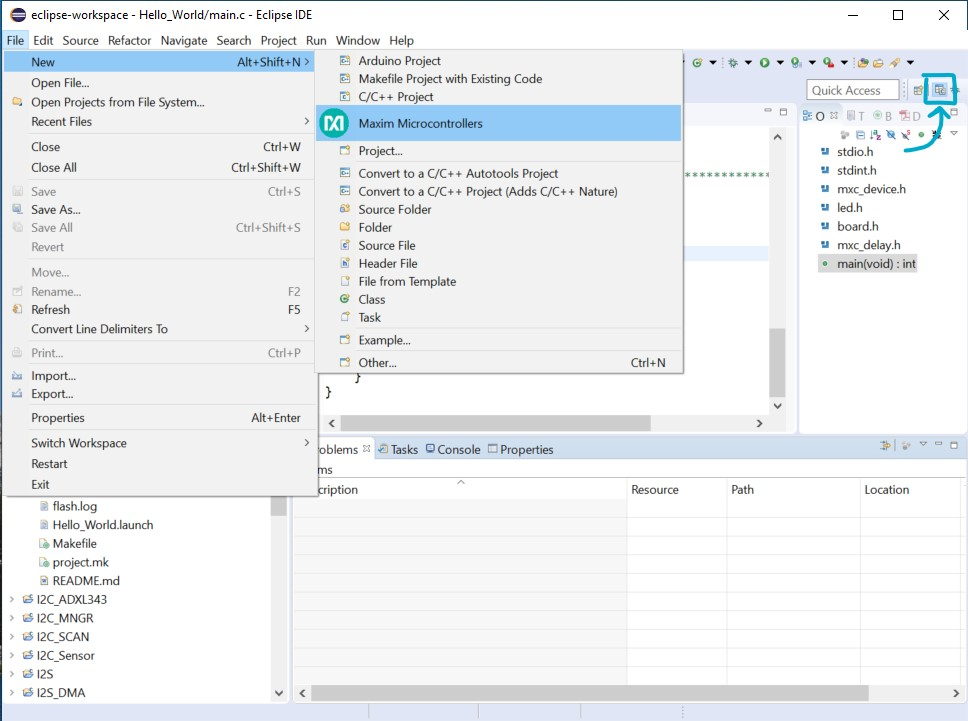
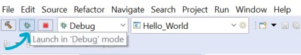
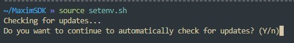

# Getting Started

The MSDK is designed for both evaluation and end-application development. The typical **evaluation** cycle usually involves setting up the development environment, running demos, and exercising the peripheral driver API on an _evaluation platform_. The typical **development** cycle typically involves building a prototype application on an _evaluation platform_ first, then porting the application to a custom board. This section describes how to get started with the MSDK focusing on the _evaluation_ cycle.

**First**, review the [**Key Concepts**](#key-concepts) below.  Then proceed to the section for your preferred IDE. Each subsection is a self-contained quick-start that includes links to additional documentation on important topics.

* [Getting Started with Visual Studio Code](#getting-started-with-visual-studio-code)
* [Getting Started with Eclipse](#getting-started-with-eclipse)
* [Getting Started with Command-Line Development](#getting-started-with-command-line-development)

## Key Concepts

The MSDK supports multiple development environments with different features that can be tailored to the user's preferences. A few concepts are key to remember that are universal to MSDK development.

* **Target Microcontroller**:  The _target microcontroller_ refers to the base part number of the microcontroller used for development. The MSDK contains register-level support and startup files for each of its [supported parts](index.md#supported-parts), and it's important to note that support files for a target microcontroller and its _Board Support Packages_ are distinct from each other.

    For example, if the [MAX78000EVKIT](https://www.analog.com/en/design-center/evaluation-hardware-and-software/evaluation-boards-kits/max78000evkit.html) _or_ [MAX78000FTHR](https://www.analog.com/en/design-center/evaluation-hardware-and-software/evaluation-boards-kits/max78000fthr.html) is being used, the _Target Microcontroller_ is the MAX78000.

---

* **Board Support Package (BSP)**:  The MSDK supports evaluation platforms for target microcontrollers with _Board Support Packages_.  For microcontrollers with multiple evaluation platforms, multiple BSPs are available. These can be found in the `Libraries/Boards` folder of the MSDK installation.

    By default, most projects in the MSDK come pre-configured for the "EVKIT"-type BSP, which is generally the largest evaluation platform for that device with most (or all) pins broken out. It's important to note that the active BSP may need to be reconfigured for a project, which is done slightly differently for each development environment.

---

* **System Environment**:  Your system's _environment_ is a broad term that encapsulates the programs and variables available to your system's shell on the command line. The user is expected to have some basic familiarity with this concept.

---

* **System Path**:  Your system's _Path_ is a unique environment variable that tells it where to search for program binaries. The user is expected to be familiar with this concept and how to modify the system Path if necessary.

---

* **Integrated Development Environment (IDE)**:  An IDE offers a higher-level user interface (typically with a GUI) that manages the tools for **editing** source code, **building** source code, **flashing** program binaries, and **debugging**. The abbreviation is frequently used in this document, and the MSDK supports _multiple_ IDEs that can be used depending on preference. (See ["Supported Development Environments"](index.md#supported-development-environments))

---

* **Build Configuration vs. Project Configuration**: An MSDK project is comprised of two complementary systems: The _Build System_ and the _Integrated Development Environment (IDE)_. These systems each offer their own configuration interfaces, and it's important to note what each is used for.

    The **Build System** manages source code compilation into program binaries and offers a **Command-Line Interface (CLI)** for setting **Build Configuration Variables**.

    The **IDE** offers a higher-level user interface (typically with a GUI) for managing a project and sits _on top_ of the build system's _CLI_. Each IDE offers its own settings for managing fundamental aspects of the build, such as:

    * Setting the _Target Microcontroller_
    * Setting the _Board Support Package_
    * Configuring the _Environment_ and _System Path_ for use with the MSDK toolchain

## Getting Started with Visual Studio Code

The MSDK includes Visual Studio Code ("VS Code") support through the [VSCode-Maxim](https://github.com/MaximIntegratedTechSupport/VSCode-Maxim) project.

This section walks through setup, opening, and running an example project with VS Code. This material is also available in video form targeting the MAX78000 in ["Understanding Artificial Intelligence Episode 8.5 - Visual Studio Code"](https://www.analog.com/en/education/education-library/videos/6313212752112.html).

For complete documentation, see the [Visual Studio Code](visual-studio-code.md) section of this User Guide.

### Setup (VS Code)

The setup below only needs to be done once per MSDK [installation](installation.md).

1. Download and install Visual Studio Code for your OS [here](https://code.visualstudio.com/Download).

2. Launch Visual Studio Code.

3. Install the Microsoft [C/C++ extension](https://marketplace.visualstudio.com/items?itemName=ms-vscode.cpptools).

4. Install the [Cortex-Debug extension](https://marketplace.visualstudio.com/items?itemName=marus25.cortex-debug)

5. Use **`CTRL + SHIFT + P`** (or **`COMMAND + SHIFT + P`** on MacOS) to open the developer prompt.

6. Type "open user settings" and select the **"Preferences: Open User Settings (JSON)"** option.

    

7. Add the entries below to your user settings.json file.

        :::json
        // There may be other settings up here...

        "MAXIM_PATH": "Change me!  Only use forward slashes (/) for this path",
        "update.mode": "manual",
        "extensions.autoUpdate": false,

        // There may be other settings down here...

    ???+ warning "⚠️ **Setting MAXIM_PATH**"
        Set the `MAXIM_PATH` option to the _absolute path_ of the MSDK installation.
        For example, you might set `"MAXIM_PATH":"C:/MaximSDK"` on Windows and `"MAXIM_PATH":"/home/username/MaximSDK"` on Ubuntu/MacOS.

    ???+ note "ℹ️ **Note: Automatic Updates**"
        `"update.mode: "manual"` and `"extensions.autoUpdate": false` _disable_ automatic updates of VS Code and its extensions, respectively.  This is an _optional_ (but recommended) addition left over from the early days of VS Code development when there was lots of feature churn. Things have stabilized more as of version 1.70+, but updates remain frequent. For the VSCode-Maxim project files, the exact version numbers tested with each release can be found on the [VSCode-Maxim Releases](https://github.com/analogdevicesinc/VSCode-Maxim/releases) page.

8. Save your changes to the file with **`CTRL + S`** and restart VS Code.

### Building and Running a Project (VS Code)

1. Launch Visual Studio Code.

2. Select **File -> Open Folder...**

    

3. Navigate to an example project for the target microcontroller in the MSDK's `Examples` folder.

    

    ???+ warning "**⚠️ Copying Examples**"
        It's strongly recommended to copy example projects to an _outside_ folder before modifying them.  This keeps the MSDK's "source" copy preserved for reference.  Project folders must be copied to a location _without_ any spaces in its filepath.

4. VS Code will prompt for trust the first time. Select _Trust folder and enable all features_

    

5. The opened project should look something like this.

    

6. Set the **Board Support Package** to match your evaluation platform. In VS Code, this is done by editing the `.vscode/settings.json` file and setting the `"board"`  project configuration option.

    ???+ note "ℹ️ **Note**"
        See [Board Support Packages](board-support-pkgs.md) for more details and a table of values.

    

7. Save your changes to `settings.json` with `CTRL+S`.

8. Reload the VS Code window. After changing any options in `settings.json`, a reload is necessary to force it to re-index VS Code's Intellisense engine.

    VS Code can be conveniently reloaded with the **Reload Window** developer command accessed with **`CTRL + SHIFT + P`** (or **`COMMAND + SHIFT + P`** on MacOS).

    

9. Press the shortcut **`Ctrl+Shift+B`** to open the available **Build Tasks** (alternatively navigate to _Terminal -> Run Build task..._).

    

10. Run the **"build"** task to compile the project for the configured _Target Microcontroller_ and _BSP_. Notice that the `TARGET` and `BOARD` Build Configuration Variables are set on the command line. The program binary is successfully compiled into the `.elf` program binary in the **build** sub-folder of the project.

    

11. Connect a debug adapter between the host PC and the evaluation platform. Detailed instructions on this hardware setup can be found in the evaluation platform's Datasheet and Quick-Start Guide, which are available on its [analog.com](https://analog.com) product page.

12. Run the **`flash`**  build task. Running this task will automatically build the project if needed, flash the program binary, and halt the program execution to await a debugger connection.

    

13. Open the **Run and Debug** window (**`CTRL+SHIFT+D`**) and launch the debugger (**`F5`**).

    

14. Verify the program counter enters `main` successfully.

    

15. Press **Continue** (**`F5`**) to run the program.

    

        Continue | Step Over | Step Into | Step Out | Restart | Stop

16. Exercise the debugger and press stop to disconnect when finished.

    ???+ note "ℹ️ **Note**"
        See [Visual Studio Code](visual-studio-code.md) for additional more detailed documentation.

---

## Getting Started with Eclipse

### Setup (Eclipse)

The only setup required to use Eclipse is to ensure that the "Eclipse" component has been selected during the [MSDK installation](installation.md). If the MSDK is already installed, Eclipse can be retrieved using the [Maintenance Tool](installation.md#maintenance).

This section is an Eclipse "quick-start" that walks through creating, building, and running a project. For complete documentation, see the [Eclipse](eclipse.md) section of this User Guide.

### Building and Running a Project (Eclipse)

1. Launch Eclipse with its start menu shortcut.

    

2. Ensure Eclipse is set to the **C/C++ perspective** in the top right corner. Otherwise, the new project wizard will not show up.

3. Navigate to **File -> New -> Maxim Microcontrollers**.

    

4. Enter the project name and hit **Next**.

    

5. Follow the new project wizard.

    * Chip type selects the _Target Microcontroller_
    * Board type selects the [_Board Support Package (BSP)_](board-support-pkgs.md)
    * Example type selects the example project to be copied as the template for the new project.
    * Adapter type selects the debug adapter to use.

    

6. Select **Finish** to create the new project.

7. Build the project using the **Build** hammer button (top left).

    

8. Select the correct project in the **Launch Configuration** dropdown and set it to **Debug** mode.

9. Use the **Debug** button (top left) to flash the program binary and connect the debugger.

    

10. The Eclipse view will switch to debug mode, and the debugger will break on entry into `main`.

    

11. **Resume** the program (**`F8`**) using the top control bar and exercise the debugger.

    

12. **Terminate** the debugger (**`CTRL+F2`**) when finished.

    ???+ note "ℹ️ **Note**"
        See [Eclipse](eclipse.md) for additional more detailed documentation.

---

## Getting Started with Command-Line Development

This section demonstrates how to build MSDK example projects on the command line. It also shows how to flash and debug over the command line. The [MAX78002EVKIT](https://www.analog.com/en/design-center/evaluation-hardware-and-software/evaluation-boards-kits/max78002evkit.html) will be used as an example, but the same concepts apply to all parts.

For more detailed documentation, see the [Command-Line Development](command-line-dev.md) section of this User Guide.

### Setup (Command-Line)

#### Windows

On Windows, use the MinGW shortcut to launch an MSYS2/MinGW terminal. This shortcut points to `Tools/MSYS2/msys.bat` in an MSDK installation and correctly configures the user's environment for development.


#### Linux/MacOS

##### Sourcing `setenv`

A `setenv.sh` script is available in the root directory of an MSDK installation. This file can be sourced to facilitate the setup of an environment for MSDK development.

```bash
source ~/MaximSDK/setenv.sh
```

This command can also be added to shell startup scripts (`~/.bashrc`, `~/.zshrc`, etc.) to automate the environment setup.

???+ note "ℹ️ **Note: Automatic Updates**"
    `setenv.sh` will automatically check for available updates to the MSDK. This can be permanently disabled by following its prompt on startup, or by deleting/moving the `updates.sh` script in the root directory of the MSDK installation.

    

##### Manual Setup

1. On Linux and MacOS, copy the following contents into your shell's terminal profile/startup script to manually configure your environment for MSDK development. Depending on your system and shell, this could be `~/.profile`, `~/.zprofile`, `~/.bashrc`, `~/.zshrc`, etc. Command-line Linux/MacOS users are expected to know which file to edit for their particular system and preferences.

        # Set MAXIM_PATH to point to the MSDK
        export MAXIM_PATH=#changeme!

        # Add Arm Embedded GCC to path (v10.3)
        export ARM_GCC_ROOT=$MAXIM_PATH/Tools/GNUTools/10.3
        export PATH=$ARM_GCC_ROOT/bin:$PATH

        # Add xPack RISC-V GCC to path (v12.2)
        export XPACK_GCC_ROOT=$MAXIM_PATH/Tools/xPack/riscv-none-elf-gcc/12.2.0-3.1
        export PATH=$XPACK_GCC_ROOT/bin:$PATH

        # Add OpenOCD to path
        export OPENOCD_ROOT=$MAXIM_PATH/Tools/OpenOCD
        export PATH=$OPENOCD_ROOT:$PATH

2. Change `export MAXIM_PATH=#changeme!` to the installation location of the MSDK. This will make the toolchain accessible from the command line by adding it to your _system's path_.

        # Set MAXIM_PATH environment variable
        export MAXIM_PATH=$HOME/MaximSDK

#### Verification

Run the following commands to verify that the toolchain is accessible. They should display version numbers successfully.

* `arm-none-eabi-gcc -v`
* `arm-none-eabi-gdb -v`
* `make -v`
* `openocd -v`

Any "file not found" errors indicate that `MAXIM_PATH` has not been set correctly or the system's Path has not been configured correctly.

### Building and Running an Example (Command-Line)

1. First, copy an [example project](https://github.com/analogdevicesinc/msdk/tree/main/Examples) to an accessible directory outside of the SDK. The `Hello_World` project is a good one to start with.

    ???+ warning "**⚠️ Copying Examples**"
        It's strongly recommended to copy example projects to an _outside_ folder before modifying them.  This keeps the MSDK's "source" copy preserved for reference.  Project folders must be copied to a location _without_ any spaces in its filepath.

2. Launch your terminal. On Windows, use the MinGW shortcut or `Tools/MSYS2/msys.bat` file to launch the MSYS2 terminal.

3. `cd` into the location of the copied example project.

4. Run the following command to build the example:

        make

    ???+ note "ℹ️ **Note: Improving Build Speed**"
        The following command can be used to enable parallel builds and drastically improve build speed:

            :::shell
            make -r -j --output-sync=target --no-print-directory

        * `-r` is an option that ignores some of Make's implicit rules to improve build speed.
        * `-j` enables parallel execution of the build in the maximum number of threads.

            ???+ warning "**⚠️ Parallel Builds**"
                Parallel builds can mangle the console output. To deal with this, the `--output-sync=target` option can be used. However, _this is only available in Make version 4 or higher_. When this option is used, `--no-print-directory` is also used to declutter the build output.

    Expected output:

        :::bash
        Loaded project.mk
        CC    main.c
        CC   /home/msdk/Libraries/Boards/MAX78002/EvKit_V1/Source/board.c
        CC    /home/msdk/Libraries/Boards/MAX78002/EvKit_V1/../../../MiscDrivers/stdio.c
        CC    /home/msdk/Libraries/Boards/MAX78002/EvKit_V1/../../../MiscDrivers/LED/led.c
        CC    /home/msdk/Libraries/Boards/MAX78002/EvKit_V1/../../../MiscDrivers/PushButton/pb.c
        CC    /home/msdk/Libraries/Boards/MAX78002/EvKit_V1/../../../MiscDrivers/Display/adafruit_3315_tft.c
        CC    /home/msdk/Libraries/Boards/MAX78002/EvKit_V1/../../../MiscDrivers/Touchscreen/adafruit_3315_touch.c
        CC    /home/msdk/Libraries/Boards/MAX78002/EvKit_V1/../../../MiscDrivers/Camera/camera.c
        CC    /home/msdk/Libraries/Boards/MAX78002/EvKit_V1/../../../MiscDrivers/Camera/mipi_camera.c
        CC    /home/msdk/Libraries/Boards/MAX78002/EvKit_V1/../../../MiscDrivers/Camera/ov7692.c
        CC    /home/msdk/Libraries/Boards/MAX78002/EvKit_V1/../../../MiscDrivers/Camera/sccb.c
        AS    /home/msdk/Libraries/CMSIS/Device/Maxim/MAX78002/Source/GCC/startup_max78002.S
        CC    /home/msdk/Libraries/CMSIS/Device/Maxim/MAX78002/Source/heap.c
        CC    /home/msdk/Libraries/CMSIS/Device/Maxim/MAX78002/Source/system_max78002.c
        LD    /home/msdk/Examples/MAX78002/Hello_World/build/max78002.elf
        arm-none-eabi-size --format=berkeley /home/msdk/Examples/MAX78002/Hello_World/build/max78002.elf
        text    data     bss     dec     hex filename
        35708    2504    1156   39368    99c8 /home/msdk/Examples/MAX78002/Hello_World/build/max78002.elf

5. Connect a debug adapter between the host PC and the evaluation platform. Detailed instructions on this hardware setup can be found in the evaluation platform's Datasheet and Quick-Start Guide, which are available on its [analog.com](https://analog.com) product page.

6. Flash and run the program with OpenOCD.

        :::shell
        make flash.openocd

    ???+ note "ℹ️ **Note: Flashing with Make**"
        The command `make flash.openocd` is a build target added to the MSDK as of the [June 2023 Release](https://github.com/analogdevicesinc/msdk/releases/tag/v2023_06) to make flashing over the command-line easier.  It launches and drives an OpenOCD server behind the scenes to flash the project's binary.  See the `Tools/Flash/flash.mk` file for implementation details, and [Flashing on the Command-Line](command-line-dev.md#flashing-on-the-command-line) for more details on launching debug server/clients manually.

    Expected output:

        :::bash
        Open On-Chip Debugger 0.11.0+dev-g4cdaa275b (2022-03-02-09:57)
        Licensed under GNU GPL v2
        For bug reports, read
            http://openocd.org/doc/doxygen/bugs.html
        DEPRECATED! use 'adapter driver' not 'interface'
        Info : CMSIS-DAP: SWD supported
        Info : CMSIS-DAP: Atomic commands supported
        Info : CMSIS-DAP: Test domain timer supported
        Info : CMSIS-DAP: FW Version = 0256
        Info : CMSIS-DAP: Serial# = 044417016af50c6500000000000000000000000097969906
        Info : CMSIS-DAP: Interface Initialised (SWD)
        Info : SWCLK/TCK = 1 SWDIO/TMS = 1 TDI = 0 TDO = 0 nTRST = 0 nRESET = 1
        Info : CMSIS-DAP: Interface ready
        Info : clock speed 2000 kHz
        Info : SWD DPIDR 0x2ba01477
        Info : max32xxx.cpu: Cortex-M4 r0p1 processor detected
        Info : max32xxx.cpu: target has 6 breakpoints, 4 watchpoints
        Info : starting gdb server for max32xxx.cpu on 3333
        Info : Listening on port 3333 for gdb connections
        Info : SWD DPIDR 0x2ba01477
        target halted due to debug-request, current mode: Thread
        xPSR: 0x81000000 pc: 0x0000fff4 msp: 0x20003ff0
        ** Programming Started **
        ** Programming Finished **
        ** Verify Started **
        ** Verified OK **
        ** Resetting Target **
        Info : SWD DPIDR 0x2ba01477
        shutdown command invoked

7. The program has been flashed and the target micro has been reset. The flashed program should now be running. For the `Hello_World` example, an LED on the board should be blinking.

    ???+ note "ℹ️ **Note**"
        See [Command-Line Development](command-line-dev.md) for additional detailed documentation.
