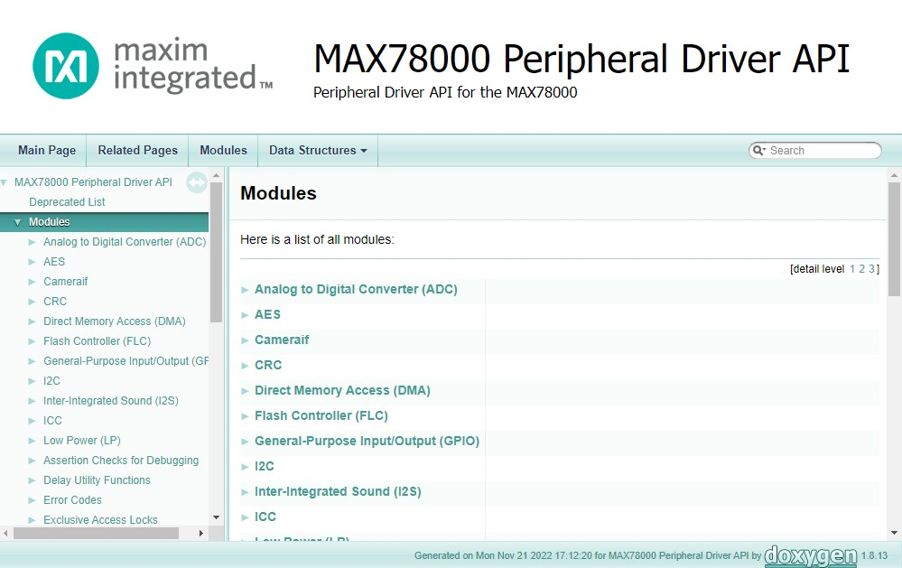

# Libraries

The MSDK contains a large number of libraries, both third-party and in-house. The main library is the [Peripheral Driver API](#peripheral-driver-api), but the MSDK also contains drivers for various _external_ components such as TFT displays, cameras, accelerometers, audio codecs, and other devices. Additionally, dedicated libraries for more complex _internal_ hardware peripherals such as USB, the SDHC interface, and the Cordio BLE stack are also available. These usually build on _top_ of the Peripheral Driver API.

???+ note "ℹ️ **Note: Enabling Libraries**"
    Libraries can be enabled for a project with a convenient _toggle switch_ provided by the build system (See [Build Variables for Toggling Libraries](build-system.md#build-variables-for-toggling-libraries)).

## Peripheral Driver API

A microcontroller is made up of a Central Processing Unit (CPU) that is surrounded by additional _peripheral_ hardware blocks such as timers, memory controllers, UART controllers, ADCs, RTCs, audio interfaces, and many more. The **Peripheral Driver API** is an important core library in the MSDK that allows the CPU to utilize the microcontroller's hardware blocks over a higher-level **_Application Programming Interface (API)_**.



### API Documentation (PeriphDrivers)

The links below will open detailed API references for each microcontroller. Offline copies of these API references can also be found in the `Documentation` folder of the MSDK installation.

- [MAX32520 API](../Libraries/PeriphDrivers/Documentation/MAX32520/index.html)

- [MAX32650 API](../Libraries/PeriphDrivers/Documentation/MAX32650/index.html)

- [MAX32655 API](../Libraries/PeriphDrivers/Documentation/MAX32655/index.html)

- [MAX32660 API](../Libraries/PeriphDrivers/Documentation/MAX32660/index.html)

- [MAX32665-MAX32666 API](../Libraries/PeriphDrivers/Documentation/MAX32665/index.html)

- [MAX32670 API](../Libraries/PeriphDrivers/Documentation/MAX32670/index.html)

- [MAX32672 API](../Libraries/PeriphDrivers/Documentation/MAX32672/index.html)

- [MAX32675 API](../Libraries/PeriphDrivers/Documentation/MAX32675/index.html)

- [MAX32680 API](../Libraries/PeriphDrivers/Documentation/MAX32680/index.html)

- [MAX32690 API](../Libraries/PeriphDrivers/Documentation/MAX32690/index.html)

- [MAX78000 API](../Libraries/PeriphDrivers/Documentation/MAX78000/index.html)

- [MAX78002 API](../Libraries/PeriphDrivers/Documentation/MAX78002/index.html)

### PeriphDrivers Organization

The Peripheral Driver API's source code is organized as follows:

- **Header files _(.h)_** can be found in the `Libraries/PeriphDrivers/Include` folder.
    - These files contain function _declarations_ for the API, describing the function prototypes and their associated documentation.
- **Source files _(.c)_** can be found in the `Libraries/PeriphDrivers/Source` folder.
    - These files contain the function _definitions_ for the API - the _implementations_ of the functions declared by the header files.

The _**implementation**_ files are further organized based on _**die type**_ and **_hardware revision_**. This is worth noting when browsing or debugging through the drivers.

- The **_die type_** files follow the **`_ESXX`** , **`_MEXX`** , or **`_AIXX`** naming convention.
    - These files' responsibility is to manage microcontroller-specific implementation details that may interact with other peripheral APIs _before_ ultimately calling the revision-specific files.  See [Die Types to Part Numbers](#die-types-to-part-numbers)

- The **_hardware revision_** files follow the **`_revX`** naming convention.
    - These files contain the _pure_ driver implementation for a peripheral block and typically interact with the hardware almost entirely at the register level.

### Die Types to Part Numbers

The following table matches external part numbers to internal die types.  This is useful for browsing through the PeriphDrivers source code, which uses the die types.

- ???+ note "ℹ️ **Note: Die Types Table**"

    | Part Number | Die Type |
    | -------- | ----------- |
    | MAX32520 | ES17 |
    | MAX32570 | ME13 |
    | MAX32650 | ME10 |
    | MAX32655 | ME17 |
    | MAX32660 | ME11 |
    | MAX32662 | ME12 |
    | MAX32665 | ME14 |
    | MAX32670 | ME15 |
    | MAX32672 | ME21 |
    | MAX32675 | ME16 |
    | MAX32680 | ME20 |
    | MAX32690 | ME18 |
    | MAX78000 | AI85 |
    | MAX78002 | AI87 |

### `MSDK_NO_GPIO_CLK_INIT`

Most Peripheral Driver initialization routines involve enabling system clocks, setting clock dividers, and configuring GPIO pins.  In some cases (such as for Zephyr), frameworks or tools offer their own mechanisms for handling this, or it's desirable to manually handle it in custom application code.  

The MSDK offers a mechanism for disabling the automatic initialization of clocks and GPIO pins via the `MSDK_NO_GPIO_CLK_INIT` compiler definition.  To enable this for a project, add it via the `PROJ_CFLAGS` [build configuration variable](build-system.md#build-variables-for-the-compiler) using the following syntax:

```Makefile
#project.mk

PROJ_CFLAGS += -DMSDK_NO_GPIO_CLK_INIT
```

???+ note "ℹ️ **Syntax Note:**"
    The `-D` flag tells the compiler to define a symbol at compile-time.  It should be followed by the symbol we wish to define.  In this case, `MSDK_NO_GPIO_CLK_INIT`.

#### Peripheral Driver Build Variables

| Configuration Variable | Description                                                | Details                                                      |
| ---------------------- | ---------------------------------------------------------- | ------------------------------------------------------------ |
|                        |                                                            |                                                              |
| `PINS_FILE`               | Override pin definitions                   | This option can be used to override the default GPIO definitions used by the peripheral drivers, which can be found in the `Libraries/PeriphDrivers/Source/SYS/pins_xx.c` files in the MSDK.  The file specified by this option will be passed to the build instead of the default.  It's suggested to copy the default file first as a template before making modifications.  |

---

## CMSIS-DSP

The CMSIS-DSP library provides a suite of common **Digital Signal Processing _(DSP)_** functions that take advantage of hardware accelerated _Floating Point Unit (FPU)_ available on microcontrollers with Arm Cortex-M cores. This library is distributed in the MSDK as a pre-compiled static library file, and the MSDK maintains a port of the official code examples in the **ARM-DSP** [Examples](https://github.com/analogdevicesinc/msdk/tree/main/Examples) folder for each microcontroller.

Please refer to the [CMSIS-DSP official documentation](https://arm-software.github.io/CMSIS-DSP/v1.16.2/index.html) for more detailed documentation on the library functions and usage.

### CMSIS-DSP Supported Parts

- All microcontrollers with a Cortex M4 core are supported.

### CMSIS-DSP Build Variables

| Configuration Variable | Description                                                | Details                                                      |
| ---------------------- | ---------------------------------------------------------- | ------------------------------------------------------------ |
|                        |                                                            |                                                              |
| `CMSIS_DSP_VERSION`    | (Optional) Set the CMSIS-DSP version to use.               | Defaults to `1.16.2`, which is currently the only supported version. |

---

## Cordio Bluetooth Low Energy

The Cordio Bluetooth Low Energy (BLE) library provides a full BLE stack for microcontrollers with an integrated BLE controller.

The Cordio library warrants its own separate documentation. See the **[Cordio BLE User Guide](../Libraries/Cordio/docs/CORDIO_USERGUIDE.md)**.

### Cordio Supported Parts

- MAX32655
- MAX32665
- MAX32680
- MAX32690

---

## MAXUSB

The MAXUSB library provides a higher-level interface for utilizing the built-in USB controller hardware available on some microcontrollers. This allows the microcontroller to enumerate as a USB device without the need for an external USB controller IC. MAXUSB provides a finer level of control of USB events and classes than TinyUSB.

### MAXUSB Supported Parts

- MAX32570
- MAX32650
- MAX32655 and MAX32656
- MAX32665-MAX32666
- MAX32690
- MAX78002

---

## TinyUSB

The TinyUSB library provides a high-level interface for utilizing the built-in USB controller hardware available on some microcontrollers. This allows the microcontroller to enumerate as a USB device without the need for an external USB controller IC. **[TinyUSB](https://github.com/hathach/tinyusb) provides a cross-platform USB stack for embedded systems, with a higher level of abstraction than MAXUSB,
supporting most standard USB device classes.

### TinyUSB Supported Parts

- MAX32650
- MAX32665-MAX32666
- MAX32690
- MAX78002

---

## Miscellaneous Drivers

The `Libraries/MiscDrivers` folder of the MSDK contains drivers for miscellaneous external components such as TFT displays, cameras, audio codecs, PMICs, pushbuttons, etc. These resources are usually closely tied with the [Board Support Packages](board-support-pkgs.md).

### Miscellaneous Build Variables

| Configuration Variable | Description                                                | Details                                                      |
| ---------------------- | ---------------------------------------------------------- | ------------------------------------------------------------ |
|                        |                                                            |                                                              |
| `CAMERA`               | (Optional) Set the Camera drivers to use                   | This option is only useful for the MAX78000 and MAX78002 and sets the camera drivers to use for the project. Permitted values are `HM01B0`, `HM0360_MONO`, `HM0360_COLOR`, `OV5642`, `OV7692` (default), or `PAG7920`. Camera drivers can be found in the `Libraries/MiscDrivers/Camera` folder. Depending on the selected camera, a compiler definition may be added to the build. See the `board.mk` file for the active BSP for more details. |

---

## SDHC

The **Secure Digital High Capacity _(SDHC)_** library offers a higher-level interface built on top of the SDHC [Peripheral Driver API](#peripheral-driver-api) that includes a [FatFS File System](http://elm-chan.org/fsw/ff/00index_e.html) implementation for managing files on SD cards.

See [Build Variables for Toggling Libraries](build-system.md#build-variables-for-toggling-libraries) for instructions on enabling the SDHC library.

### SDHC Supported Parts

- MAX32650
- MAX32570
- MAX32665-MAX32666
- MAX78000
- MAX78002

### SDHC Build Variables

Once enabled, the following [build configuration variables](build-system.md#build-configuration-variables) become available.

| Configuration Variable | Description                                                | Details                                                      |
| ---------------------- | ---------------------------------------------------------- | ------------------------------------------------------------ |
| `FATFS_VERSION`            | Specify the version of [FatFS](http://elm-chan.org/fsw/ff/00index_e.html) to use | FatFS is a generic FAT/exFAT filesystem that comes as a sub-component of the SDHC library.  This variable can be used to change the [version](http://elm-chan.org/fsw/ff/updates.html) to use.  Acceptable values are `ff13` (R0.13), `ff14` (R0.14b), or `ff15` (R0.15) |
| `SDHC_CLK_FREQ`            | Sets the clock freq. for the SDHC library (Hz) | Sets the target clock frequency in units of Hz (Default is 30Mhz).  Reducing the SDHC clock frequency is a good troubleshooting step when debugging communication issues. |
| `FF_CONF_DIR`            | Sets the search directory for `ffconf.h` | (Available for `FATFS_VERSION = ff15` only) FatFS configuration is done via an `ffconf.h` file.  This option allows specifying the location of a custom `ffconf.h` file for a project. |

---

## FreeRTOS

[FreeRTOS](https://www.freertos.org/index.html) is a Real-Time Operating System (RTOS), which offers basic abstractions for multi-tasking and an OS layer specifically targeted at embedded systems with real-time requirements.  The MSDK maintains an official support layer for the FreeRTOS kernel.  Official documentation can be found on the [FreeRTOS website](https://www.freertos.org/index.html).

### FreeRTOS Supported Parts

FreeRTOS is supported by all parts in the MSDK.  See the `FreeRTOSDemo` example application.

### FreeRTOS Build Variables

| Configuration Variable | Description                                                | Details                                                      |
| ---------------------- | ---------------------------------------------------------- | ------------------------------------------------------------ |
| `FREERTOS_HEAP_TYPE`            | Specify the method of heap allocation to use for the FreeRTOS API | FreeRTOS provides options for the heap management alogirthms to optimize for memory size, speed, and risk of heap fragmentation. For more details, visit the [FreeRTOS MemMang Docs](https://www.freertos.org/a00111.html).  Acceptable values are `1`, `2`, `3`, `4`, or `5`. The default value is `4` for heap_4. |

### FreeRTOS-Plus

[FreeRTOS-Plus](https://www.freertos.org/FreeRTOS-Plus/index.html) is an additional library that implements addon functionality for the FreeRTOS kernel.  The MSDK maintains support for some, but not all, available addons.

- [FreeRTOS-Plus-CLI](https://www.freertos.org/FreeRTOS-Plus/index.html): **Supported**
- [FreeRTOS-Plus-TCP](https://www.freertos.org/FreeRTOS-Plus/FreeRTOS_Plus_TCP/index.html): **Not supported** (Contributions welcome!)

## CLI

Developing a UART Command-Line Interface (CLI) is a common task while developing embedded firmware. The MSDK contains a pre-made command processing library in the `Libraries/CLI` that can be used to simplify and speed up development.

See the [`Libraries/CLI/README.md`](../Libraries/CLI/README.md) document for more details.

## CoreMarkS

[EEMBC’s CoreMark®](https://www.eembc.org/coremark/) is a benchmark that measures the performance of microcontrollers (MCUs) and central processing units (CPUs) used in embedded systems. CoreMark is a simple, yet sophisticated benchmark that is designed specifically to test the functionality of a processor core. Running CoreMark produces a single-number score allowing users to make quick comparisons between processors.

### CoreMark Supported Parts

All parts in the MSDK support the Coremark library via a `Coremark` example application.

???+ note "ℹ️ **Note**"
    The source code of the `Coremark` examples are somewhat unique.  They only contain a `core_portme.c`/`core_portme.h`.  These files are provided by CoreMark libraries to give the MSDK an implementation layer for a few hardware-dependent functions.  Otherwise, the remainder of the source code (located in `Libraries/Coremark`) must remain unmodified to comply with the CoreMark rules.

## Unity Test Framework

The [Unity Test Project](https://github.com/ThrowTheSwitch/Unity) is a simple unit testing framework for C.  It can be used to run hardware-in-the-loop tests on MSDK microcontrollers, as well as more individual unit tests compiled and run on a developer's host machine to test less hardware-dependent software abstractions.

See [Build Variables for Toggling Libraries](build-system.md#build-variables-for-toggling-libraries) for instructions on enabling the Unity Test framework.

### Unity Test Supported Parts

- All

### Running Tests on a Target Micro

The following code snippet shows how a simple sequence of tests might be run on a target microcontroller using the Unity test library.  Once unity is [enabled](build-system.md#build-variables-for-toggling-libraries), including the `"unity.h"` header file grants access to useful assertions and macros.  The project can then be [built and run](visual-studio-code.md#flash-run) like any other MSDK project.

```C
#include "unity.h"

// *****************************************************************************
int main(void)
{
    UnityBegin(__FILE__);

    Unity.NumberOfTests++;
    TEST_ASSERT_EQUAL(1 + 1, 2);

    Unity.NumberOfTests++;
    TEST_ASSERT_NOT_EQUAL(1 + 1, 0);

    return (UnityEnd());
}
```

The results of the test will be sent to the microcontroller's serial console output (defined by `CONSOLE_UART` in the [BSP](board-support-pkgs.md)), and can be viewed from a serial terminal.

```serial
-----------------------
2 Tests 0 Failures 0 Ignored 
OK
```

For a more comprehensive list of available assertions see the [Unity Assertions Documentation](https://github.com/ThrowTheSwitch/Unity/blob/master/docs/UnityAssertionsReference.md).

### Running Tests on a Host Machine

When the Unity Test framework is enabled, a new build target `test` becomes available.  When `make test` is run, it compiles the source code in the `test` sub-folder of the current project into a single binary that will run on the developer's host PC.  The test results are printed to the screen and a non-zero return code is passed to the host process in the case of any failures.  Currently, the tools are set up to do this with GCC.

This is useful for developing unit-level testing for more abstract software.

For example, assume there is a simple function for adding two `uint8_t` in the current project that we would like to unit test.

```C
// simple_code.c
#include <stdint.h>

uint8_t simple_add(uint8_t x, uint8_t y)
{
    return x + y;
}
```

In the `test` folder of our project, we can implement the following tests in a file called `test_functions.c`

```C
// test/test_functions.c
#include <stdint.h>
#include "unity.h"

// Adding an 'extern' declaration of the function to test gets this file access to it 
extern uint8_t simple_add(uint8_t x, uint8_t y);

// Utility functions for unit testing setup/clean-up.  Empty for this simple example.
void setUp(void) {}
void tearDown(void) {}

// Validate that 'simple_add' 3+4 == 7
void test_simple_add_ok(void)
{
    TEST_ASSERT_EQUAL(7, simple_add(3, 4));
}

// Check if 'simple_add' 3+4 == -1
// In this case, we expect this to fail since we are using uint8_t
void test_simple_add_fail(void)
{
    TEST_ASSERT_EQUAL(-1, simple_add(3, -4));
}
```

A top-level `main` function for driving these test functions also needs to be written.  Unity features scripts for generating these top-level functions automagically (see the [Unity Helper Scripts Guide](https://github.com/ThrowTheSwitch/Unity/blob/master/docs/UnityHelperScriptsGuide.md)), or they can be written manually.  For this example, the output of the helper script looks as follows and is saved to the `test/test_runner.c` file.

```C
// test/test_runner.c
/* AUTOGENERATED FILE. DO NOT EDIT. */

/*=======Test Runner Used To Run Each Test Below=====*/
#define RUN_TEST(TestFunc, TestLineNum)            \
    {                                              \
        Unity.CurrentTestName = #TestFunc;         \
        Unity.CurrentTestLineNumber = TestLineNum; \
        Unity.NumberOfTests++;                     \
        if (TEST_PROTECT()) {                      \
            setUp();                               \
            TestFunc();                            \
        }                                          \
        if (TEST_PROTECT()) {                      \
            tearDown();                            \
        }                                          \
        UnityConcludeTest();                       \
    }

/*=======Automagically Detected Files To Include=====*/
#include "unity.h"
#include <setjmp.h>
#include <stdio.h>

/*=======External Functions This Runner Calls=====*/
extern void setUp(void);
extern void tearDown(void);
extern void test_simple_add_ok(void);
extern void test_simple_add_fail(void);

/*=======Test Reset Option=====*/
void resetTest(void);
void resetTest(void)
{
    tearDown();
    setUp();
}

/*=======MAIN=====*/
int main(void)
{
    UnityBegin("test_functions.c");
    RUN_TEST(test_simple_add_ok, __LINE__);
    RUN_TEST(test_simple_add_fail, __LINE__);

    return (UnityEnd());
}
```

Let's also assume that the source code for `simple_add` exists in a file `simple_code.c` in the root directory of the project.  We'll need to add it to the host machine's build with the `TEST_SRCS` [build configuration variable](build-system.md#build-configuration-variables).  So `project.mk` would look like this:

```Makefile
# This file can be used to set build configuration
# variables.  These variables are defined in a file called 
# "Makefile" that is located next to this one.

# For instructions on how to use this system, see
# https://analogdevicesinc.github.io/msdk/USERGUIDE/#build-system

# **********************************************************

# Add your config here!
LIB_UNITY = 1

# Add 'simple_code.c' to the compilation list for any host-side tests run on `make test`
# Everything else in the 'test' folder will get added automatically.
TEST_SRCS += simple_code.c
```

Now, running `make test` will result in the following output:

```serial
~/repos/msdk/Examples/MAX32690/Unity_Test (feat/unity*) » make test
Loaded project.mk
****************************************************************************
* Analog Devices MSDK
* v2024_02-78-g7542d6f98e
* - User Guide: https://analogdevicesinc.github.io/msdk/USERGUIDE/
* - Get Support: https://www.analog.com/support/technical-support.html
* - Report Issues: https://github.com/analogdevicesinc/msdk/issues
* - Contributing: https://analogdevicesinc.github.io/msdk/CONTRIBUTING/
****************************************************************************
- MKDIR /home/jhcarter/repos/msdk/Examples/MAX32690/Unity_Test/build/unittest
- CC /home/jhcarter/repos/msdk/Examples/MAX32690/Unity_Test/build/unittest/max32690_unittest
- RUN /home/jhcarter/repos/msdk/Examples/MAX32690/Unity_Test/build/unittest/max32690_unittest
test_functions.c:42:test_simple_add_ok:PASS
test_functions.c:15:test_simple_add_fail:FAIL: Expected -1 Was 255

-----------------------
2 Tests 1 Failures 0 Ignored 
FAIL
make: *** [/home/jhcarter/repos/msdk/Libraries/Unity/unity.mk:78: test] Error 1
```

The output shows `simple_add` behaves as expected for `3+4`, but not for `3+(-4)`.  In this case, the unit testing has caught 8-bit overflow on the unsigned `uint8_t` type.  This demonstrates the value of implementing unit tests, as well as a case where the tests can be run more generically on a host platform, independent of the target microcontroller's hardware.

For additional documentation, see the [Unity Getting Started Guide](https://github.com/ThrowTheSwitch/Unity/blob/master/docs/UnityGettingStartedGuide.md)

### Unity Build Configuration Variables

| Configuration Variable | Description                                                | Details                                                      |
| ---------------------- | ---------------------------------------------------------- | ------------------------------------------------------------ |
| `TEST_CC`              | Compiler to use for targeting the native host machine      | This option sets the compiler to use when running `make test` to run unit tests on the host machine.  It defaults to `gcc`. |
| `TEST_BUILD_DIR`       | Build output directory for `make test`                     | This option sets the build output directory when running `make test`.  It defaults to a `build/unittest` folder inside the current project. |
| `TEST_SRC_DIR`         | Where to look for source files for `make test`             | When `make test` is run, the path specified by this option will be non-recursively searched for `.c` files to compile into the native host's unit test program.  It defaults to the `test` folder inside the current project. |
| `TEST_OUTPUT_BINARY`   | Set the output filename when `make test` is run | When `make test` is run, the output binary will be saved to `$(TEST_BUILD_DIR)/$(TEST_OUTPUT_BINARY)` which may vary from project to project.  This option can be used to solidify the output filename for integration with automated CI/CD workflows. |
