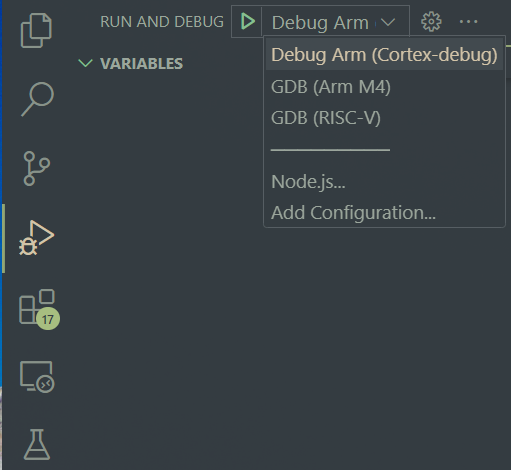
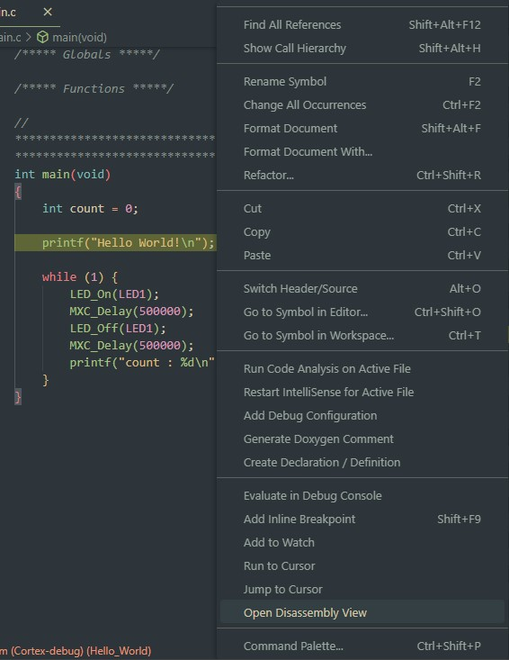

# Visual Studio Code

Support for [Visual Studio Code](https://code.visualstudio.com/) is maintained for the MSDK and developed on the [VSCode-Maxim](https://github.com/analogdevicesinc/VSCode-Maxim) GitHub repository.

For setup/quick-start instructions, see ["Getting Started with Visual Studio Code"](getting-started.md#getting-started-with-visual-studio-code) first. This section offers detailed usage info focusing on the typical development cycle.

## Opening Example Projects

Visual Studio Code is built around a "working directory" paradigm. The editor is always rooted in a working directory, and the main mechanism for changing that directory is **File -> Open Folder...**

As a result, you'll notice that there is no "New Project" mechanism. A "project" in VS Code is simply a folder. It will look inside the opened folder for a `.vscode` _sub_-folder to load project-specific settings from.

_(Note:  You may need to enable viewing of hidden items in your file explorer to see the .vscode sub-folder)._

To open a project:

1. Launch Visual Studio Code.

2. Select **File -> Open Folder...**

    

3. Navigate to an example project for the target microcontroller in the MSDK's `Examples` folder.

    

    ???+ warning "**⚠️ Copying Examples**"
        It's strongly recommended to copy example projects to an _outside_ folder before modifying them.  This keeps the MSDK's "source" copy preserved for reference.  Project folders must be copied to a location _without_ any spaces in its filepath.

4. VS Code will prompt for trust the first time. Select _Trust folder and enable all features_

    

5. The opened project should look something like this.

    

6. Verify the **_Board Support Package_** for the project is set correctly.

## How to Set the BSP (VS Code)

To set the BSP for an open project:

1. Set the `"board"` [project configuration](https://github.com/analogdevicesinc/VSCode-Maxim/tree/main#project-configuration) option in `.vscode/settings.json`, which maps to the `BOARD` _[Build Configuration Variable](build-system.md#build-tables)_.

    See [Board Support Packages](board-support-pkgs.md) for a table of possible values.

    

2. **Reload the VS Code window** to re-index its Intellisense engine.

    VS Code can be conveniently reloaded with the **Reload Window** developer command accessed with **`CTRL + SHIFT + P`** (or **`COMMAND + SHIFT + P`** on MacOS).

    

## Build Tasks

Once a project is opened 4 available build tasks will become available via `Terminal > Run Build task...` or the shortcut `Ctrl+Shift+B`.  These tasks are configured by the `.vscode/task.json` file.

### Build

* Compiles the code with a `make all` command.
* Additional options are passed into Make on the command-line based on the project's settings.json file.
* The `./build` directory will be created and will contain the output binary, as well as all intermediary object files.
* Notice the **`TARGET`**, **`BOARD`** , and **`PROJECT`** Build Configuration Variables being set on the command line, and the program binary successfully compiled into the `.elf` program binary in the **build** sub-folder of the project.

    

### Clean

* Cleans the build output, removing the `./build` directory and all of its contents.

### Clean-Periph

* This task is the same as 'clean', but it also removes the build output for the MSDK's peripheral drivers.
* Use this if you would like to recompile the peripheral drivers from source on the next build.

### Flash

* Launching this task automatically runs the `Build` task first.  Then, it flashes the output binary to the microcontroller.
* It uses the GDB `load` and `compare-sections` commands, and handles launching an OpenOCD internally via a pipe connection.
* The flashed program will be halted until the microcontroller is reset, power cycled, or a debugger is connected.
* A debugger must be connected correctly to use this task.  Refer to the datasheet of your microcontroller's evaluation board for instructions.

### Flash & Run

* This is the same as the `Flash` task, but it also will launch execution of the program once flashing is complete.

### Erase Flash

* Completely erases all of the application code in the flash memory bank.
* Once complete, the target microcontroller will be effectively "blank".
* This can be useful for recovering from Low-Power (LP) lockouts, bad firmware, etc.

## Flashing and Debugging

This section assumes a debugger is connected between the host PC and the evaluation platform. For more detailed instructions on this hardware setup, refer to the evaluation platform's Datasheet and Quick-Start Guide, which are available on its [analog.com](https://analog.com) product page.

### Arm Core Debugging

1. Run the **`flash`**  [build task](#build-tasks).  Running this task will automatically build the project if needed, flash the program binary, and halt the program execution to await a debugger connection.

    **Flashing does not happen automatically when launching the debugger**. This is an intentional design choice for VS Code to allow the debugger to quickly restart the program under debug without a lengthy re-flash procedure.

    

2. Open the **Run and Debug** window (**`CTRL+SHIFT+D`**) and select the `Debug Arm (Cortex-debug)` profile.

    

    

3. Verify the program counter enters `main` successfully.

    

4. Press **Continue** (**`F5`**) to run the program.  The debugger control bar can be used to exercise the debugger further.

    

        Continue | Step Over | Step Into | Step Out | Restart | Stop

### Breakpoints

Breakpoints can be set by clicking next to a line number in VS Code's editor. They are removed by clicking on them again.

Additionally _conditional_ breakpoints can be added by _right-clicking_ on a line.

The condition and condition type can be modified with the dropdown. This is useful for setting a breakpoint on a certain value in a `for` loop iterator or when a specific bit in a register is set, for example.

### Peripheral Browsing

A peripheral browser lets you quickly view the formatted register-level contents of the peripheral blocks on a target microcontroller under debug.

As of the [v1.6.0](https://github.com/analogdevicesinc/VSCode-Maxim/releases/tag/v1.6.0) VSCode-Maxim project files, pre-made [Cortex-Debug](https://marketplace.visualstudio.com/items?itemName=marus25.cortex-debug) launch profiles are included in each project.  These profiles enable peripheral browsing via an embedded "Cortex Peripherals"window.

Alternatively, _watch expressions_ can be used.  These can be set for registers and variables. (For example, the `sysctrl` register below).

* Adding **`,b`** lets you print out the value in **binary**
* Adding **`,x`** prints the value in **hex**.
* Standard **logical** and **bitwise** operations are supported inside the watch expression.
* **Register** and **variable** values can be **modified** through these same watch-points.  _(Right click -> Set Value)_

It should be noted that the debugger's watch points are _contextual, meaning that its symbol look-ups will depend on the active point in your program.

### Disassembly View

Stepping through disassembly is supported and enabled by the [Cortex-Debug](https://marketplace.visualstudio.com/items?itemName=marus25.cortex-debug) launch profile.

To open the disassembly view:

1. [Launch a debug session](#arm-core-debugging) with the `Debug Arm (Cortex-Debug)` profile.

2. Open the developer command prompt with `CTRL + SHIFT + P`.

3. Run the "Open Disassembly View" developer command.

    

    Alternatively, right-click -> "Open Disassembly View"

    

4. The debugger will step through whichever window has the active focus.  Set the focus to the disassembly window to step through the assembly code.

See the [Cortex-Debug Wiki](https://github.com/Marus/cortex-debug/wiki/Disassembly-Debugging) for more details.

### Dual Core Debugging

For microcontrollers with _both_ an Arm M4 and a RISC-V core, the _GDB (RISC-V)_ launch profile is provided to enable RISC-V debugging.

???+ note "ℹ️ **Note**"
    The RISC-V core requires setup and handoff from the Arm M4 core. As a result, this is an advanced configuration requiring a unique combination of the project's source code, Makefiles, and VSCode-Maxim project settings. Such projects are appended with the `-riscv` suffix in the project's folder name.

This section demonstrates how to debug `-riscv` projects in VS Code using the mnist-riscv project for the MAX78000 as an example. Example files are located in the `Examples/MAX78000/CNN/mnist-riscv` directory.

1. Connect _both_ your Arm (SWD) and RISC-V (JTAG) debuggers. VSCode-Maxim projects come pre-configured to use the [ARM-USB-OCD-H](https://www.olimex.com/Products/ARM/JTAG/ARM-USB-OCD-H/) + [ARM-JTAG-20-10](https://www.olimex.com/Products/ARM/JTAG/ARM-JTAG-20-10/) adapters for the RISC-V JTAG port. Ex:

    

    ???+ warning "**⚠️ Olimex Drivers**"
        If connection issues occur with the Olimex adapter, verify that the drivers are installed correctly.  See Section 3.3.3 of the [Olimex User Manual](https://www.olimex.com/Products/ARM/JTAG/_resources/ARM-USB-OCD_and_OCD_H_manual.pdf).  The [Zadig](https://zadig.akeo.ie/) tool to install WinUSB drivers.

2. [Open](#opening-example-projects) the project in VS Code.

3. Run the "Flash" task.

    

4. Launch the debugger using the **Debug Arm (Cortex-Debug)** or **GDB (Arm M4)** profile **first**:

    

    ... which should hit the breakpoint in `main.c`...
    

5. **Continue** the debugger.  The code in `main.c` will boot up the RISC-V core. You can optionally set a breakpoint on `WakeISR` to see when the RISC-V core has signaled it's ready.

    

6. Now, switch the debugger profile to the **GDB (RISC-V) profile** and launch it. This will launch an additional instance on a separate port and connect to the Olimex adapter.

    

    ???+ note "ℹ️ **Note: Signal 0 Exception**"
        The "Signal 0" exception below is a known issue caused by a signaling mismatch between the RISC-V core and VS Code's debugger engine. The exception message is harmless and can be safely ignored.

        

7. From here, the debugger should be fully functional. The Arm vs. RISC-V debugger instance can be selected with the dropdown on the debugger control bar.

    

## Project Settings

`.vscode/settings.json` is the main project configuration file.  Values set here are parsed into the other .json config files.

**When a change is made to this file, VS Code should be reloaded with CTRL+SHIFT+P -> Reload Window (or alternatively restarted completely) to force a re-parse.**

The default project configuration should work for most use cases as long as [`"target"`](#target) and [`"board"`](#board) are set correctly.

???+ note "ℹ️ **Note**"
    Any field from `settings.json` can be referenced from any other VS Code config file (including itself) with `"${config:[fieldname]}"`

The following configuration options are available:

### `"MAXIM_PATH"`

* This option must point to the root installation directory of the MSDK.
* It should be placed in the _global_ user settings.json file during first-time VSCode-Maxim setup.  See [Getting Started with Visual Studio Code](getting-started.md#getting-started-with-visual-studio-code).

### `"target"`

* This sets the target microcontroller for the project.
* It sets the `TARGET` [Build Configuration](build-system.md#build-configuration-variables) variable.

### `"board"`

* This sets the target board for the project (ie. Evaluation Kit, Feather board, etc.)
* See [How to Set the BSP (VS Code)](#how-to-set-the-bsp-vs-code)

### `"terminal.integrated.env.[platform]:Path"`

* This prepends the location of the MSDK toolchain binaries to the system `Path` used by VSCode's integrated terminal.
* The Path is not sanitized by default, which means that the terminal inherits the system path.

### `"project_name"`

* Sets the name of project.  This is used in other config options such as `program_file`.
* Default value: `"${workspaceFolderBasename}"`

### `"program_file"`

* Sets the name of the file to flash and debug.  This is provided in case it's needed, but for most use cases should be left at its default.
* File extension must be included.
* Default value: `"${config:project_name}.elf"`

### `"symbol_file"`

* Sets the name of the file that GDB will load debug symbols from.
* File extension must be included.
* Default value: `"${config:program_file}"`

### `"M4_OCD_interface_file"`

* Sets the OpenOCD interface file to use to connect to the Arm M4 core.  This should match the debugger being used for the M4 core.
* The `MaximSDK/Tools/OpenOCD/scripts/interface` folder is searched for the file specified by this setting.
* `.cfg` file extension must be included.
* Default value: `"cmsis-dap.cfg"`

### `"M4_OCD_target_file"`

* Sets the OpenOCD target file to use for the Arm M4 core.  This should match the target microcontroller.
* `.cfg` file extension must be included.
* The `MaximSDK/Tools/OpenOCD/scripts/target` folder is searched for the file specified by this setting.
* Default value: `"${config:target}.cfg"`

### `"RV_OCD_interface_file"`

* Sets the OpenOCD interface file to use to connect to the RISC-V core.  This should match the debugger being used for the RISC-V core.
* The `MaximSDK/Tools/OpenOCD/scripts/interface` folder is searched for the file specified by this setting.
* `.cfg` file extension must be included.
* Default value: `"ftdi/olimex-arm-usb-ocd-h.cfg"`

### `"RV_OCD_target_file"`

* Sets the OpenOCD target file to use for the RISC-V core.
* The `MaximSDK/Tools/OpenOCD/scripts/target` folder is searched for the file specified by this setting.
* `.cfg` file extension must be included.
* Default value: `"${config:target}_riscv.cfg"`

### `"v_Arm_GCC"`

* Sets the version of the Arm Embedded GCC to use, including toolchain binaries and the standard library version.
* This gets parsed into `ARM_GCC_path`.
* Default value:  `"10.3"`

### `"v_xPack_GCC"`

* Sets the version of the xPack RISC-V GCC to use.
* This gets parsed into `xPack_GCC_path`.
* Default value: `"12.2.0-3.1"`

### `"OCD_path"`

* Where to find the OpenOCD.
* Default value: `"${config:MAXIM_PATH}/Tools/OpenOCD"`

### `"ARM_GCC_path"`

* Where to find the Arm Embedded GCC Toolchain.
* Default value: `"${config:MAXIM_PATH}/Tools/GNUTools/${config:v_Arm_GCC}"`

### `"xPack_GCC_path"`

* Where to find the RISC-V GCC Toolchain.
* Default value: `"${config:MAXIM_PATH}/Tools/xPack/riscv-none-elf-gcc/${config:v_xPack_GCC}"`

### `"Make_path"`

* Where to find Make binaries (only used on Windows)
* Default value: `"${config:MAXIM_PATH}/Tools/MSYS2/usr/bin"`

### `"C_Cpp.default.includePath"`

* Which paths to search to find header (.h) files.
* Does not recursively search by default.  To recursively search, use `/**`.

### `"C_Cpp.default.browse.path"`

* Which paths to search to find source (.c) files.
* Does not recursively search by default.  To recursively search, use `/**`.

### `"C_Cpp.default.defines"`

* Sets the compiler definitions to use for the intellisense engine.
* Most definitions should be defined in header files, but if a definition is missing it can be entered here to get the intellisense engine to recognize it.

## Setting Search Paths for Intellisense

VS Code's intellisense engine must be told where to find the header files for your source code.  By default, the MSDK's peripheral drivers, the C standard libraries, and all of the sub-directories of the workspace will be searched for header files to use with Intellisense.  If VS Code throws an error on an `#include` statement (and the file exists), then a search path is most likely missing.

To add additional search paths :

1. Open the `.vscode/settings.json` file.

2. Add the include path(s) to the `C_Cpp.default.includePath` list.  The paths set here should contain header files, and will be searched by the Intellisense engine and when using "Go to Declaration" in the editor.

3. Add the path(s) to any relevant implementation files to the `C_Cpp.default.browse.path` list.  This list contains the paths that will be searched when using "Go to Definition".

## Project Creation

### Option 1.  Copying a Pre-Made Project

Copying a pre-made example project is a great way to get rolling quickly, and is currently the recommended method for creating new projects.

The release package for this project (Located at `Tools/VSCode-Maxim` in the MSDK) contains a `New_Project` folder designed for such purposes. Additionally, any of the VS Code-enabled Example projects can be copied from the MSDK.

1. Copy the existing project folder to an accessible location.  This will be the location of your new project.

    ???+ warning "**⚠️ Warning**"
        The full path to the project must _not_ have any spaces in it.

2. (Optional) Rename the folder.  For example, I might rename the folder to `MyProject`.

3. Open the project in VS Code (`File -> Open Folder...`)

4. Set your [target](#target) microcontroller and [board](#board) correctly.

5. `CTRL+SHIFT+P -> Reload Window` to re-parse the project settings.

6. That's it!  The existing project is ready to build, debug, and modify.

### Option 2 - Injecting

VSCode-Maxim releases provide the `Inject` folder for "injecting" into an existing folder.  If you want to start from scratch or use the project files with existing source code, take this option.

1. Create your project folder if necessary.  For example, I might create a new project in a workspace folder with the path: `C:/Users/Jake.Carter/workspace/MyNewProject`.

2. Copy the **contents** of the `Inject` folder into the project folder from step 1.  The contents to copy include a `.vscode` folder, a `Makefile`, and a `project.mk` file.  For this example, the contents of the 'MyProject' folder would be the following:

        :::shell
        C:/Users/Jake.Carter/workspace/MyNewProject
        |- .vscode
        |- Makefile
        |- project.mk

3. Open the project in VS Code (`File -> Open Folder...`)

4. Set your [target](#target) microcontroller and [board](#board) correctly.

5. `CTRL+SHIFT+P -> Reload Window` to re-parse the project settings.

6. Configure the [build system](build-system.md) for use with any pre-existing source code.

7. That's it!  Your new project can now be opened with `File > Open Folder` from within VS Code.
