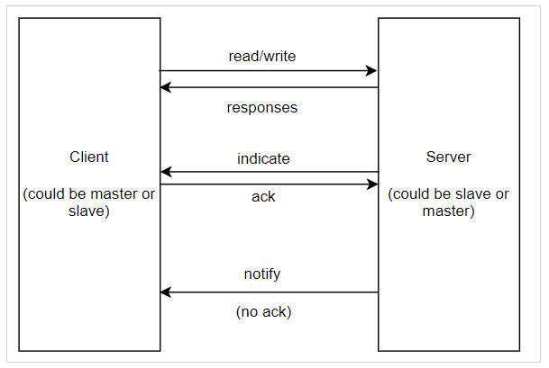

# Description

Bluetooth data client that scans for and connects to advertisers with the name of "DATS".

BLE roles are split into pre-connection and post-connection. In pre-connection, at startup a device is either a peripheral (like a Fitbit or smart watch) or a central (like a smartphone or PC). In post-connection (after a BLE connection has been established), devices can be either a client or a server.



In this application, the datc is a proprietary data client supporting proprietary profile and plays a master role. It has an auto connect feature which scans for a matching proprietary data transfer slave application (Example project BLE_dats) and then automatically connects to it.

# Usage

## LEDs

The red LED will indicate that an error assertion has occurred.  

The green LED indicates CPU activity. When the LED is on, the CPU is active, when the LED
is off, the CPU is in sleep mode.

## Setup

### Board Selection

Before building firmware you must select the correct value for BOARD in Makefile, e.g. "EvKit_V1".

### Required Connections
-   Connect a USB cable between the PC and the (USB/PWR - UART) connector.

## Trace Serial Port
When TRACE is enabled in the Makefile, the on-board USB-to-UART adapter can
be used to view the trace messages and interact with the application. Open a serial port terminal with
the following settings.

Baud            : 115200  
Char size       : 8  
Parity          : None  
Stop bits       : 1  
HW Flow Control : No  
SW Flow Control : No  

## Passkey input
Upon server dsicovery the user will be prompted to enter a passkey.
An arbitrary pin can be entered in the following format 
``` 
pin (connId) passkey
Eg: 
pin 1 123456

```
Next the server is expected to enter the same connId and passkey
to establish a secure connection and share bonding information
which for demonstration purposes,is echoed via the trace mechanism

Note that either the client or server can enter the passkey first.
The peer device must then match.


### Expected Output

On startup:
```
terminal: init
32kHz trimmed to 0xF
DatcHandlerInit
Calculating database hash
Datc got evt 32
>>> Reset complete <<<
Datc got evt 58
Database hash calculation complete
Datc got evt 21
Database hash updated
dmDevPassEvtToDevPriv: event: 13, param: 1, advHandle: 0
Datc got evt 63
Datc got evt 153
dmDevPassEvtToDevPriv: event: 12, param: 36, advHandle: 0
Datc got evt 36
>>> Scanning started <<<
```

When a scan report has been received:
```
Scan Report:                                                                  
  55:CF:67:1F:6F:27                                                           
Scan Report:                                                                  
  00:05:8B:44:12:02                                                           
  Name: Fit
```

When server has been found:
```
Scan Report:
  00:18:80:04:52:1F
  Name: DATS
dmDevPassEvtToDevPriv: event: 13, param: 37, advHandle: 0
Datc got evt 37
Scan results: 4
dmConnIdByBdAddr not found
dmConnCcbAlloc 1
>>> Scanning stopped <<<
dmConnSmExecute event=24 state=0
dmDevPassEvtToDevPriv: event: 14, param: 0, advHandle: 0
dmConnSmExecute event=28 state=1
dmDevPassEvtToDevPriv: event: 14, param: 1, advHandle: 0
dmDevPassEvtToDevPriv: event: 12, param: 39, advHandle: 0
smpDbGetRecord: connId: 1 type: 0
smpDbAddDevice
SmpDbGetFailureCount: connId: 1 count: 0
smpDbGetRecord: connId: 1 type: 0
smpDbAddDevice
SmpDbGetPairingDisabledTime: connId: 1 period: 0 attemptMult: 0
Datc got evt 39
>>> Connection opened <<<
smpSmExecute event=1 state=0
connId=1 idleMask=0x0001
Datc got evt 65
Datc got evt 22
smpSmExecute event=6 state=1
smpSmExecute event=17 state=2
smpSmExecute event=4 state=3
connId=1 idleMask=0x0001
Datc got evt 87
Datc got evt 4
connId=1 idleMask=0x0009
smpSmExecute event=6 state=4
smpSmExecute event=20 state=5
Datc got evt 46
>>> Prompt user to enter passkey <<<
Datc got evt 3
AttcDiscServiceCmpl status 0x00
Datc got evt 4
AttcDiscCharCmpl status 0x79
Datc got evt 4
AttcDiscCharCmpl status 0x79
Datc got evt 2
AttcDiscCharCmpl status 0x00
connId=1 idleMask=0x0009
Datc got evt 3
AttcDiscServiceCmpl status 0x00
Datc got evt 4
AttcDiscCharCmpl status 0x79
Datc got evt 4
AttcDiscCharCmpl status 0x00
connId=1 idleMask=0x0009
Datc got evt 3
AttcDiscServiceCmpl status 0x00
Datc got evt 4
AttcDiscCharCmpl status 0x79
Datc got evt 4
AttcDiscCharCmpl status 0x79
Datc got evt 2
AttcDiscCharCmpl status 0x00
connId=1 idleMask=0x0009
Datc got evt 3
AttcDiscServiceCmpl status 0x00
Datc got evt 4
AttcDiscCharCmpl status 0x79
Datc got evt 4
AttcDiscCharCmpl status 0x79
Datc got evt 2
AttcDiscCharCmpl status 0x79
Datc got evt 2
AttcDiscCharCmpl status 0x00
connId=1 idleMask=0x0001
AppDiscComplete connId:1 status:0x04
connId=1 idleMask=0x0009
Datc got evt 9
AttcDiscConfigCmpl status 0x79
Datc got evt 9
AttcDiscConfigCmpl status 0x79
Datc got evt 9
AttcDiscConfigCmpl status 0x79
Datc got evt 9
AttcDiscConfigCmpl status 0x00
connId=1 idleMask=0x0001
AppDiscComplete connId:1 status:0x08                                                                               
```
After entering a pin
```
pin 1 12345
> smpSmExecute event=4 state=11
Rand Na
[5fa96af9 f434b4de 3e452813 fef4f5eb]
smpSmExecute event=28 state=12
Cai
[57964640 e18b1aa1 8ea7d8b2 2eb274c3]
connId=1 idleMask=0x0001

```

Once server enters a matching pin and encrypted connection is established
```
smpSmExecute event=6 state=14
smpSmExecute event=28 state=15
Cbi
[7e2523a4 be6a8923 8ef900bf d4eaa458]
smpSmExecute event=26 state=16
Rand Na
[efb856be 61bd11a8 2dff39c0 1f5d4d91]
smpSmExecute event=28 state=12
Cai
[65f7c942 8c216010 cc73fdc9 bd21120e]
connId=1 idleMask=0x0001
smpSmExecute event=6 state=13
connId=1 idleMask=0x0001
smpSmExecute event=6 state=14
smpSmExecute event=28 state=15
Cbi
[db4858f8 33a964c1 e35ba27c 1f07e7db]
smpSmExecute event=26 state=16
Rand Na
[9904fded 40ea2bb1 dfabe4be b9bcba45]
smpSmExecute event=28 state=12
Cai
[1362d0db 074d32ea 32d0e79c 1155a20b]
connId=1 idleMask=0x0001
smpSmExecute event=6 state=13
connId=1 idleMask=0x0001
smpSmExecute event=6 state=14
smpSmExecute event=28 state=15
Cbi
[efd27c04 96ff72e0 c893bf54 9c524f0a]
smpSmExecute event=26 state=16
Rand Na
[5ba16640 fd3af1ae afc6d035 d8eb1fa5]
smpSmExecute event=28 state=12
Cai
[79603efa ad87d2cd bdc4c83b 17dcffe6]
connId=1 idleMask=0x0001
smpSmExecute event=6 state=13
connId=1 idleMask=0x0001
smpSmExecute event=6 state=14
smpSmExecute event=28 state=15
Cbi
[c1221276 73df3bf7 90e8df64 741909c1]
smpSmExecute event=26 state=16
Rand Na
[59ea06d0 760407f7 87415144 fe234a1e]
smpSmExecute event=28 state=12
Cai
[40b9915c af4a8712 c81e98f9 f197953a]
connId=1 idleMask=0x0001
smpSmExecute event=6 state=13
connId=1 idleMask=0x0001
smpSmExecute event=6 state=14
smpSmExecute event=28 state=15
Cbi
[325fe15b 5a6862e1 f4de459d 6c91c220]
smpSmExecute event=26 state=16
Rand Na
[4c56f9f9 b1d91236 8dfb81f8 b0629bb7]
smpSmExecute event=28 state=12
Cai
[c2fb6b18 63cb9311 d53c3333 0a2924cf]
connId=1 idleMask=0x0001
smpSmExecute event=6 state=13
connId=1 idleMask=0x0001
smpSmExecute event=6 state=14
smpSmExecute event=28 state=15
Cbi
[7725d42d 35f8e465 b3b6cfed 9bfe125a]
smpSmExecute event=26 state=16
Rand Na
[3909e384 45979c24 c85d36d3 fc2bd4bf]
smpSmExecute event=28 state=12
Cai
[9e570480 195412a0 07c84616 36cd6a06]
connId=1 idleMask=0x0001
smpSmExecute event=6 state=13
connId=1 idleMask=0x0001
smpSmExecute event=6 state=14
smpSmExecute event=28 state=15
Cbi
[1bce9472 21f7d6c4 4f8fe62b 91ac2271]
smpSmExecute event=26 state=16
Rand Na
[fe57e223 78ca04e3 cd13bd82 ad43289c]
smpSmExecute event=28 state=12
Cai
[42ba2b2e bd35ebe6 56c59b28 957639d2]
connId=1 idleMask=0x0001
smpSmExecute event=6 state=13
connId=1 idleMask=0x0001
smpSmExecute event=6 state=14
smpSmExecute event=28 state=15
Cbi
[a35acba5 00eba332 31442e10 aea9dacf]
smpSmExecute event=26 state=16
Rand Na
[71aa44ad abe2d668 07b79f02 d2a974dc]
smpSmExecute event=28 state=12
Cai
[5b02fce8 f92549ca 54bea290 c9fdfd1b]
connId=1 idleMask=0x0001
smpSmExecute event=6 state=13
connId=1 idleMask=0x0001
smpSmExecute event=6 state=14
smpSmExecute event=28 state=15
Cbi
[4a52c87c a504c8cf 49d9e8f0 1a69aca2]
smpSmExecute event=26 state=16
Rand Na
[0f87eb54 83f4f78b 754d2f74 1b406c0d]
smpSmExecute event=28 state=12
Cai
[16a9ba43 8c8b39d2 912f1f85 3f738170]
connId=1 idleMask=0x0001
smpSmExecute event=6 state=13
connId=1 idleMask=0x0001
smpSmExecute event=6 state=14
smpSmExecute event=28 state=15
Cbi
[b2aa1f53 802fa4ad 3e415844 4953c931]
smpSmExecute event=26 state=16
Rand Na
[466db705 9fd2d031 35759a3f 45869950]
smpSmExecute event=28 state=12
Cai
[004c8d5f 4413efb9 f60c10c2 8af82058]
connId=1 idleMask=0x0001
smpSmExecute event=6 state=13
connId=1 idleMask=0x0001
smpSmExecute event=6 state=14
smpSmExecute event=28 state=15
Cbi
[6b93dfa8 91d6bc27 fbb7142a 778d6eab]
smpSmExecute event=26 state=16
Rand Na
[4d0cfaee 277f0959 ee9ad6b5 bf89e129]
smpSmExecute event=28 state=12
Cai
[b977b373 4fdeb62d 4b9fc6dd 0cd58ccb]
connId=1 idleMask=0x0001
smpSmExecute event=6 state=13
connId=1 idleMask=0x0001
smpSmExecute event=6 state=14
smpSmExecute event=28 state=15
Cbi
[7d734f74 37d7575f 9a2176fe 9e0d7793]
smpSmExecute event=26 state=16
Rand Na
[aa704717 22c5a505 922ea504 c8f32c21]
smpSmExecute event=28 state=12
Cai
[b8db800a c2cfb643 0ad2127e 154b27e3]
connId=1 idleMask=0x0001
smpSmExecute event=6 state=13
connId=1 idleMask=0x0001
smpSmExecute event=6 state=14
smpSmExecute event=28 state=15
Cbi
[fb8bfb47 1db075d6 c10dfe20 275580a6]
smpSmExecute event=26 state=16
Rand Na
[6715c20d 284d6526 c826990b c0266d4d]
smpSmExecute event=28 state=12
Cai
[9a07bded 4652b3b3 04e58dd3 ddc41f5b]
connId=1 idleMask=0x0001
smpSmExecute event=6 state=13
connId=1 idleMask=0x0001
smpSmExecute event=6 state=14
smpSmExecute event=28 state=15
Cbi
[9b11572d 6ac46706 2a42ddf7 fa3f7eb6]
smpSmExecute event=26 state=16
Rand Na
[276b1950 0160195c 2ca2749e 04cc0bba]
smpSmExecute event=28 state=12
Cai
[7811b835 1ee6cd01 b35e0068 b0e995a2]
connId=1 idleMask=0x0001
smpSmExecute event=6 state=13
connId=1 idleMask=0x0001
smpSmExecute event=6 state=14
smpSmExecute event=28 state=15
Cbi
[febf4094 ccf93969 adc4d7e3 c3f26246]
smpSmExecute event=26 state=16
Rand Na
[31c8d021 62bd5eb6 470c008d 0f9a8f69]
smpSmExecute event=28 state=12
Cai
[6cc99436 0835e6bf b7ccd2a8 81eb7c2d]
connId=1 idleMask=0x0001
smpSmExecute event=6 state=13
connId=1 idleMask=0x0001
smpSmExecute event=6 state=14
smpSmExecute event=28 state=15
Cbi
[314f5edd e73e8b9e 865c3924 c438e032]
smpSmExecute event=26 state=16
Rand Na
[4f46b9ce 57474f8d 8d00a000 74bdea15]
smpSmExecute event=28 state=12
Cai
[baea7468 fabb299a 837bbbfb c47572e2]
connId=1 idleMask=0x0001
smpSmExecute event=6 state=13
connId=1 idleMask=0x0001
smpSmExecute event=6 state=14
smpSmExecute event=28 state=15
Cbi
[f8a46358 201aab0a ae9aae2c 0c32fb92]
smpSmExecute event=26 state=16
Rand Na
[b80a6511 3c82e7e6 055243e6 a45202a6]
smpSmExecute event=28 state=12
Cai
[24c084e8 e92b8e03 1a37f096 f4d5c31f]
connId=1 idleMask=0x0001
smpSmExecute event=6 state=13
connId=1 idleMask=0x0001
smpSmExecute event=6 state=14
smpSmExecute event=28 state=15
Cbi
[04aa43e8 dac7aa2a 490e6154 11b81966]
smpSmExecute event=26 state=16
Rand Na
[16bc0b9f a93b2745 729a08b9 85682b0d]
smpSmExecute event=28 state=12
Cai
[a5caa3a1 b7b66eaa f113972c 88645db6]
connId=1 idleMask=0x0001
smpSmExecute event=6 state=13
connId=1 idleMask=0x0001
smpSmExecute event=6 state=14
smpSmExecute event=28 state=15
Cbi
[831b8daf 7ae674d8 e2c5fbc3 9fc27be3]
smpSmExecute event=26 state=16
Rand Na
[3a8e02cf 001e84b3 08d9a24e 19ff9b18]
smpSmExecute event=28 state=12
Cai
[bf5345f1 299bca3f 0c99eac6 3ea96052]
connId=1 idleMask=0x0001
smpSmExecute event=6 state=13
connId=1 idleMask=0x0001
smpSmExecute event=6 state=14
smpSmExecute event=28 state=15
Cbi
[0a4dec2e 6aebc804 7bb1a21b aadc18c1]
smpSmExecute event=27 state=16
smpSmExecute event=25 state=19
DHKey (Shared Secret)
[7cf8b651 6c0f5bff 7d66bbf6 d8d85abd]
[0ef6bf2d 85a594d2 f55dccc3 6f98dd1d]
smpSmExecute event=28 state=20
T
[a02f2c9d 9a153f28 0bde8cb2 ab2a7b84]
smpSmExecute event=28 state=21
MAC
[66ebd01a c4818e8b 1cec71bf f0644ed9]
smpSmExecute event=28 state=22
LTK
[b4cad222 8324e2fb 71bbca0f 04bfc828]
smpSmExecute event=28 state=23
DHKey Ea
[a2925a68 0b71e9c3 065a959d 39079b01]
smpSmExecute event=28 state=24
DHKey Eb
[3ed3c373 5b99fc5e 16577603 7a1ba181]
connId=1 idleMask=0x0001
smpSmExecute event=6 state=25
connId=1 idleMask=0x0001
smpSmExecute event=8 state=34
Datc got evt 44
>>> Connection encrypted <<<
smpSmExecute event=6 state=35
smpSmExecute event=6 state=35
smpSmExecute event=12 state=35
Datc got evt 47
Datc got evt 47
smpSmExecute event=12 state=35
smpSmExecute event=12 state=35
smpSmExecute event=14 state=35
connId=1 idleMask=0x0000
Datc got evt 42
>>> Pairing completed successfully <<<
dmDevPassEvtToDevPriv: event: 13, param: 1, advHandle: 0
Datc got evt 58
Datc got evt 63
```
Simple message passing to peer:
```
btn 2 l
Long Button 2 Press
> Datc got evt 10
Datc got evt 13
hello back
```
Secure message passing to peer:
```
btn 2 m
Medium Button 2 Press
> Datc got evt 10
Datc got evt 13
>> Notification from secure data service <<<
Secure data received!

```

On PHY change request:
```
btn 1 x
XL Button 1 Press
2 MBit TX and RX PHY Requested
> Datc got evt 70
DM_PHY_UPDATE_IND - RX: 2, TX: 2
Datc got evt 65
btn 1 x
XL Button 1 Press
LE Coded S2 TX and RX PHY Requested
> Datc got evt 70
DM_PHY_UPDATE_IND - RX: 3, TX: 3
Datc got evt 65
btn 1 x
XL Button 1 Press
LE Coded S8 TX and RX PHY Requested
> Datc got evt 70
DM_PHY_UPDATE_IND - RX: 3, TX: 3
btn 1 x
XL Button 1 Press
1 MBit TX and RX PHY Requested
> Datc got evt 70
DM_PHY_UPDATE_IND - RX: 1, TX: 1
Datc got evt 65
```

Data Transfer Speed test (1M PHY):
```
btn 2 x
XL Button 2 Press
Starting speed test
...
flowDisabled=1 handle=0
flowDisabled=0 handle=0
9520000 bits transferred in 18823249 us
505757 bps
```

Data Transfer Speed test (2M PHY):
```
btn 2 x
XL Button 2 Press
Starting speed test
...
flowDisabled=1 handle=0
flowDisabled=0 handle=0
9520000 bits transferred in 9413977 us
1011262 bps
```

### Commands
Type the desired command and parameter (if applicable) and press enter to execute the command.  

__help__  Displays the available commands.  
__echo (on|off)__ Enables or disables the input echo. On by default.  
__btn (ID) (s|m|l|x)__ Simulates button presses. Example: "btn 1 s" for a short button press on button 1.  
__pin (ConnID) (Pin Code)__ Used to input the pairing pin code.  

## Push buttons
Push buttons can be used to interact with the application.

__short__       : press is less than 200 ms  
__medium__      : press is between 200 and 500 ms  
__long__        : press is between 500 and 1000 ms  
__extra long__  : press is greater than 1000 ms  

Table: Button operations
| Connection Status | Button Press        | Operation                                                    |
| ----------------- | ------------------- | ------------------------------------------------------------ |
| Disconnected      | Button 1 short      | Start/Stop scanning                                          |
|                   | Button 1 medium     | Cycle through the connection index (select connection)       |
|                   | Button 1 long       | Clear all bonding info                                       |
|                   | Button 1 extra long | Add RPAO characteristic to GAP service -- needed only when DM Privacy enabled |
|                   | Button 2 extra long | Enable device privacy -- start generating local RPAs every 15 minutes |
| Connected         | Button 1 short      | Start/Stop scanning                                          |
|                   | Button 1 medium     | Cycle through connection index (select connection)           |
|                   | Button 1 long       | Close selected connection                                    |
|                   | Button 2 short      | Request PHY change (1M-2M-S2-S8) Only for BLE5 version       |
|                   | Button 2 medium     | Send secure message to peer                                  |
|                   | Button 2 long       | Send short message to peer                                   |
|                   | Button 2 extra long | Start data transfer speed test                               |
