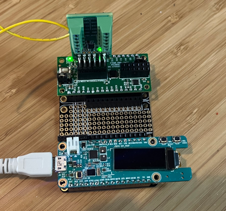
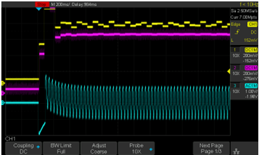
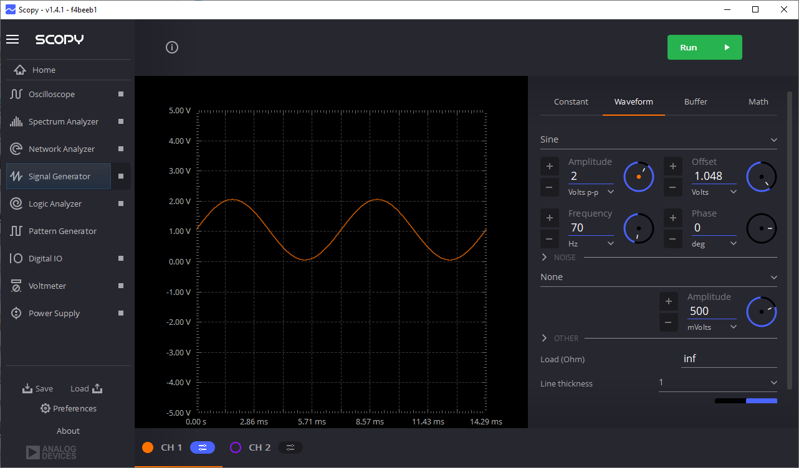
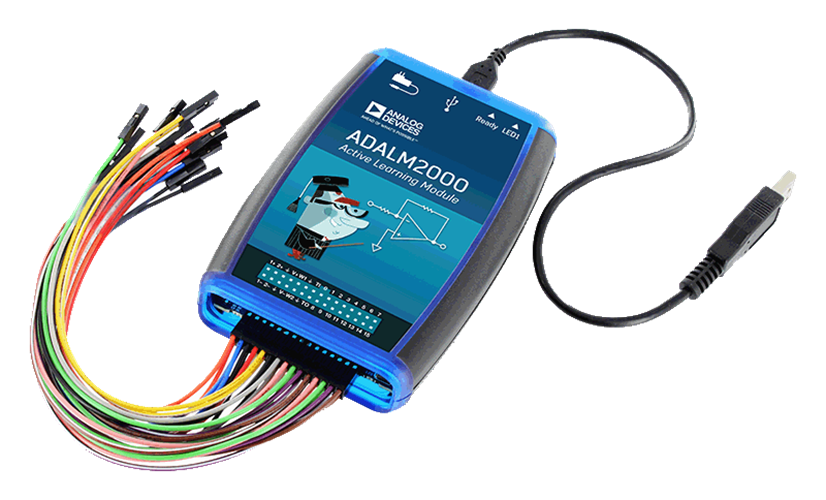

# Description

This example demonstrates utilizing the integrated ADC with DMA to continuously
sample converter data from a single channel for signal processing applications.

This application performs a simple RMS calculation on the input signals, filters
the data through a moving average filter, and optionally provides the result
via the console and/or a SPI connected AD5592r configured as a DAC.

## ADC Configuration

The internal ADC is configured to run at a sample rate of approximately 500ksps
(490196).  The ADC is configured with the internal 2.048VDC reference, and
trimmed using the defined calibration procedure.  The input features a /2, giving
an actual input range of 0 - 4.096VDC.

## ADC DMA Operation

The ADC conversion is continuous, and as a result double buffering is utilized
with the DMA engine.  To accomplish a continuous stream of data, while a block
of samples is being processed by the RMS engine, a second block is being loaded
by the DMA.  Through the use of the reload feature, the DMA engine can be
configured to continuously provide sample data to the application.

## RMS Calculation

The RMS calculation subtracts a DC offset of 2.048VDC from the sample to create
a simulated AC input signal.  For testing, all AC input signals should be centered
around a mid point 2.048VDC.  The current 'block size' for the RMS calculation
is 32768 samples, which equates to a RMS output rate of approximately 15Hz.

## AD5592r Output

To visualize the calculated RMS values, an AD5592r PMOD connected via SPI is
utilized to convert the RMS value to analog representation.

## Timing Analysis

Two GPIOs are configured for analyzing the time spent performing math operations
 * P0.6 is set high during the time the DMA IRQ is active
 * P0.7 is set high during the time the RMS calculation is being performed.

These GPIOs can be monitored with an oscilloscope to determine frequency and
active time of these functions.

# Software

## Project Usage

Universal instructions on building, flashing, and debugging this project can be found in the **[MSDK User Guide](https://analogdevicesinc.github.io/msdk/USERGUIDE/)**.

## Project-Specific Build Notes

There are several user configurable options to tailor what aspects of this
project are run.  While these #defines can be added to the source code, it
is recommended they are incorporated with PROJ_CFLAGS variable in the project.mk
file.

| Definition | Description |
| ---------- | ----------- |
| `CONSOLE_OUTPUT` | Prints the raw and filtered RMS values to the console. |
| `AD5592_OUTPUT` | Converts the raw and filtered RMS values to analog via the AD5592r. | Y |

## Required Connections

This project can run on either the MAX32672FTHR or MAX32672EVKIT.  Due to ease
of integration with the AD5592r PMOD and access to the AIN3 and GPIO pins, the
MAX32672FTHR is recommended.

When working with the CONSOLE_OUTPUT only, no additional hardware is required
to run this application.  Apply a input signal to AIN3 and observe the output
on the console.

### MAX32672FTHR & AD5592r PMOD

To view the resulting RMS value as an analog signal, the AD5592r can be utilized.

A simple setup involves the following hardware:
 * [MAX32672FTHR](https://www.analog.com/en/resources/evaluation-hardware-and-software/evaluation-boards-kits/max32672fthr.html)
 * [EVAL-AD5592R-PMDZ](https://www.analog.com/en/resources/evaluation-hardware-and-software/evaluation-boards-kits/eval-ad5592r-pmdz.html)
 * [FTHR-PMD-INTZ](https://www.analog.com/en/resources/evaluation-hardware-and-software/evaluation-boards-kits/fthr-pmd-intz.html)

The FTHR-PMD-INTZ may be joined to the MAX32672FTHR via stacking headers, or by
utilizing a 3rd party FTHR expander as shown.

## Expected Output

### CONSOLE_OUTPUT

When using the CONSOLE_OUTPUT flag, the serial console port will continuously
stream pairs of RMS data, with the first column being the raw calculated RMS and
the second being the filtered RMS via the moving average filter.  These values
are in decimal and are the same 12-bit scale as the ADC.

### AD5592_OUTPUT

When using the AD5592r, the output data can be monitored on an oscilloscope.
The data is updated at the output rate of the RMS, ~15Hz.  The following plot
shows the raw (yellow), filtered (magenta) RMS values, as well as the input
signal (cyan).

# Input Signal Generation

Any signal source may be utilized to interface with the ADC as long as it does
not exceed the input range of 0-4.096V.

For testing during development of this example, the Analog Devices
[ADALM2000](https://www.analog.com/en/resources/evaluation-hardware-and-software/evaluation-boards-kits/adalm2000.html)
(i.e M2K) was used as a signal source.  Along with the free
[Scopy software](https://wiki.analog.com/university/tools/m2k/scopy), the
M2K can easily output configurable and arbitrary waveforms.

