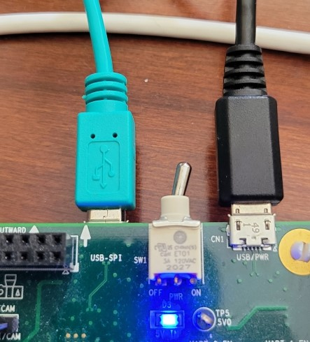
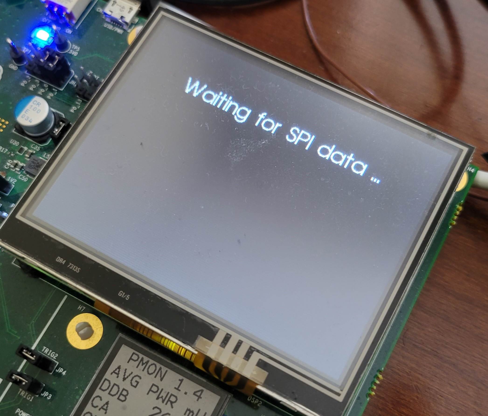

# Serial Image Loader

The image loader script in this project is a simplified revision of the cifar-10-auto-test serial loader in [1]. 

Please follow the below instructions to configure the EvKit and to send images with serial loader:

## Configuring the MAX78000EVKIT board

1- Remove camera module connected to J4 if installed

2- De-select camera interface and select USB-SPI interface by installing a jumper on JP22 pins 1 and 2


3- Connect host to MAX78000EVKIT CN1 using USB Micro-B cable. 

4- Connect host to MAX78000EVKIT CN2 using USB Micro-B cable



## Preparing the host machine

The host application is written in Python and uses the following packages:

- ft4222 -- USB-to-QSPI communications
- Pillow --  image data access

The host application requires Python 3.7.x or 3.8.x. Python 2.x and 3.9 are not supported.

_NOTE_: It is not necessary to install a compatible Python system-wide, or to rely on the system-provided Python. To manage Python versions, use `pyenv` (https://github.com/pyenv/pyenv).

Like the Python interpreter, Python packages do not need to be installed system-wide, and they do not need to rely on the system-provided Python packages. To manage external Python packages, use `pip` (https://pip.pypa.io/en/stable/installing/). Note that pip is installed with Python >= 3.4 downloaded from python.org or when working in a Virtual Environment created by `venv`.

## Installing Python modules

```
$ pip3 install -r requirements.txt
```

## Running the example

With the MAX78000EVKIT connected and powered on, run the 'UNet-demo' application. It shows "Waiting for SPI data" on the EvKit display:



Next, run the host application to send the image to the EvKit:

```
$ python main.py -i test-image.jpg
```

where `-i` or  `--inp` specifies the png or jpg image.

The image is expected to be 80 by 80, or it will be resized. The EVKIT will show the image, the outcome of the UNet inference as a mask, and the image overlaid with the mask:


## Reference:

[1] https://github.com/MaximIntegratedMicros/cifar-10-png-loader