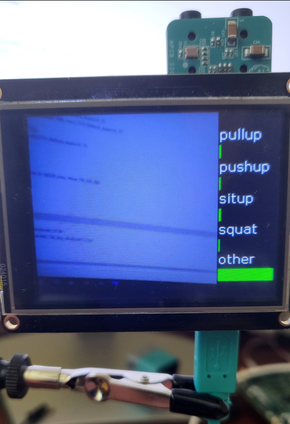

# MAX78000 Action Recognition Demo v.1.0.0

## Description

This Action Recognition demo software demonstrates recognition of a number of human actions using the MAX78000FTHR Evaluation Board. The example uses a pre-trained CNN/TCN (Convolutional Neural Network / Temporal Convolution Network) model to classify the video stream into one of 5 classes: Pull-up, Push-up, Sit-up, Squat, and Other (i.e. Background). The demo also supports out to a TFT display, which shows the live capture from the camera module and the real-time classification results.

The model is trained using the [Kinetics Human Action Video Dataset](https://research.google/pubs/the-kinetics-human-action-video-dataset/). At each inference step, the input to the model is two consecutive RGB frames at 240x240 resolution, which results in 96 channels of 60x60 data in CHW format, with 4x [data folding](https://github.com/MaximIntegratedAI/ai8x-training?tab=readme-ov-file#data-folding).

## Software

### Project Usage

Universal instructions on building, flashing, and debugging this project can be found in the **[MSDK User Guide](https://analog-devices-msdk.github.io/msdk/USERGUIDE/)**.

### Project-Specific Build Notes

* This project is only supported for the MAX78000FTHR.

* This project supports output to a TFT display, which is **enabled** by default. It can be disabled by undefining `TFT_ENABLE` in [project_config.h](project_config.h). The compatible 2.4'' TFT FeatherWing is an optional display that does not come with the MAX78000FTHR.  It can be ordered [here](https://learn.adafruit.com/adafruit-2-4-tft-touch-screen-featherwing)

## Hardware

### MAX78000FTHR operations

The OVM7692 camera module is located on the same side of the MAX78000FTHR as the USB connector and the MAX78000 chip, whereas the TFT module is placed on other the side of the board. The demo should be ran with camera side facing the action, with the MAX78000FTHR held upright (USB connector down, audio jacks up), as shown below.   

### Terminal output

The Console UART of the device will show the classification results, as well as the time consumed in various stages (image capture, image display, loading the data to the CNN memory, unloading and displaying the decisions) in milliseconds. Two frames are processed during each inference step, which should take around 200 milliseconds if the TFT is not connected, or 260 milliseconds if the TFT is connected (in which case additional time is required to display the captured frames and the decisions).