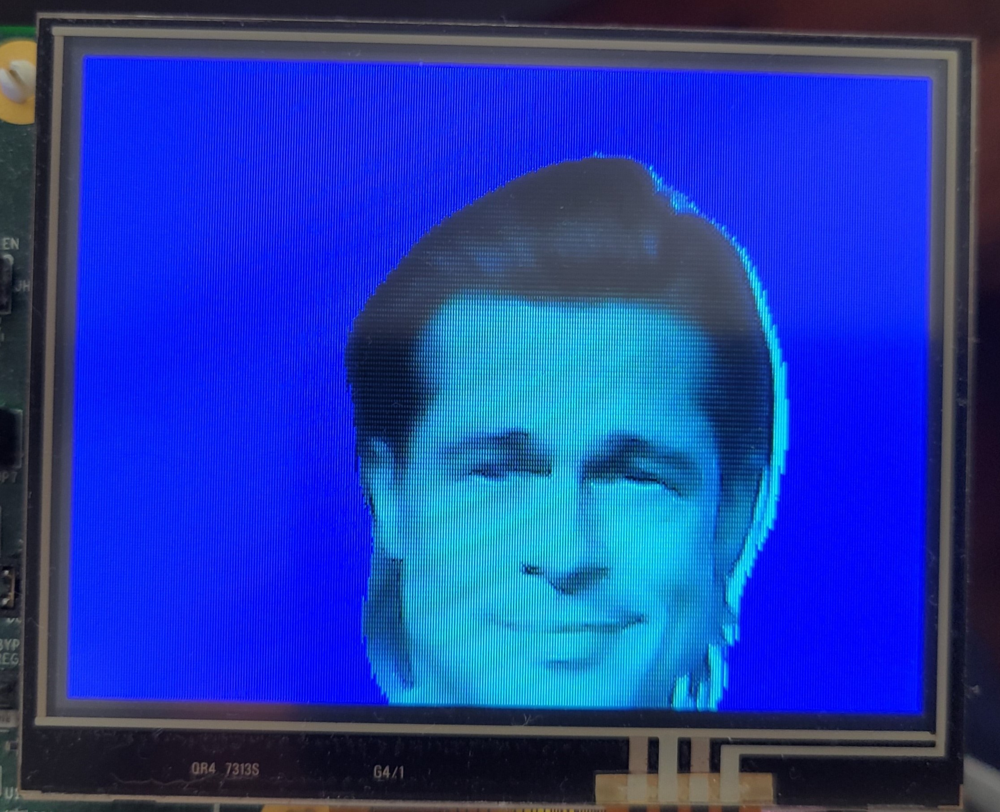

# AI-Segmentation Demo


Description
-----------

This demo shows a UNet network with 352x352 resolution input, trained to segment image into two categories:

- Portrait
- Background

## Software

### Project Usage

Universal instructions on building, flashing, and debugging this project can be found in the **[MSDK User Guide](https://analog-devices-msdk.github.io/msdk/USERGUIDE/)**.

### Project-Specific Build Notes

Before building the firmware, please make sure to enable your intended mode of operation by enabling/disabling the following defines in `main.c`:

```c
#define USE_CAMERA   // if enabled, it uses the camera specified in the make file, otherwise it uses serial loader
```

MAX78000 Feather board requires TFT display https://github.com/MaximIntegratedAI/MaximAI_Documentation/tree/master/MAX78000_Feather.

**Note: If you are using Eclipse, please also make sure to change the value of Board environment variable to "FTHR_RevA by:**

*right click project name > Properties > C/C++ Build > Environment > Board"*


### Load firmware image to MAX78000 EVKIT or Feather Board

#### EVKIT:

- Connect USB cable to CN1 (USB/PWR) and turn ON power switch (SW1).

- Connect PICO adapter to JH5 SWD header. 

#### Feather Board:

- Connect USB cable to CN1 USB connector.

If you are using Windows, load the firmware image with OpenOCD in a MinGW shell:

```bash
openocd -s $MAXIM_PATH/Tools/OpenOCD/scripts -f interface/cmsis-dap.cfg -f target/max78000.cfg -c "program build/MAX78000.elf reset exit"
```

If using Linux, perform this step:

```bash
./openocd -f tcl/interface/cmsis-dap.cfg -f tcl/target/max78000.cfg -c "program build/MAX78000.elf verify reset exit"
```

### Running Demo

If camera mode is selected (#define USE_CAMERA), a captured camera image and calculated mask are both displayed on TFT.



If the project is built without `#define USE_CAMERA`, offline sample data image is transferred over serial port from PC and calculated mask is sent back to PC. 

Check the [README](Utility/README.md)  in the `Utility` folder for instructions on how to send serial images.

### References

https://github.com/MaximIntegratedAI/MaximAI_Documentation