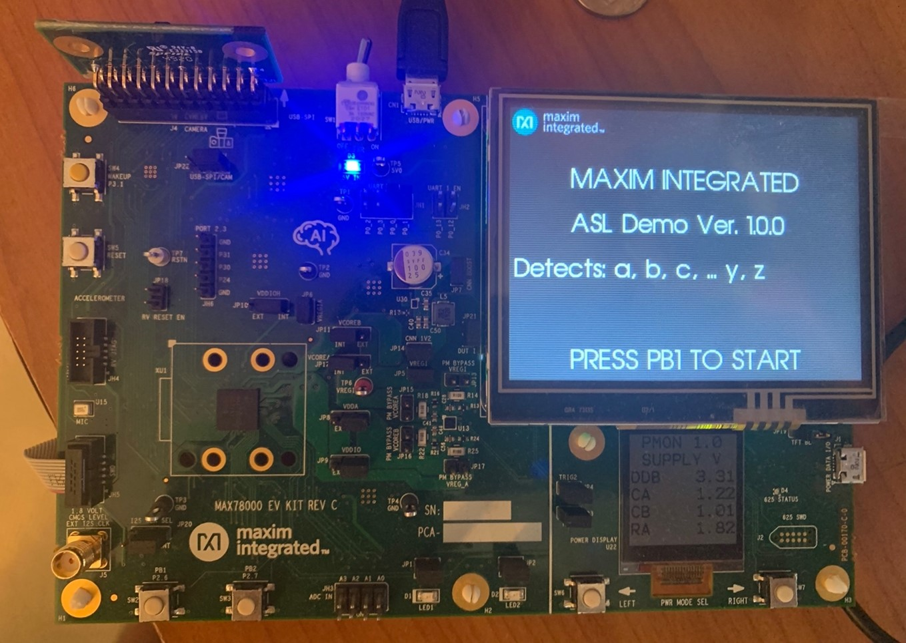
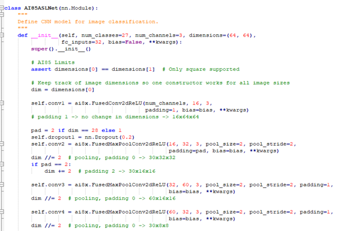
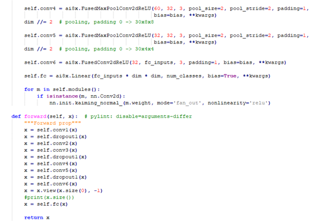
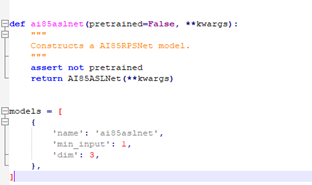

# MAX78000 ASL Recognition Demo v.1

# Overview

The ASL Demo software demonstrates recognition of American Sign Language hand symbols using MAX78000 EVKIT. 

The ASL demo software utilizes an ASL dataset which consists of 26 hand symbols, one for each letter in the alphabet, and a total of 81000 images. Below is the pre-augmented dataset that was downloaded and used for training and testing:

https://www.kaggle.com/grassknoted/asl-alphabet

The following 27 keyword subset from the complete dataset is used for this demo:

 **[‘a’, ‘b’, ‘c’, …. ‘y’, ‘z’, ‘empty’]**

In the demo, “empty” represents blank images missing hand symbols.

# ASL Recognition Demo Software

### Building firmware:

Navigate directory where ASL demo software is located and build the project:

```bash
$ cd /Examples/MAX78000/CNN/asl_demo
$ make
```

If this is the first time after installing tools, or peripheral files have been updated, first clean drivers before rebuilding the project: 

```bash
$ make distclean
```

To compile code for MAX78000 EVKIT enable **BOARD=EvKit_V1** in project.mk:

```bash
# Specify the board used
ifeq "$(BOARD)" ""
BOARD=EvKit_V1
#BOARD=FTHR_RevA
endif
```

To compile code for MAX78000 Feather board enable **BOARD=FTHR_RevA** in project.mk:

```bash
# Specify the board used
ifeq "$(BOARD)" ""
#BOARD=EvKit_V1
BOARD=FTHR_RevA
endif
```

**Note: If you are using Eclipse, please also make sure to change the value of Board environment variable to "FTHR_RevA by:**

*Right click project name > Properties > C/C++ Build > Environment > Board"*


## Load firmware image to MAX78000 EVKIT                    [ ](af://n142/)

Connect USB cable to CN1 (USB/PWR) and turn ON power switch (SW1).

Connect PICO adapter to JH5 SWD header.

Load the firmware image using OpenOCD. If you are using Windows, perform this step in a MinGW shell.

```bash
openocd -s $MAXIM_PATH/Tools/OpenOCD/scripts -f interface/cmsis-dap.cfg -f target/max78000.cfg -c "program build/MAX78000.elf reset exit"
```

## MAX78000 EVKIT operations                                 [ ](af://n152/)

After power-cycle, if the TFT display is blank, or not shown properly as below, please press RESET (SW5).

The TFT display shows that it is ready. Press PB1 to start:



Once RED LED2 turns on, the initialization is complete and ready to accept keywords. If PICO adapter is still connected to SWD, disconnect it and power cycle.

The following 27 symbols can be detected:

 **[‘a’, ‘b’, ‘c’, …. ‘y’, ‘z’, ‘empty’]**

 The MAX78000 ASL demo firmware recognizes keywords and reports result and confidence level.


## Load firmware image to MAX78000 Feather                  [ ](af://n142/)

Connect USB cable to CN1 USB connector.

Load the firmware image using OpenOCD. If you are using Windows, perform this step in a MinGW shell.

```bash
openocd -s $MAXIM_PATH/Tools/OpenOCD/scripts -f interface/cmsis-dap.cfg -f target/max78000.cfg -c "program build/MAX78000.elf reset exit"
```

## MAX78000 Feather operations                               [ ](af://n152/)

The ASL demo starts automatically after power-up or pressing reset button (SW4). The TFT display is optional and not supplied with the MAX78000 Feather board. 

The MAX78000 Feather compatible 2.4'' TFT FeatherWing display can be ordered here:

https://learn.adafruit.com/adafruit-2-4-tft-touch-screen-featherwing

This TFT display comes fully assembled with dual sockets for MAX78000 Feather to plug into. To compile code with enabled TFT feature use following setting in project.mk:

```bash
ifeq "$(BOARD)" "FTHR_RevA"
PROJ_CFLAGS += -DENABLE_TFT
endif
```

While using TFT display keep its power switch in "ON" position. The TFT "Reset" button also can be used as Feather reset. Press PB1 (SW1) button to start demo.


## CNN Model

The ASL Convolutional Neural Network (CNN) model consists of **2D** CNN with 6 layers and one fully connected layer to recognize 27 different hand symbols used for training, with 64x64 images as input.









# Network Training                                 [ ](af://n199/)

To invoke network training execute the script:

```bash
(ai8x-training) $ ./scripts/train_asl.sh
```

Details of network training methodology are described in [AI8X Model Trainin](https://github.com/MaximIntegratedAI/ai8x-synthesis/blob/master/README.md)[g](https://github.com/MaximIntegratedAI/ai8x-synthesis/blob/master/README.md)[ and ](https://github.com/MaximIntegratedAI/ai8x-synthesis/blob/master/README.md)[Q](https://github.com/MaximIntegratedAI/ai8x-synthesis/blob/master/README.md)[uantization ](https://github.com/MaximIntegratedAI/ai8x-synthesis/blob/master/README.md)After training unquantized network can be evaluated by executing script:

```bash
(ai8x-training) $ ./scripts/evaluate_asl.sh
```

## Network Quantization

The CNN weights generated during training need to be quantized:

```bash
(ai8x-synthesis) $ ./scripts/quantize_asl.sh
```

Details of quantization are described in [AI8X Model Training and Quantization](https://github.com/MaximIntegratedAI/ai8x-synthesis/blob/master/README.md)

## Network Synthesis

The network synthesis script generates a pass/fail C example code which includes necessary functions to initialize MAX78000 CNN accelerator, to load quantized CNN weights and input samples and to unload classification results. 

```bash
(ai8x-synthesis) $ ./gen_asl.sh
```

## References                                       [ ](af://n235/)

[https://](https://github.com/MaximIntegratedAI/MaximAI_Documentation)[g](https://github.com/MaximIntegratedAI/MaximAI_Documentation)[ithub.com/MaximInte](https://github.com/MaximIntegratedAI/MaximAI_Documentation)[g](https://github.com/MaximIntegratedAI/MaximAI_Documentation)[ratedAI/MaximAI_Documentation](https://github.com/MaximIntegratedAI/MaximAI_Documentation)