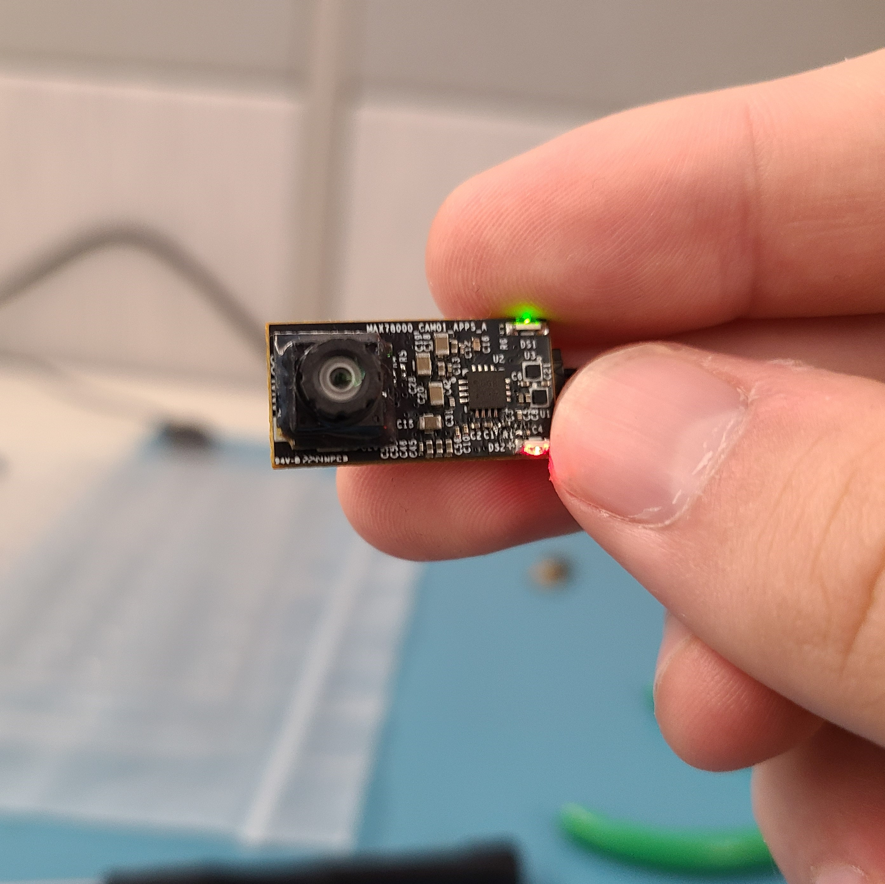

## Description

This project demonstrates object detection running on the MAX78000CAM01 board.  It runs the pre-trained ["facedet_tinierssd"](https://github.com/MaximIntegratedAI/ai8x-synthesis/blob/develop/networks/ai85-facedet-tinierssd.yaml) model to perform face detection with bounding boxes.  The firmware captures 320x240 RAW8 images from the HM0360 camera module and debayers, crops, and rotates the image to 168x224 on the fly as it is fed to the accelerator.  LED indicators show the output status of the model when it has detected a face.

## Software

### Project Usage

Universal instructions on building, flashing, and debugging this project can be found in the **[MSDK User Guide](https://analog-devices-msdk.github.io/msdk/USERGUIDE/)**.

### Project-Specific Build Notes

* This project is pre-configured for the MAX78000CAM01 board only.

## Required Connections

* Supply power to the MAX78000CAM01 board over its QWIIC connector.

## Expected Output

After flashing and running the demo, the MAX78000CAM01 board must be oriented as follows.  While facing the camera module the MAX78000CAM01 should be rotated so that the LEDs are on the right, and the green LED is above the red LED.  This is the required orientation for the camera module to properly detect faces.

* The **green** LED is the **inference** indicator.  Every pulse indicates an image capture and inference.
* The **red** LED is the **face detected** indicator.  When this LED is lit, the MAX78000CAM01 has detected a face in frame.
