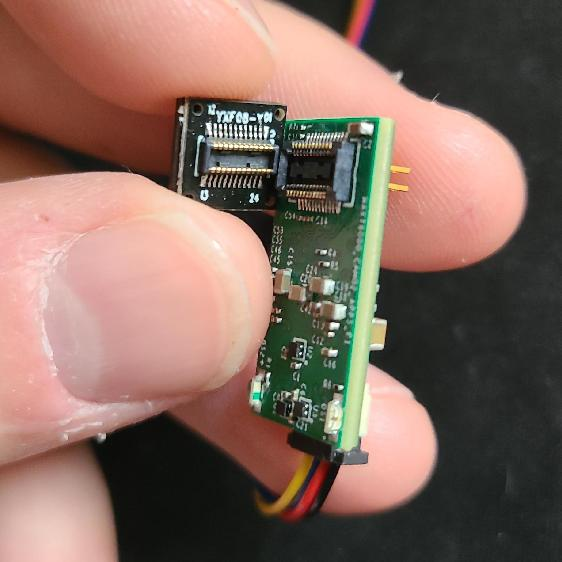
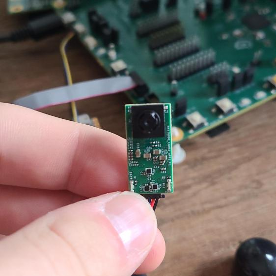

## Description

This project demonstrates object detection running on the MAX78000CAM02 board.  It runs the pre-trained ["facedet_tinierssd"](https://github.com/MaximIntegratedAI/ai8x-synthesis/blob/develop/networks/ai85-facedet-tinierssd.yaml) model to perform face detection with bounding boxes.  The firmware captures 168x224 RGB565 images from the GC0308 camera module and feed them to the CNN accelerator.  LED indicators show the output status of the model when it has detected a face.

## Software

### Project Usage

Universal instructions on building, flashing, and debugging this project can be found in the **[MSDK User Guide](https://analog-devices-msdk.github.io/msdk/USERGUIDE/)**.

### Project-Specific Build Notes

* This project is pre-configured for the MAX78000CAM02 board only.

## Required Connections

* Supply power to the MAX78000CAM02 board over its QWIIC connector (1.6V - 3.6V)
* Connect the GC0308 camera module with its back-face text aligned to the outer edge of the PCB.

    

* (optional) Connect a serial terminal to the port presented by the PICO debugger to see console message logs.  The baud rate is 115200. 

## Expected Output

After flashing and running the demo, the MAX78000CAM02 board should be oriented as follows.



* The **green** LED is the **inference** indicator.  Every pulse indicates an image capture and inference.
* The **red** LED is the **face detected** indicator.  When this LED is lit, the MAX78000CAM02 has detected a face in frame.

Console output:

```serial
Waiting...
Initializing DMA
Initializing camera

Scanning Camera On SCCB
The camera address : 00 
reg: 0x00fe , val: 0x80

reg: 0x00fe , val: 0x00

...

reg: 0x00fe , val: 0x00

Camera I2C slave address: 21
Camera ID detected: 009b
Subsample window:  336x448, ratio: 1/2

*** CNN Inference Test facedet_tinierssd ***
Approximate data loading and inference time: 151096 us

Approximate data loading and inference time: 169500 us

Approximate data loading and inference time: 169501 us

Approximate data loading and inference time: 181168 us

Approximate data loading and inference time: 169501 us

x1:45 y1:32 x2:114 y2:135
width:69 heigth:103
Approximate data loading and inference time: 169502 us

x1:52 y1:35 x2:122 y2:136
width:70 heigth:101
Approximate data loading and inference time: 162478 us

x1:56 y1:24 x2:125 y2:127
width:69 heigth:103
Approximate data loading and inference time: 163969 us

...
```
