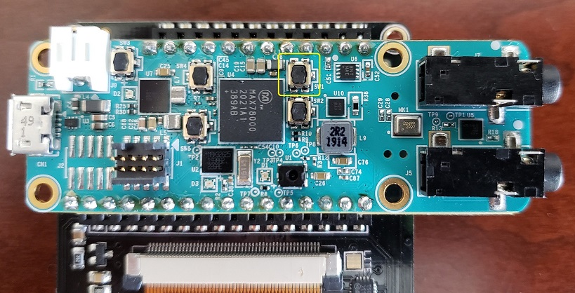
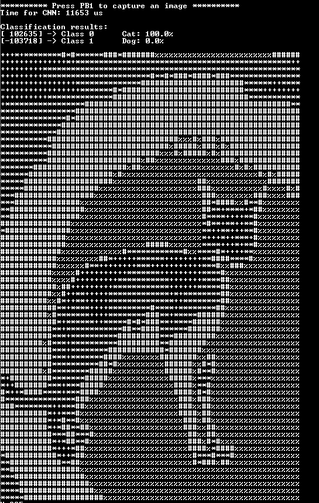

# MAX78000 Cats vs Dogs Demo


Description
-----------

The model trained in this demo is used to classify images of cats and dogs. 25000 images dataset is used to train the model. The dataset can be downloaded using [https://www.kaggle.com/c/dogs-vs-cats/data](https://www.kaggle.com/c/dogs-vs-cats/data) link. The input size is 64x64 pixels RGB which is 3x64x64 in CHW format.

The code uses a sampledata header (sampledata.h) file to test a pre-defined input sample. The example also supports live capture from camera module and displays the image on the TFT LCD.

### Building firmware:

Navigate directory where **cats-dogs_demo** software is located and build the project:

```bash
$ cd /Examples/MAX78000/CNN/cats-dogs_demo
$ make
```

If this is the first time after installing tools, or peripheral files have been updated, first clean drivers before rebuilding the project: 

```bash
$ make distclean
```

To compile code for MAX78000 EVKIT enable **BOARD=EvKit_V1** in Makefile:

```bash
# Specify the board used
ifeq "$(BOARD)" ""
BOARD=EvKit_V1
#BOARD=FTHR_RevA
endif
```

To compile code for MAX78000 Feather board enable **BOARD=FTHR_RevA** in Makefile:

```bash
# Specify the board used
ifeq "$(BOARD)" ""
#BOARD=EvKit_V1
BOARD=FTHR_RevA
endif
```

**Note: If you are using Eclipse, please also make sure to change the value of Board environment variable to "FTHR_RevA by:**

*Right click project name > Properties > C/C++ Build > Environment > Board"*


### Load firmware image to MAX78000 EVKIT

Connect USB cable to CN1 (USB/PWR) and turn ON power switch (SW1).

Connect PICO adapter to JH5 SWD header.

If you are using Windows, load the firmware image with OpenOCD in a MinGW shell:

```bash
openocd -s $MAXIM_PATH/Tools/OpenOCD/scripts -f interface/cmsis-dap.cfg -f target/max78000.cfg -c "program build/MAX78000.elf reset exit"
```

If using Linux, perform this step:

```bash
./openocd -f tcl/interface/cmsis-dap.cfg -f tcl/target/max78000.cfg -c "program build/MAX78000.elf verify reset exit"
```

### MAX78000 EVKIT operations

*   If using camera and TFT LCD, connect OVM7692 camera board directly (without 90 degree adapter) to 'J4 Camera' header facing out and place TFT display on the display header.
*   Connect a USB cable between the PC and the CN1 (USB/PWR) connector.
*   Place jumper P0\_0 and P0\_1 on UART\_0\_EN header JH1.
*   Open a serial port application on the PC and connect to Ev-Kit's console UART at 115200, 8-N-1 configuration.

This demo is operated in two modes: Real-time data using Camera module or using sample image header file in offline mode.

In either mode, pushbutton trigger PB1(SW2) is used to capture and load an image into CNN engine. User is prompted to press PB1 to load an image

### Load firmware image to MAX78000 Feather

Connect USB cable to CN1 USB connector.

If you are using Windows, load the firmware image with OpenOCD in a MinGW shell:

```bash
openocd -s $MAXIM_PATH/Tools/OpenOCD/scripts -f interface/cmsis-dap.cfg -f target/max78000.cfg -c "program build/MAX78000.elf reset exit"
```

If using Linux, perform this step:

```bash
./openocd -f tcl/interface/cmsis-dap.cfg -f tcl/target/max78000.cfg -c "program build/MAX78000.elf verify reset exit"
```

### MAX78000 Feather operations

The TFT display is optional and not supplied with the MAX78000 Feather board.
User should use PC terminal program to observe **cats-dogs_demo** result as described in "Terminal output" section with help of the ascii art representation of the captured image.

The MAX78000 Feather compatible 2.4'' TFT FeatherWing display can be ordered here:

https://learn.adafruit.com/adafruit-2-4-tft-touch-screen-featherwing

This TFT display comes fully assembled with dual sockets for MAX78000 Feather to plug into.

To compile code with enabled TFT feature use following setting in Makefile:

```bash
ifeq "$(BOARD)" "FTHR_RevA"
PROJ_CFLAGS += -DENABLE_TFT
endif
```

While using TFT display keep its power switch in "ON" position. The TFT "Reset" button also can be used as Feather reset.
Press PB1 (SW1) button to start demo.


The PB1 (SW1) button is located as shown in picture bellow:




### Camera Mode 

To operate in this mode, comment out "#define USE\_SAMPLEDATA", defined in main.c.

This mode uses OVM7692 camera module to capture an image in RGB888 format. Since the model is trained using 64x64 pixel image, the PCIF peripheral captures 64x64 pixel image and displays it on LCD.

The data received from camera interface is an unsigned data and should be converted to signed data before feeding to the CNN network.

### Offline Mode

To operate in this mode, uncomment "#define USE\_SAMPLEDATA", defined in main.c. 

This mode uses a header file "sampledata.h" containing RGB image data and it should be included in the project to use it as an input to the cnn network. 

To create your own header file follow these steps:

1.  Navigate to Utility directory. $ cd Utility
2.  Download cat or dog image in this directory.
3.  Open 'rgb.py' file and change the name of the image file on line 8. im = (Image.open('image_filename.format')). Save the changes.
4.  Now generate a header file using this command: python3 rgb.py
5.  Use this header file in your main.c

Terminal output
---------------

The Console UART of the device will output the classification result + an ascii art demonstration of the picture :



### References

https://github.com/MaximIntegratedAI/MaximAI_Documentation
