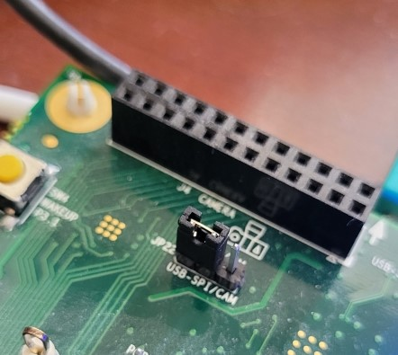

# MAX78000 CIFAR-10 Auto Test Example

## Preparing the MAX78000EVKIT board
#### Clone the upstream firmware project

```
$ cd <maxim-sdk-directory>/Examples/MAX78000/CNN
$ git clone https://github.com/MaximIntegratedMicros/cifar-10-auto-test.git
```

#### Build and load the `cifar-10-auto-test` firmware following the 'Building the SDK Examples' document

 https://github.com/MaximIntegratedAI/MaximAI_Documentation/blob/master/MAX78000_Evaluation_Kit/README.md#building-the-sdk-examples

#### Configure MAX78000EVKIT for running cifar-10-auto-test:

* Turn MAX78000EVKIT off by placing SW1 in the OFF position

* Remove camera module connected to J4 if installed

* De-select camera interface and select USB-SPI interface by installing a jumper on JP22 pins 1 and 2

  

* Connect host to MAX78000EVKIT CN1 using USB Micro-B cable

* Connect host to MAX78000EVKIT CN2 using USB Micro-B cable

  

* Turn MAX78000EVKIT on by placing SW1 in the ON position


## Preparing the host machine
The host application communicates with the MAX78000EVKIT using two USB interfaces, a USB-to-UART bridge and a USB-to-QSPI bridge.

The host application transfers image data to the MAX78000 using the QSPI bridge (Quad Serial Peripheral Interface). Connector CN2 is used to connect to the MAX78000EVKIT USB-to-QSPI bridge.

The host application receives MAX78000 inference results using the UART bridge (Universal Asynchronous Receiver/Transmitter). Connector CN1 is used to connect to the MAX78000EVKIT USB-to-UART bridge.

The host application is written in Python and uses the following packages:

- pyserial -- USB-to-UART communications
- ft4222 -- USB-to-QSPI communications
- Pillow --  image data access

The host application requires Python 3.7.x or 3.8.x.  Python 2.x and 3.9 are not supported.

It is not necessary to install a compatible Python system-wide, or to rely on the system-provided Python. To manage Python versions, use `pyenv` (https://github.com/pyenv/pyenv).

Like the Python interpreter, Python packages do not need to be installed system-wide, or to rely on the system-provided Python packages. To manage external Python packages, use `pip` (https://pip.pypa.io/en/stable/installing/). Note that pip is installed with Python >= 3.4 downloaded from [python.org]()  or when working in a Virtual Environment created by `venv`.

#### Creating project directory and cloning upstream project

```$ mkdir ai85project
$ mkdir ai85proj
$ cd ai85proj
$ git clone https://github.com/MaximIntegratedMicros/cifar-10-png-loader
```

#### Creating the Virtual Environment

```
$ cd cifar-10-png-loader
$ pyenv local 3.8.6
$ python3 -m venv .
$ source bin/activate
```

#### Installing Python modules

```
$ pip3 install -r requirements.txt
```

## Running the example

With the MAX78000EVKIT connected, powered on and running the 'cifar-10-auto-test' example, run the host application.

```
$ python main.py --device /dev/ttyUSB0 --path test-images
```

Where `--device` specifies the serial port associated with the MAX78000EVKIT USB-to-UART bridge and `--path` specifies the directory containing the test images.

The expected output is shown here:

```

Testing images from: /home/fwlogin/develop/ai85proj/cifar-10-png-loader/test-images

airplane1.png	Class:0
airplane10.png	Class:0
airplane2.png	Class:0
airplane3.png	Class:0
airplane4.png	Class:0
...
```


## Software

### Project Usage

Universal instructions on building, flashing, and debugging this project can be found in the **[MSDK User Guide](https://analog-devices-msdk.github.io/msdk/USERGUIDE/)**.

### Project-Specific Build Notes

(None - this project builds as a standard example)

