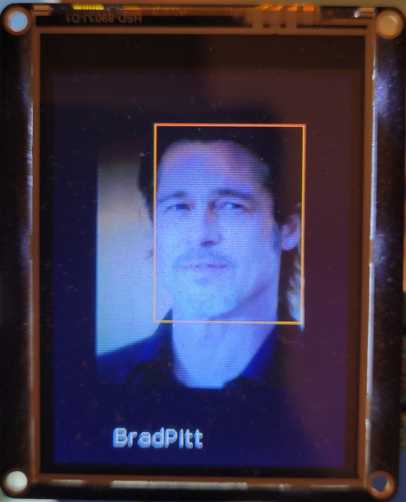
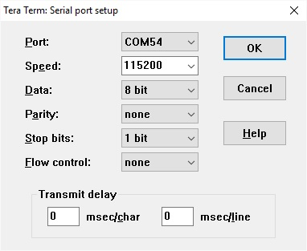
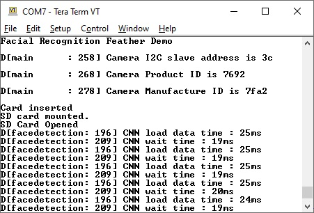
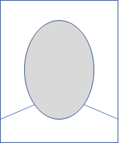

# MAX78000 Facial Recognition Demo

## Overview

This demo includes **FaceDetection** and **FaceID** CNN models and runs them sequentially on MAX78000 Feather board only. The **FaceID** CNN model weight binary file (Include/weigths_2.bin) needs to be programmed to SD card using the "SDHC_weights" project which converts the FaceID weights (weights_2.h) into binary file (weights_2.bin) and writes it to the SD card.
The **FaceDetection** CNN model detects a face and application draws a box around the face.

The **FaceID** CNN model demonstrates identification of a number of persons from their facial images.

For this purpose, the **FaceID** CNN model generates a 512-length embedding for a given image, whose distance to whole embeddings stored for each subject is calculated. The image is identified as either one of these subjects or 'Unknown' depending on the embedding distances.

## Facial Recognition Demo Software

### Loading Weights to SD Card

This project loads weights for the CNN model from an SD card.  The required file is `weights_2.bin`, and can be found in the [SDHC_weights](SDHC_weights) sub-folder.  Load this file into the root directory of a FAT32 formatted SD card before running this project.

Alternatively, the [SDHC_weights](SDHC_weights) sub-project can be used to load the weights onto the SD card.  See [SDHC_weights/README.md](SDHC_weights/README.md) for more details.

### Project Usage

Universal instructions on building, flashing, and debugging this project can be found in the **[MSDK User Guide](https://analog-devices-msdk.github.io/msdk/USERGUIDE/)**.

### Project-Specific Build Notes

* This project is supported on the MAX78000FTHR board only.

* This project supports displaying its results to a TFT display.  The TFT display is **disabled** by default since it's not supplied with the MAX78000 Feather board. The compatible 2.4'' TFT FeatherWing display can be ordered [here](https://learn.adafruit.com/adafruit-2-4-tft-touch-screen-featherwing).  To _enable_ the display code, uncomment `# PROJ_CFLAGS+=-DTFT_ENABLE` in [project.mk](project.mk)

## Required Connections

Before running this project:

* Load the CNN model's weights into the SD card (see [Loading Weights to SD Card](#loading-weights-to-sd-card)) and insert the SD card into the FTHR boards SD slot.
* Insert a micro-USB cable into CN1 of the FTHR board.

### MAX78000 Feather operations

The TFT display is optional and not supplied with the MAX78000 Feather board.

The MAX78000 Feather compatible 2.4'' TFT FeatherWing display can be ordered from here:

https://learn.adafruit.com/adafruit-2-4-tft-touch-screen-featherwing

This TFT display comes fully assembled with dual sockets for MAX78000 Feather to plug into.

To compile code with enabled TFT feature use following setting in project.mk:

```bash
ifeq "$(BOARD)" "FTHR_RevA"
PROJ_CFLAGS+=-DTFT_ENABLE
endif
```

While using TFT display keep its power switch in "ON" position. The TFT "Reset" button also can be used as Feather reset.



### Using Debug Terminal

Debug terminal shows more information on status and detected faces. 

The USB cable connected to CN1 (USB/PWR) provides power and serial communication to  MAX78000 Feather board.

To configure PC terminal program select correct COM port and settings as follow:




Following message will appear in terminal window:




## Face Database Generation

This section describes how to add new pictures to the data base.

### Prerequisites:

- Python 3.6.9 or higher (tested for 3.7.7 and 3.8.1)
- numpy (>=1.19)
- scipy (>=1.4)
- opencv-python (>=3.4)
- pyserial (>=3.4)
- matplotlib (>=3.2)
- torch (>=1.4.0)
- torchvision (>=0.5.0)

### Taking Face Pictures

In order to achieve best identification, following steps are recommended:

1. Phone or webcam can be used to take pictures.
2. Make sure the subject face is well illuminated.

3. Pictures should be a passport style, with subject's face covering about 60-70% of the area: 



4. Use a light color background; make sure it is not underexposed, and there is no shadow in the background or face. 

5. Take one picture with each of the following poses, total of 6-8 pictures:

   a) facing directly to camera (1 picture)

   b) tilting face slightly (5-10 degree) to right, left, up and down, but still looking at the camera (4 pictures)

   c) zoomed out face directly to camera covering about 20-30% of area (1 picture): 


6. If needed, you may add additional 1-2 pictures with some facial expressions (eg. smile) directly facing the camera, similar to 5-a (1-2 pictures)

7. Save pictures in .jpg format with arbitrary names.

### Populate Face Images

Navigate to 'db' folder and create a folder for each subject in your database and copy each subject's photos into these folders. The name of the folder will be used as the detected subject's name. These photos must contain subject's face directed to the camera but do not need to be consisting only the face. The structure of the directory should be as the following. 

```bash
├── db
    ├── Name1
    │    ├── Image1.jpg
    │    ├── Image2.jpg
    │    ├── Image3.jpg
    │    ├── Image4.jpg
    │    ├── Image5.jpg
    │    └── Image6.jpg
    └── Name2
         ├── Image1.jpg
         ├── Image2.jpg
         ├── Image3.jpg
         ├── Image4.jpg
         └── Image5.jpg
```

Having at least 5 images per subject is recommended. There must be no other person in the images besides the subject. For the both the images in the database and in the operation time, the face should be well and evenly illuminated.

### Generate DB

Run the python script by:

```bash
$ python db_gen/generate_face_db.py --db db --db-filename embeddings --include-path include
```

The script updates embeddings.h file under 'include' folder using the images under 'db' folder.  Next, you can rebuild the project and load the firmware as described before:

```bash
cd$ make clean
$ make 
```


## CNN Model Design
### Problem Definition
To identify people from 3 channel (RGB) frontal facial images, i.e. portraits. Small amount of rotations should be considered to have a robust application.

### Approach
The main approach in the literature is composed of three steps:

- Face Extraction: Detection of the faces in the image and extract a rectangular sub-image that contains only face.
- Face Alignment: The rotation angles (in 3D) of the face in the image is find to compensate its effect by affine transformation.
- Face Identification: The extracted sub-image is used to identify the person.

In this project, the aim is to run all those steps in a single MAX78000 chip so the approach is to identify the faces with a single from uncropped portraits, each contains 1 face only.

Then, the embeddings (Face ID) are created by FaceNet [1] model as seen below and used these embeddings as our target. There is no need to deal with center loss, triplet loss, since those are assumed to be covered by FaceNet model. The loss used in the model development will be Mean Square Error (MSE) between the target and predicted embeddings.

### CNN Model
The CNN model synthesized for MAX78000 is 9 layer sequential [model](db_gen/ai85/AI85FaceIDNetNoBias.py). It takes 160x120 RGB image from the input and gives out 512 length embedding corresponds to the image.


## References
[1] FaceNet: https://arxiv.org/pdf/1503.03832.pdf

[2] https://github.com/MaximIntegratedAI/MaximAI_Documentation
