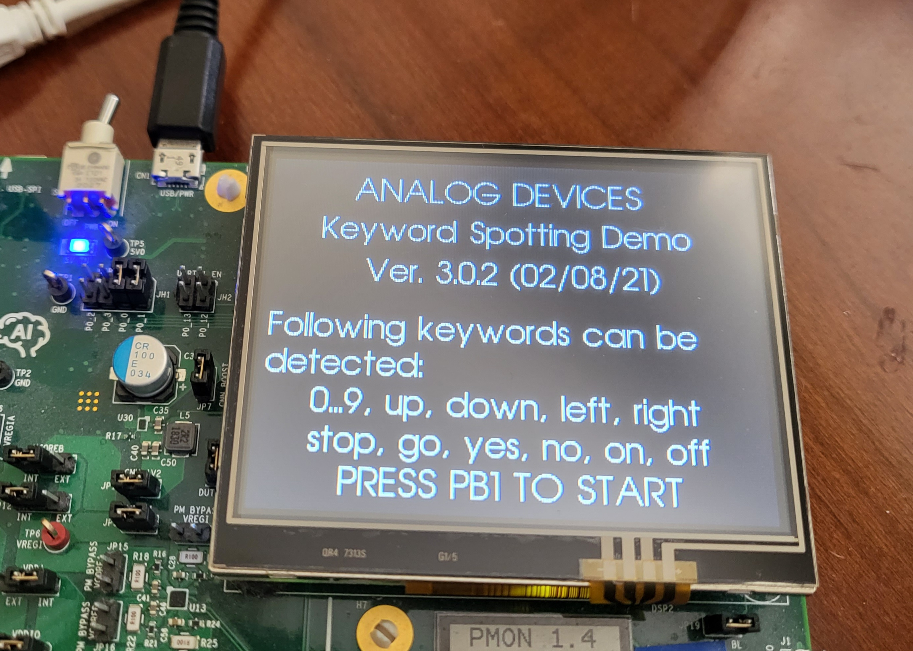
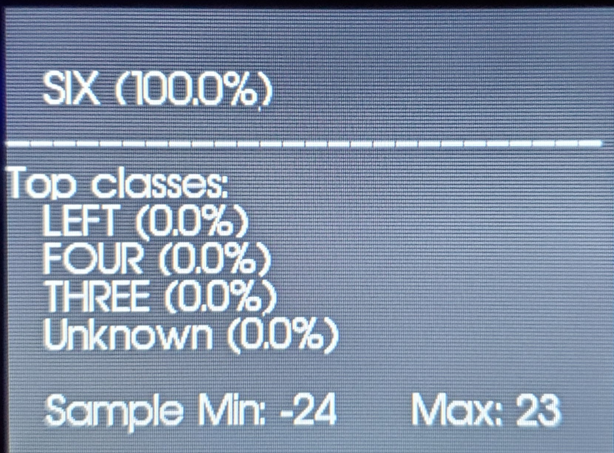
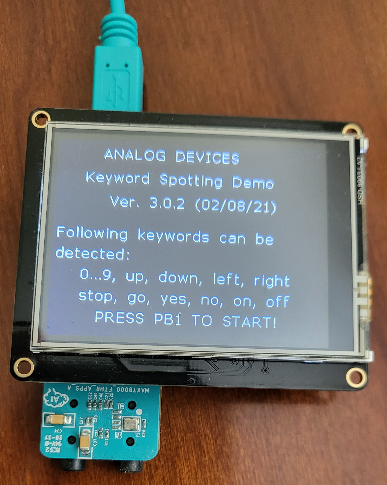

# MAX78000 Keyword Spotting Demo v.3 on ARM and RISC-V


## Overview

The Keyword Spotting Demo software demonstrates recognition of a number of keywords using MAX78000 EVKIT.  

The KWS20 demo software utilizes 2nd version of Google speech commands dataset which consists of 35 keywords and more than 100K utterances:

https://storage.cloud.google.com/download.tensorflow.org/data/speech_commands_v0.02.tar.gz


The following 20 keyword subset from the complete dataset is used for this demo:

 ['**up', 'down', 'left', 'right', 'stop', 'go', 'yes', 'no', 'on', 'off', 'one', 'two', 'three', 'four', 'five', 'six', 'seven', 'eight', 'nine', 'zero**']

Rest of keywords and unrecognized words fall into "**Unknown**" category.

The demo application runs on two cores: ARM and RISC-V. The RISC-V core gets an audio from the microphone and controls the CNN engine. The ARM core shows the result of keyword detection on the TFT display.

## Keyword Spotting Demo Software

### Building firmware:

Navigate directory where KWS20 demo software is located and build the project:

```bash
$ cd /Examples/MAX78000/CNN/kws20_demo-riscv
$ make
```

If this is the first time after installing tools, or peripheral files have been updated, first clean drivers before rebuilding the project: 

```bash
$ make distclean
```

To compile code for MAX78000 EVKIT enable **BOARD=EvKit_V1** in project.mk:

```bash
# Specify the board used
ifeq "$(BOARD)" ""
BOARD=EvKit_V1
#BOARD=FTHR_RevA
endif
```

To compile code for MAX78000 Feather board enable **BOARD=FTHR_RevA** in project.mk:

```bash
# Specify the board used
ifeq "$(BOARD)" ""
#BOARD=EvKit_V1
BOARD=FTHR_RevA
endif
```

### Load firmware image to MAX78000 EVKIT

Connect USB cable to CN1 (USB/PWR) and turn ON power switch (SW1).

Connect PICO adapter to JH5 SWD header.

If you are using Windows, open the MinGW window and start OpenOCD:

```bash
openocd -s $MAXIM_PATH/Tools/OpenOCD/scripts -f interface/cmsis-dap.cfg -f target/max78000.cfg
```

Open a second MinGW window and load combined ARM/RISC-V application image using ARM GDB:

```bash
arm-none-eabi-gdb build/max78000-combined.elf -x gdb.txt
```

If using Linux, perform these steps:

Start OpenOCD:

```bash
openocd -s $MAXIM_PATH/Tools/OpenOCD/scripts -f interface/cmsis-dap.cfg -f target/max78000.cfg
```

Load combined ARM/RISC-V application image using ARM GDB:

```bash
arm-none-eabi-gdb build/max78000-combined.elf -x gdb.txt
```

**Make sure to remove PICO adapter once firmware is loaded.**

### Debugging application on MAX78000 EVKIT

To debug the application, change an optimization setting in project.mk and recompile the code:

```bash
# Set a higher optimization level to maximize performance
#MXC_OPTIMIZE_CFLAGS = -O2
# Default optimization level for debugging purpose
MXC_OPTIMIZE_CFLAGS = -Og
```

Load and debug ARM/RISC-V application image using ARM GDB:

```bash
arm-none-eabi-gdb build/max78000-combined.elf
(gdb) target remote localhost:3333
(gdb) monitor reset halt
(gdb) load
(gdb) compare-sections
(gdb) monitor reset halt
(gdb) c
```

Note: Debugging RISC-V core is not possible due to multiplexed RV JTAG and I2S interface.

### MAX78000 EVKIT jumper setting

Make sure to install jumper at JP20-CLK (INT position) as shown bellow:


Note: On board external oscillator Y3 is used to generate I2S clock. The I2S sample rate is 16kHz to match speech samples of the dataset.

### MAX78000 EVKIT operations

After power-cycle,  if the TFT display is blank, or not shown properly as below, please press RESET (SW5).

The TFT display shows that it is ready. Press PB1 to start:




Once RED LED2 turns on, the initialization is complete and it is ready to accept keywords. If PICO adapter is still connected to SWD, disconnect it and power cycle.

Following words can be detected:

 ['**up', 'down', 'left', 'right', 'stop', 'go', 'yes', 'no', 'on', 'off', 'one', 'two', 'three', 'four', 'five', 'six', 'seven', 'eight', 'nine', 'zero**']

 The MAX78000 KWS20 demo firmware recognizes keywords and reports result and confidence level.

The microphone (U15) is located between JH4 and JH5 headers on EVKIT, (MK1) between J5 and J7 audio connectors on MAX78000 Feather board.





### Load firmware image to MAX78000 Feather

Connect USB cable to CN1 USB connector.

If you are using Windows, open the MinGW window and start OpenOCD:

```bash
openocd -s $MAXIM_PATH/Tools/OpenOCD/scripts -f interface/cmsis-dap.cfg -f target/max78000.cfg
```

Open a second MinGW window and load combined ARM/RISC-V application image using ARM GDB:

```bash
arm-none-eabi-gdb build/max78000-combined.elf -x gdb.txt
```

If using Linux, perform these steps:

Start OpenOCD:

```bash
openocd -s $MAXIM_PATH/Tools/OpenOCD/scripts -f interface/cmsis-dap.cfg -f target/max78000.cfg
```

Load combined ARM/RISC-V application image using ARM GDB:

```bash
arm-none-eabi-gdb build/max78000-combined.elf -x gdb.txt
```

### MAX78000 Feather operations

The KWS20 demo starts automatically after power-up or pressing reset button (SW4).
The TFT display is optional and not supplied with the MAX78000 Feather board.
User should use PC terminal program to observe KWS20 demo result as described in "Using Debug Terminal" section.

The MAX78000 Feather compatible 2.4'' TFT FeatherWing display can be ordered here:

https://learn.adafruit.com/adafruit-2-4-tft-touch-screen-featherwing

This TFT display comes fully assembled with dual sockets for MAX78000 Feather to plug into.

To compile code with enabled TFT feature use following setting in project.mk:

```bash
ifeq "$(BOARD)" "FTHR_RevA"
PROJ_CFLAGS += -DENABLE_TFT
endif
```

While using TFT display keep its power switch in "ON" position. The TFT "Reset" button also can be used as Feather reset.
Press PB1 (SW1) button to start demo.



The PB1 (SW1) button is located as shown in picture bellow:


### Using Debug Terminal

Debug terminal shows more information on status and detected words. 

The USB cable connected to CN1 (USB/PWR) provides power and serial communication.

To configure PC terminal program select correct COM port and settings as follow:


After turning on power or pressing reset button the following message will appear in terminal window:


Terminal display after detecting words:


The software components of KWS20 demo are shown in diagram below:


## CNN Model

The KWS20 v.3 Convolutional Neural Network (CNN) model consists of **1D** CNN with 8 layers and one fully connected layer to recognize keyword from 20 words dictionary used for training.

```python
class AI85KWS20Netv3(nn.Module):
    """
    Compound KWS20 v3 Audio net, all with Conv1Ds
    """

    # num_classes = n keywords + 1 unknown
    def __init__(
            self,
            num_classes=21,
            num_channels=128,
            dimensions=(128, 1),  # pylint: disable=unused-argument
            bias=False,
            **kwargs

    ):
        super().__init__()
        self.drop = nn.Dropout(p=0.2)
        # Time: 128 Feature :128
        self.voice_conv1 = ai8x.FusedConv1dReLU(num_channels, 100, 1, 
                                                stride=1, padding=0,
                                                bias=bias, **kwargs)
        # T: 128 F: 100
        self.voice_conv2 = ai8x.FusedConv1dReLU(100, 96, 3, 
                                                stride=1, padding=0,
                                                bias=bias, **kwargs)
        # T: 126 F : 96
        self.voice_conv3 = ai8x.FusedMaxPoolConv1dReLU(96, 64, 3, 
                                                       stride=1, padding=1,
                                                       bias=bias, **kwargs)
        # T: 62 F : 64
        self.voice_conv4 = ai8x.FusedConv1dReLU(64, 48, 3, 
                                                stride=1, padding=0,
                                                bias=bias, **kwargs)
        # T : 60 F : 48
        self.kws_conv1 = ai8x.FusedMaxPoolConv1dReLU(48, 64, 3, 
                                                     stride=1, padding=1,
                                                     bias=bias, **kwargs)
        # T: 30 F : 64
        self.kws_conv2 = ai8x.FusedConv1dReLU(64, 96, 3, 
                                              stride=1, padding=0,
                                              bias=bias, **kwargs)
        # T: 28 F : 96
        self.kws_conv3 = ai8x.FusedAvgPoolConv1dReLU(96, 100, 3, 
                                                     stride=1, padding=1,
                                                     bias=bias, **kwargs)
        # T : 14 F: 100
        self.kws_conv4 = ai8x.FusedMaxPoolConv1dReLU(100, 64, 6, 
                                                     stride=1, padding=1,
                                                     bias=bias, **kwargs)
        # T : 2 F: 128
        self.fc = ai8x.Linear(256, num_classes, bias=bias, wide=True, **kwargs)

    def forward(self, x):  # pylint: disable=arguments-differ
        """Forward prop"""
        # Run CNN
        x = self.voice_conv1(x)
        x = self.voice_conv2(x)
        x = self.drop(x)
        x = self.voice_conv3(x)
        x = self.voice_conv4(x)
        x = self.drop(x)
        x = self.kws_conv1(x)
        x = self.kws_conv2(x)
        x = self.drop(x)
        x = self.kws_conv3(x)
        x = self.kws_conv4(x)
        x = x.view(x.size(0), -1)
        x = self.fc(x)

        return x
```

The CNN input is 128x128=16384 8-bit signed speech samples.

## Network Training

To invoke network training execute the script:

```bash
(ai8x-training) $ ./scripts/train_kws20_v3.sh
```

If this is the first time, and the dataset does not exist locally, the scrip will automatically download Google speech commands dataset (1 second keyword .wav files , sampled at 16KHz, 16-bit) into /data/KWS/raw, and process it to make appropriate training, test and validation dataset integrated in /data/KWS/process/dataset.pt. The processing step expands training dataset by using augmentation techniques like adding white noise, random time shift and stretch to improve training results. In addition, each 16000 sample word example is padded with zeros to make it 128x128=16384 speech samples. The augmentation process triples the size of dataset and could take 30min to complete.

Details of network training methodology are described in [AI8X Model Training and Quantization](https://github.com/MaximIntegratedAI/ai8x-synthesis/blob/master/README.md)

After training unquantized network can be evaluated by executing script:

```bash
(ai8x-training) $ ./scripts/evaluate_kws20_v3.sh
```


## Network Quantization

The CNN weights generated during training need to be quantized:

```bash
(ai8x-synthesis) $ ./scripts/quantize_kws20_v3.sh
```

Details of quantization are described in [AI8X Model Training and Quantization](https://github.com/MaximIntegratedAI/ai8x-synthesis/blob/master/README.md)

## Network Synthesis

The network synthesis script generates a pass/fail C example code which includes necessary functions to initialize MAX78000 CNN accelerator, to load quantized CNN weights and input samples and to unload classification results. A sample input with the expected result is part of this automatically generated code to verify.  Following script generates all example projects including **kws20_v3**:

```bash
(ai8x-synthesis) $ ./gen-demos-max78000.sh
```

The **kws20_v3** bare-bone C code is partially used in KWS20 Demo. In particular, CNN initialization, weights (kernels) and helper functions to load/unload weights and samples are ported from **kws20_v3** to KWS20 Demo.


## KWS20 Demo Code

KWS20 demo works in two modes:  Using microphone (real-time), or offline processing:

```c
#define ENABLE_MIC_PROCESSING
```

### Microphone Mode

In this mode, EVKIT I2S Mic is initialized to operate at 16KHz 32-bit samples.  In the main loop, I2S buffer is checked and sampled are stored into  **pChunkBuff** buffer.  

### Offline Mode

if **ENABLE_MIC_PROCESSING** is not defined, a header file containing the 16-bit samples (e.g. **kws_five.h**) should be included in the project to be used as the input . To create a header file from a wav file, use included utilities to record a wav file and convert it to header file. 

```bash
# record 3sec of 16-bit 16KHz sampled wav file 
$ python VoiceRecorder.py -d 3 -o voicefile.wav
# convert to header
$ python RealtimeAudio.py -i voicefile.wav -o voicefile.h
```

### KWS20 Demo Firmware Structure

Following figure shows the processing in KWS20 Demo firmware:


Collected samples from mic/file are 18/16 bit signed and are converted to 8 bit signed to feed into CNN. If Microphone mode, a high pass filter is used to filter out the DC level in captured samples. Scaled samples are stored in **pPreambleCircBuffer** circular buffer in chunks of 128 samples (bytes). 

Following parameters in the firmware can be tuned:

```c
#define SAMPLE_SCALE_FACTOR    		4		// multiplies 16-bit samples by this scale factor before converting to 8-bit
#define THRESHOLD_HGIH				350  	// voice detection threshold to find beginning of a keyword
#define THRESHOLD_LOW				100  	// voice detection threshold to find end of a keyword
#define SILENCE_COUNTER_THRESHOLD 	20 		// [>20] number of back to back CHUNK periods with avg < THRESHOLD_LOW to declare the end of a word
#define PREAMBLE_SIZE				30*CHUNK// how many samples before beginning of a keyword to include
#define INFERENCE_THRESHOLD   		49 		// min probability (0-100) to accept an inference
```

When the average absolute values of samples during last 128 number of samples goes above a threshold, the beginning of a word is marked. 

The end of a word is signaled when the **SILENCE_COUNTER_THRESHOLD** back to back chunks of samples with average absolute threshold lower than **THRESHOLD_LOW** is observed. 

The CNN requires 1sec worth of samples (128*128) to start processing. This window starts at **PREAMBLE_SIZE** samples prior to the beginning of the word, and ends after 16384 samples. If the end of a word is determined earlier, the pAI85Buffer sample buffer is padded with zeros.

The CNN related API functions are in **cnn.c**. They are used to load weights and data, start CNN, wait for CNN to complete processing and unload the result. 

If a new network is developed and synthesized, the new weight file and related API functions are needed to be ported from automatically generated kws20 example project. Furthermore, if the input layer or organization of 128x128 sample sets in the trained network is changed, **AddTranspose()** function should be changed to reflect the new sample data arrangement in CNN memory.

### References

[1] https://github.com/MaximIntegratedAI/MaximAI_Documentation

[2] [MaximAI_Documentation/README.md at master · MaximIntegratedAI/MaximAI_Documentation (github.com)](https://github.com/MaximIntegratedAI/MaximAI_Documentation/blob/master/MAX78000_Evaluation_Kit/README.md)


## Software

### Project Usage

Universal instructions on building, flashing, and debugging this project can be found in the **[MSDK User Guide](https://analog-devices-msdk.github.io/msdk/USERGUIDE/)**.

### Project-Specific Build Notes

(None - this project builds as a standard example)

