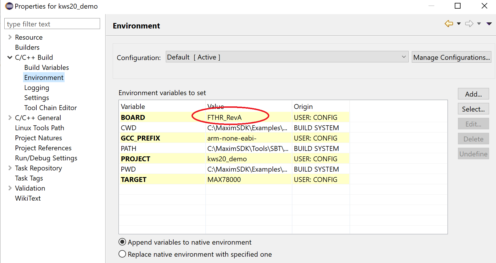
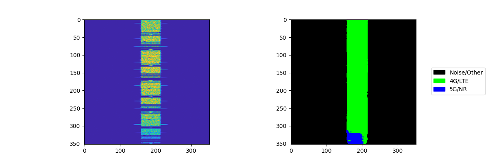
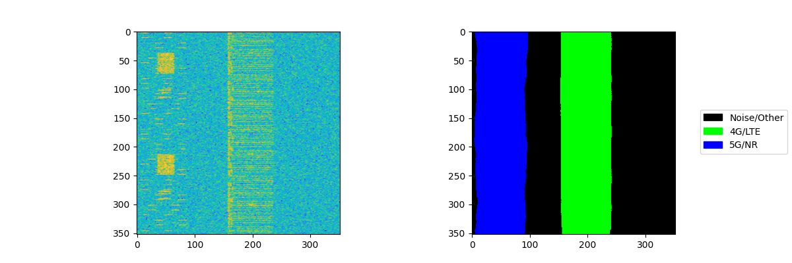

# RF Spectrum Sensing Demo

Description
-----------

This demo shows a UNet network with 352x352 resolution input, trained to segment
image data into 3 categories:

- 4G Signals
- 5G Signals
- Noise/Other

The model was inspired by the Mathworks tutorial [Spectrum Sensing with Deep Learning to Identify 5G and LTE Signals](https://www.mathworks.com/help/comm/ug/spectrum-sensing-with-deep-learning-to-identify-5g-and-lte-signals.html).
This demo did not utilize the model developed by Mathworks, however leveraged
the data synthesis approach for generating training data for use directly with
the Ai8x tools.


## Software

### Project Usage

Universal instructions on building, flashing, and debugging this project can be found in the **[MSDK User Guide](https://analogdevicesinc.github.io/msdk/USERGUIDE/)**.

### Project-Specific Build Notes

All input data is sourced from the PC, as well as results provided via the
SerialLoader Python script.  The Camera and display are not used for this
demonstration.

The demo supports both the EvKit and FTHR form factor MAX78000 boards.

**Note: If you are using Eclipse, please also make sure to change the value of Board environment variable to "FTHR_RevA by:**

*right click project name > Properties > C/C++ Build > Environment > Board"*




### Load firmware image to MAX78000 EVKIT or Feather Board

#### EVKIT:

- Connect USB cable to CN1 (USB/PWR) and turn ON power switch (SW1).

- Connect PICO adapter to JH5 SWD header.

#### Feather Board:

- Connect USB cable to CN1 USB connector.

If you are using Windows, load the firmware image with OpenOCD in a MinGW shell:

```bash
openocd -s $MAXIM_PATH/Tools/OpenOCD/scripts -f interface/cmsis-dap.cfg -f target/max78000.cfg -c "program build/MAX78000.elf reset exit"
```

If using Linux, perform this step:

```bash
./openocd -f tcl/interface/cmsis-dap.cfg -f tcl/target/max78000.cfg -c "program build/MAX78000.elf verify reset exit"
```

### Running Demo

The application runs with the offline sample data only. Run the SerialLoader.py
script to transfer an image.

For example: `$ python SerialLoader.py -c COM6 -b 115200 -i LTE_frame_12.png -o CNNout.txt`

Check the [README](Utility/README.md)  in the `Utility` folder for instructions on how to send serial images.

**Note:** It takes some time to get the data between the host and board. Track the
progress in the Python script's terminal output.






### References

https://github.com/MaximIntegratedAI/MaximAI_Documentation