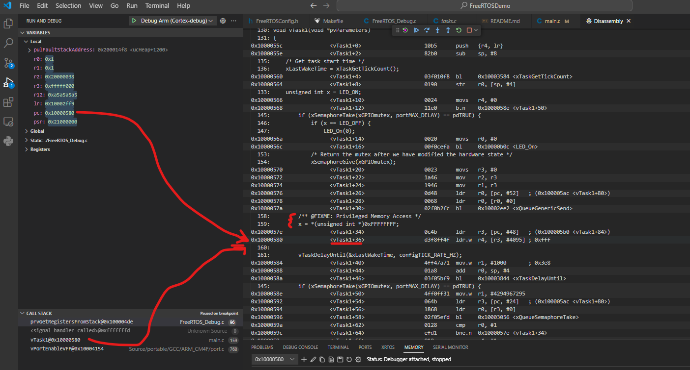

## Description

A basic getting started application for FreeRTOS.

## Software

### Project Usage

Universal instructions on building, flashing, and debugging this project can be found in the **[MSDK User Guide](https://analogdevicesinc.github.io/msdk/USERGUIDE/)**.
Universal instructions on building, flashing, and debugging this project can be found in the **[MSDK User Guide](https://analogdevicesinc.github.io/msdk/USERGUIDE/)**.

### Project-Specific Build Notes

* This project comes pre-configured for the MAX78000EVKIT.  See [Board Support Packages](https://analogdevicesinc.github.io/msdk/USERGUIDE/#board-support-packages) in the UG for instructions on changing the target board. 
* Setting the "DEBUG" flag to 1 in project.mk will configure TMR0 as an RTOS Stats Timer running at 32 kHz. Timer configuration is provided in FreeRTOS_Debug.c.

## Required Connections

If using the MAX78000EVKIT (EvKit_V1):
-   Connect a USB cable between the PC and the CN1 (USB/PWR) connector.
-   Connect pins 1 and 2 (P0_1) of the JH1 (UART 0 EN) header.
-   Open a terminal application on the PC and connect to the EV kit's console UART at 115200, 8-N-1.
-   Close jumper JP1 (LED1 EN).
-   Close jumper JP2 (LED2 EN).

If using the MAX78000FTHR (FTHR_RevA)
-   Connect a USB cable between the PC and the CN1 (USB/PWR) connector.
-	Open a terminal application on the PC and connect to the EV kit's console UART at 115200, 8-N-1.

## Expected Output

The Console UART of the device will output these messages:

```
-=- MAX78000 FreeRTOS (V10.2.0) Demo -=-
SystemCoreClock = 60000000
Starting scheduler.
Uptime is 0x00000000 (0 seconds), tickless-idle is disabled

Enter 'help' to view a list of available commands.
cmd>
```

## Debugging

Some extra debug features are provided as recommended practice in FreeRTOS_Debug.c. These are based on recommendations from the FreeRTOS documentation. They include:
- A timer setup using TMR0 as an RTOS Statistics timer to profile task runtime. 
- A custom HardFaultHandler which copies CPU register state to C variables for viewing inside a debugger program. 
  - This is useful to diagnose the system state at the moment the HardFault occured. 

The statistics timer can be used by numerous RTOS Debug utilities which detect a kernel and use the kernel's profiling routines to output useful information to the user. A similar timer configuration could also be used for RTOS kernels other than FreeRTOS. Be aware that TMR0 may not behave properly when using Low-Power features -- for these use-cases a Low-Power timer on the device should be used.  

An example of using the HardFaultHandler can be observed by placing a privileged memory access (e.g. ```int y = *(uint32_t *)0xFFFFFFFF```) inside an RTOS task. The program counter will show as a C variable, which can be used with a Disassembly View to find the location of the HardFault. An image is provided below as an example:



