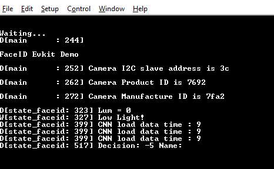
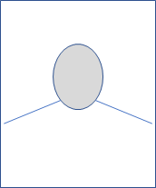

# MAX78002 FaceID Demo

## Overview
The FaceID Demo software demonstrates the identification of a number of persons from their facial images using MAX78002 EVKIT.

For this purpose, the CNN model generates a 512-length embedding for a given image, whose distance to whole embeddings stored for each subject is calculated. The image is identified as either one of these subjects or 'Unknown' depending on the embedding distances.

The CNN model is trained with the VGGFace-2 dataset using MTCNN and FaceNet models for an embedding generation.

## FaceID Demo Software

### Project Usage

Universal instructions on building, flashing, and debugging this project can be found in the **[MSDK User Guide](https://analog-devices-msdk.github.io/msdk/USERGUIDE/)**.

### Project-Specific Build Notes

See ["Build System"](https://analog-devices-msdk.github.io/msdk/USERGUIDE/#build-system) in the MSDK User Guide for detailed documentation.  The section below contains additional notes on options that are specific to this project.

This project offers the option to enable or disable the TFT display in [project.mk](project.mk) via the `ENABLE_TFT` build configuration variable.

* Set `ENABLE_TFT = 1` to enable the display, or `ENABLE_TFT = 0` to disable it in [project.mk](project.mk).

Additionally, this project also offers the option to switch the display drivers for use with the legacy [Adafruit 3315](https://www.adafruit.com/product/3315) display shipped with some early MAX78002EVKITs.

* Uncomment `TFT = ADAFRUIT` in [project.mk](project.mk) to use drivers for the legacy [Adafruit 3315](https://www.adafruit.com/product/3315).  Otherwise, the default drivers for the [NewHaven NHD-2.4-240320CF](https://newhavendisplay.com/2-4-inch-premium-spi-resistive-tft-display/) will be used.

### MAX78002 EVKIT operations

After loading FaceID firmware demo starts. Make sure that captured face images are inside the blue rectangle.

### Using Debug Terminal

Debug terminal shows more information on the status and detected words.

The USB cable connected to CN2 (USB/UART) provides power and serial communication.

To configure the PC terminal program select the correct COM port and settings as follow:


The following messages will appear in the terminal window:




### Face Database Generation

This section describes how to add new pictures to the database.

#### Prerequisites:

- Python 3.6.9 or higher (tested for 3.7.7 and 3.8.1)
- numpy (>=1.19)
- scipy (>=1.4)
- opencv-python (>=3.4)
- pyserial (>=3.4)
- matplotlib (>=3.2)
- torch (>=1.4.0)
- torchvision (>=0.5.0)

#### Taking Face Pictures

In order to achieve the best identification, the following steps are recommended:

1. A phone or webcam can be used to take pictures.
2. Make sure the subject face is well-illuminated.

3. Pictures should be passport style, with the subject's face covering about 60-70% of the area: 


4. Use a light color background; make sure it is not underexposed, and there is no shadow in the background or face. 

5. Take one picture with each of the following poses, a total of 6-8 pictures:

   a) facing directly to the camera (1 picture)

   b) tilting face slightly (5-10 degrees) to right, left, up, and down, but still looking at the camera (4 pictures)

   c) zoomed out face directly to camera covering about 20-30% of the area (1 picture): 



6. If needed, you may add additional 1-2 pictures with some facial expressions (eg. smile) directly facing the camera, similar to 5-a (1-2 pictures)

7. Save pictures in .jpg format with arbitrary names.

#### Populate Face Images

Navigate to 'db' folder and create a folder for each subject in your database and copy each subject's photos into these folders. The name of the folder will be used as the detected subject's name. These photos must contain subject's face directed to the camera. The structure of the directory should be as the following. 

```bash
├── db
    ├── Name1
    │    ├── Image1.jpg
    │    ├── Image2.jpg
    │    ├── Image3.jpg
    │    ├── Image4.jpg
    │    ├── Image5.jpg
    │    └── Image6.jpg
    └── Name2
         ├── Image1.jpg
         ├── Image2.jpg
         ├── Image3.jpg
         ├── Image4.jpg
         └── Image5.jpg
```

Having at least 5 images per subject is recommended. There must be no other person in the images besides the subject. For the both the images in the database and in the operation time, the face should be well and evenly illuminated.

#### Generate DB

Run the python script by:

```bash
$ python db_gen/generate_face_db.py --db db --db-filename embeddings --include-path include
```

The script updates embeddings.h file under the 'include' folder using the images under the 'db' folder.  Next, you can rebuild the project and load the firmware as described before:

```bash
$ make clean
$ make 
```


## CNN Model Design
### Problem Definition
To identify people from 3 channel (RGB) frontal facial images, i.e. portraits. A small number of rotations should be considered to have a robust application.

### Approach
The main approach in the literature is composed of three steps:

- Face Extraction: Detection of the faces in the image and extract a rectangular sub-image that contains only the face.
- Face Alignment: The rotation angles (in 3D) of the face in the image are found to compensate for its effect by an affine transformation.
- Face Identification: The extracted sub-image is used to identify the person.

In this project, the aim is to run all those steps in a single AI-85 chip so the approach is to identify the faces with a single from uncropped portraits, each containing 1 face only.

Then, the embeddings (Face ID) are created by FaceNet [2] model as seen below, and used these embeddings as our target. There is no need to deal with center loss, triplet loss, etc since those are assumed to be covered by FaceNet model. The loss used in the model development will be Mean Square Error (MSE) between the target and predicted embeddings.

### CNN Model
The CNN model synthesized for MAX78009 is a 9-layer sequential [model](db_gen/ai85/AI85FaceIDNetNoBias.py). It takes a 160x120 RGB image from the input and gives out 512-length embedding corresponding to the image.


## References
[1] MTCNN: https://arxiv.org/ftp/arxiv/papers/1604/1604.02878.pdf

[2] FaceNet: https://arxiv.org/pdf/1503.03832.pdf

[3] https://github.com/MaximIntegratedAI/MaximAI_Documentation
