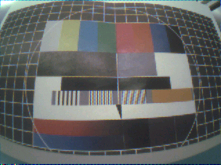
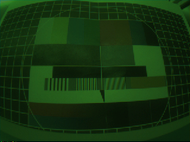

# ImgCapture


(Above:  352x352 capture of a test pattern using the MAX78000FTHR's OV7692 camera)

## Description

This example demonstrates how to capture an image using the PCIF peripheral and Camera drivers.  It also demonstrates a method for collecting high resolution images and sending them to any arbitrary output destination, such as a UART interface or SD card.  

Collecting images can be a challenge when dealing with low-power CMOS camera sensors, which usually don't have memory buffers of any significant size.  Most will internally buffer a single row and then immediately stream it out to a high-speed Parallel Camera Interface (PCIF).  As a result, exposure time is proportional to the clock speed of the camera.  Therefore, the host microcontroller must be able to process, forward, and/or store the incoming image data within the strict timing limitations imposed by the camera module.  The limited general purpose SRAM size of microcontrollers make alternate output destinations (host PC, external memory, SD card, etc.) attractive, but these often have much lower bandwidth than the PCIF peripheral.  Slowing the PCIF clock speed can work for these, but is not an ideal solution because of the relationship between clock speed and exposure time.

In order to collect useful high resolution images, the data SRAM in the MAX78000/MAX78002's CNN accelerator is stitched into a virtually contiguous data buffer.  **This is not the correct way to load data for ML inferences**, but it allows high resolution images to be buffered.  From there, the data can then be forwarded on to any secondary destination by the host firmware.  The implementation can be found in [src/cnn_memutils.h](src/cnn_memutils.h).  High-level usage examples for supported output destinations can be found in [src/main.c](src/main.c).

The example can perform standard blocking captures up to the memory limits of the device, and streaming DMA captures (using cnn_memutils) up to 352x352, including QVGA (320x240) at max camera clock speeds.  Image captures are controlled from a host PC running [utils/console.py](utils/console.py).

It supports the following output destinations:

* Transmit image to a host PC.

* Save image to SD card. (MAX7800FTHR only)

## Building, Flashing, & Debugging

For instructions on how to build, flash, and debug this example see [.vscode/readme.md](.vscode/readme.md).

## Console Interface & Utilites

For more details on running the serial console, converting images, and excercising the example, see [utils/README.md](utils/README.md)

## Build Notes

Full documentation on the build system can be found in the "Build Configuration" section of [.vscode/README.md](.vscode/README.md#build-configuration).  The following notes contain important quick-start info.

### Enabling Firmware Features

Firmware features can be toggled in [project.mk](project.mk).

* The console is enabled by default.  It will wait for a valid connection from [utils/console.py](utils/console.py) on startup.

* SD card functionality is disabled by default.  It will attempt to mount the SD card on startup using the FAT32 format.  If it detects a blank card has been inserted (the drive name is empty) then it will attempt to format the card to FAT32.

After making any changes, fully clean the project and then rebuild.

### Setting CAMERA

The `CAMERA` variable in [project.mk](project.mk) is used to select the correct drivers for the attached camera.  When this variable is changed, you should also ensure the `CAMERA_xxx` compiler definitions in [.vscode/settings.json](.vscode/settings.json) is also changed to match.  The project settings cannot automatically changes in the compiler definitons to match the camera.

For the OV7692:

* Define `CAMERA_OV7692`

For the HM0360 (mono):

* Define `CAMERA_HM0360_MONO`
* Define `CAMERA_MONO`

For the HM0360 (color):

* Define `CAMERA_HM0360_COLOR`
* Define `CAMERA_BAYER`

## OVM7692 Quick-Start

1. Set `CAMERA=OV7692` in [project.mk](project.mk)

2. Clean and rebuild the firmware.

3. Ensure JP38 (DVP CAM PWR) is connected to the "ON" position.  This routes GND to the PWDN input of the OVM7692 which is active LOW.

4. Connect the PICO debugger to the SWD port (JH5) and a micro-USB cable to CN1.

5. Power on the board take note of the COM port presented by CN1.

6. [Flash & run](.vscode/README.md#build-tasks) the firmware.  LED1 on the board will be blinking.

7. Connect [console.py](utils/README.md) to the COM port presented by CN1.

    ```shell
    $ python console.py COM19

    Started ImgCapture console and opened COM19
    MCU: *SYNC*
    MCU: Established communications with host!
    MCU: Registered 7 total commands:
    MCU: -----
    MCU: 'help' : Print this help string
    MCU: 'reset' : Issue a soft reset to the host MCU.
    MCU: 'capture' : Perform a standard blocking capture of a single image
    MCU: 'imgres' <width> <height> : Set the image resolution of the camera to <width> x <height> 
    MCU: 'stream' : Performs a line-by-line streaming DMA capture of a single image, capable of higher resolutions
    MCU: 'set-reg' <register> <value> : Write a value to a camera register.
    MCU: 'get-reg' <register> : Prints the value in a camera register.
    MCU: -----
    MCU: Initializing DMA
    MCU: Initializing camera
    MCU: Camera I2C slave address: 3c
    MCU: Camera ID detected: 7fa2
    MCU: Ready!
    $

    ```

8. Run a standard `capture` with default settings.

    ```shell
    $ capture

    MCU: Configuring camera
    MCU: Capturing image   
    MCU: Done! (Took 58536 us)
    MCU: Captured 64x64 RGB565 image to buffer location 0x20001b98 (8192 bytes)
    MCU: *IMG* RGB565 8192 64 64
    Collecting 8192 bytes...
    Saved image to 'C:\Users\User\repos\msdk\Examples\MAX78002\ImgCapture\utils\Image.png'
    MCU: Done! (serial transmission took 88480 us)
    ```

9. Increase image resolution and recapture.

    ```shell
    $ imgres 128 128

    MCU: Set image resolution to width 128, height 128
    $ capture

    MCU: Configuring camera
    MCU: Capturing image
    MCU: Done! (Took 87906 us)
    MCU: Captured 128x128 RGB565 image to buffer location 0x20001b98 (32768 bytes)
    MCU: *IMG* RGB565 32768 128 128
    Collecting 32768 bytes...
    Saved image to 'C:\Users\User\repos\msdk\Examples\MAX78002\ImgCapture\utils\Image.png'
    MCU: Done! (serial transmission took 353104 us)
    ```

10. Increase image resolution beyond SRAM limits and perform streaming capture.

    ```shell
    $ imgres 320 240

    MCU: Set image resolution to width 320, height 240
    $ stream

    MCU: Configuring camera
    MCU: Starting streaming capture...
    MCU: Done! (Took 81657 us)
    MCU: DMA transfer count = 241
    MCU: OVERFLOW = 0
    MCU: Transmitting image data over UART...
    MCU: *IMG* RGB565 153600 320 240
    Collecting 153600 bytes...
    Saved image to 'C:\Users\User\repos\msdk\Examples\MAX78002\ImgCapture\utils\Image.png'
    MCU: Done! (serial transmission took 1653952 us)
    ```

## HM0360 (Mono) Quick-Start

This quick-start is applicable for the [HM0360-MWA](https://www.digikey.com/en/products/detail/himax/HM0360-MWA/14109823) **mono** sensor.

1. Set `CAMERA=HM0360_MONO` in [project.mk](project.mk)

2. [Clean and rebuild](.vscode/README.md#build-tasks) the firmware.

3. Ensure JP38 (DVP CAM PWR) is connected to the "OFF" position.  This routes 1V8 to the PWDN input of the HM0360 which is active HIGH.

4. Connect the PICO debugger to the SWD port (JH5) and a micro-USB cable to CN1.

5. Power on the board take note of the COM port presented by CN1.

6. [Flash & run](.vscode/README.md#build-tasks) the firmware.  LED1 on the board will be blinking.

7. Connect [console.py](utils/README.md) to the COM port presented by CN1.

    ```shell
    $ python console.py COM19

    Started ImgCapture console and opened COM19
    MCU: *SYNC*
    MCU: Established communications with host!
    MCU: Registered 7 total commands:
    MCU: -----
    MCU: 'help' : Print this help string
    MCU: 'reset' : Issue a soft reset to the host MCU.
    MCU: 'capture' : Perform a standard blocking capture of a single image
    MCU: 'imgres' <width> <height> : Set the image resolution of the camera to <width> x <height> 
    MCU: 'stream' : Performs a line-by-line streaming DMA capture of a single image, capable of higher resolutions
    MCU: 'set-reg' <register> <value> : Write a value to a camera register.
    MCU: 'get-reg' <register> : Prints the value in a camera register.
    MCU: -----
    MCU: Initializing DMA
    MCU: Initializing camera
    MCU: Camera I2C slave address: 24
    MCU: Camera ID detected: 0360
    MCU: Ready!
    $
    ```

8. Run a standard `capture` with default settings.

    ```shell
    $ capture

    MCU: Configuring camera
    MCU: Capturing image
    MCU: Done! (Took 646721 us)
    MCU: Captured 320x240 BAYER image to buffer location 0x20001b98 (76800 bytes)
    MCU: *IMG* BAYER 76800 320 240
    Collecting 76800 bytes...
    Saved image to 'C:\Users\User\repos\msdk\Examples\MAX78002\ImgCapture\utils\Image.png'
    MCU: Done! (serial transmission took 827340 us)
    ```

    

9. Decrease image resolution and recapture.  The HM0360 requires switching the active context to one that has been configured for the target resolution.

    The active context is selected via register `0x3024`.

    * `0x3024 = 0` shows Context A is active (320x240).
    * `0x3024 = 1` show Context B is active (160x120).

    ```shell
    $ get-reg 0x3024

    MCU: Camera reg 0x3024=0x0
    ```

    To change to Context B (160x120):

    ```shell
    $ set-reg 0x3024 1

    MCU: Writing 0x1 to camera reg 0x3024
    $ imgres 160 120

    MCU: Set image resolution to width 160, height 120
    $ capture

    MCU: Configuring camera
    MCU: Capturing image
    MCU: Done! (Took 73982 us)
    MCU: Captured 160x120 BAYER image to buffer location 0x20001b98 (19200 bytes)
    MCU: *IMG* BAYER 19200 160 120
    Collecting 19200 bytes...
    Saved image to 'C:\Users\User\repos\msdk\Examples\MAX78002\ImgCapture\utils\Image.png'
    MCU: Done! (serial transmission took 206999 us)
    ```

    

## HM0360 (Color) Quick-Start

This quick-start is applicable for the [HM0360-AWA](https://www.digikey.com/en/products/detail/himax/HM0360-AWA/14109822) **color** sensor.  In practice, this is the same sensor hardware as the "MWA" mono variant but with a bayer-patterned color filter.  As a result, de-bayering and color-correction functions are required to reproduce the image.

1. Set `CAMERA=HM0360_COLOR` in [project.mk](project.mk)

2. [Clean and rebuild](.vscode/README.md#build-tasks) the firmware.

3. Ensure JP38 (DVP CAM PWR) is connected to the "OFF" position.  This routes 1V8 to the PWDN input of the HM0360 which is active HIGH.

4. Connect the PICO debugger to the SWD port (JH5) and a micro-USB cable to CN1.

5. Power on the board take note of the COM port presented by CN1.

6. [Flash & run](.vscode/README.md#build-tasks) the firmware.  LED1 on the board will be blinking.

7. Connect [console.py](utils/README.md) to the COM port presented by CN1.

    ```shell
    $ python console.py COM19

    Started ImgCapture console and opened COM6
    MCU: *SYNC*
    MCU: Established communications with host!
    MCU: Registered 8 total commands:
    MCU: -----
    MCU: 'help' : Print this help string
    MCU: 'reset' : Issue a soft reset to the host MCU.
    MCU: 'capture' : Perform a standard blocking capture of a single image
    MCU: 'imgres' <width> <height> : Set the image resolution of the camera to <width> x <height>
    MCU: 'stream' : Performs a line-by-line streaming DMA capture of a single image, capable of higher resolutions
    MCU: 'set-reg' <register> <value> : Write a value to a camera register.
    MCU: 'get-reg' <register> : Prints the value in a camera register.
    MCU: 'set-debayer' <function> : Set the debayering function ('passthrough','bilinear')
    MCU: -----
    MCU: Initializing DMA
    MCU: Initializing camera
    MCU: Camera I2C slave address: 24
    MCU: Camera ID detected: 0360
    MCU: Ready!
    $
    ```

8. Run a standard `capture` with default settings.

    ```shell
    $ capture

    MCU: Configuring camera
    MCU: Capturing image
    MCU: Done! (Took 48117 us)
    MCU: Captured 320x240 BAYER image to buffer location 0x200018b0 (76800 bytes)
    MCU: R average: 84      G average: 102  B average: 64
    MCU: R correction: 1.21 B correction: 1.59
    MCU: Debayering complete. (Took 66333 us)
    MCU: *IMG* RGB565 153600 320 240
    Collecting 153600 bytes...
    Saved image to 'C:\Users\User\repos\msdk\Examples\MAX78002\ImgCapture\utils\Image.png'
    MCU: Done! (serial transmission took 1664200 us)
    ```

    

9. Decrease image resolution and recapture.  The HM0360 requires switching the active context to one that has been configured for the target resolution.

    The active context is selected via register `0x3024`.

    * `0x3024 = 0` shows Context A is active (320x240).
    * `0x3024 = 1` show Context B is active (160x120).

    ```shell
    $ get-reg 0x3024

    MCU: Camera reg 0x3024=0x0
    ```

    To change to Context B (160x120):

    ```shell
    $ set-reg 0x3024 1

    MCU: Writing 0x1 to camera reg 0x3024
    $ imgres 160 120

    MCU: Set image resolution to width 160, height 120
    $ capture

    MCU: Configuring camera
    MCU: Capturing image
    MCU: Done! (Took 73982 us)
    MCU: Captured 160x120 BAYER image to buffer location 0x20001b98 (19200 bytes)
    MCU: *IMG* BAYER 19200 160 120
    Collecting 19200 bytes...
    Saved image to 'C:\Users\User\repos\msdk\Examples\MAX78002\ImgCapture\utils\Image.png'
    MCU: Done! (serial transmission took 206999 us)
    ```

10. The raw debayer pattern can also be viewed using the `set-debayer` command.  This is useful for testing and development of additional debayering algorithms.

    ```shell
    $ set-debayer passthrough 

    MCU: Set passthrough
    $ capture

    MCU: Configuring camera
    MCU: Capturing image
    MCU: Done! (Took 30723 us)
    MCU: Captured 320x240 BAYER image to buffer location 0x200018b0 (76800 bytes)
    MCU: Debayering complete. (Took 9656 us)
    MCU: *IMG* RGB565 153600 320 240
    Collecting 153600 bytes...
    Saved image to 'C:\Users\User\repos\msdk\Examples\MAX78002\ImgCapture\utils\Image.png'
    MCU: Done! (serial transmission took 1664091 us)
    ```

    
