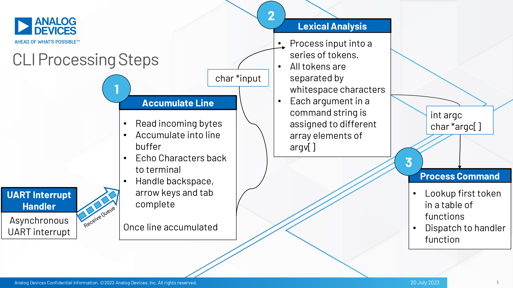

# Command Line Interface

## Description

#### What is a Command Line Interface(CLI)?

A command-line interface or command language interpreter (CLI), also known as command-line user interface, console user interface, and character user interface (CUI), is a means of interacting with an embedded system where the user (or client) issues commands to the program in the form of successive lines of text (command lines).

This library provides an extensible command processor on device to:
* Allow developers to get diagnostics and change device parameters interactively
* Easily automate testing of the device, through PC-side scripting

The current CLI Library includes the following features:
- Case insensitive commands & arguments
- Can have spaces at beginning or end of string
- Can have multiple spaces between words
- Backspace
- Arrow keys
- Tab completion
- An internally defined 'help' command which lists information about each of the user-defined commands

## CLI Software Flow
The following graphic describes the software flow of the CLI.


## Porting Guide

The CLI library expects the user to implement the following steps:

1. Add the following line to your project.mk file to include the CLI library in your project:
```
include ${MAXIM_PATH}/Libraries/CLI/CLI.mk 
```

2. Define an array of type const command_t, this is your command table. Include an array element for each command you want your CLI to support. Each command_t element should define the name of the command, a string showing how to enter the command in the terminal, a description of what the command does, and a function pointer to the corresponding handler function.

For example, the following is subset of the SDHC example command set:
```
const command_t user_commands[] = {{ "format", "format", "Format the Card", handle_format },
    							   { "mkdir", "mkdir <directory name>", "Create a directory", handle_mkdir }}
```

3. Define a handler function for each command.

Return Value
- The function needs to return an integer type. It should return 0 (E_NO_ERROR) if the command was executed successfuly, otherwise it should return a negative integer as an error code.

Parameters
- argc   - Argument counter, number of tokens in the argument vector
- argv[] - Argument vector, tokenized command string

Below is a sample handler function prototype for a "make directory" command.
```
int handle_mkdir(int argc, char *argv[]);
```

As an example, suppose a user entered the command:
```
mkdir new_folder
```
The CLI library will tokenize the command string "mkdir new_folder" into "mkdir" and "new_folder" and assigns them to argv[0] and argv[1] respectively. The library would then determine that this is the "make directory" command and would call "handle_mkdir" with argc=2 and a pointer to the argument vector.

4. Include cli.h in the approriate source file and initialize the CLI by calling the CLI_Init function with a pointer to the command table, along with the number of entries in the command table.
