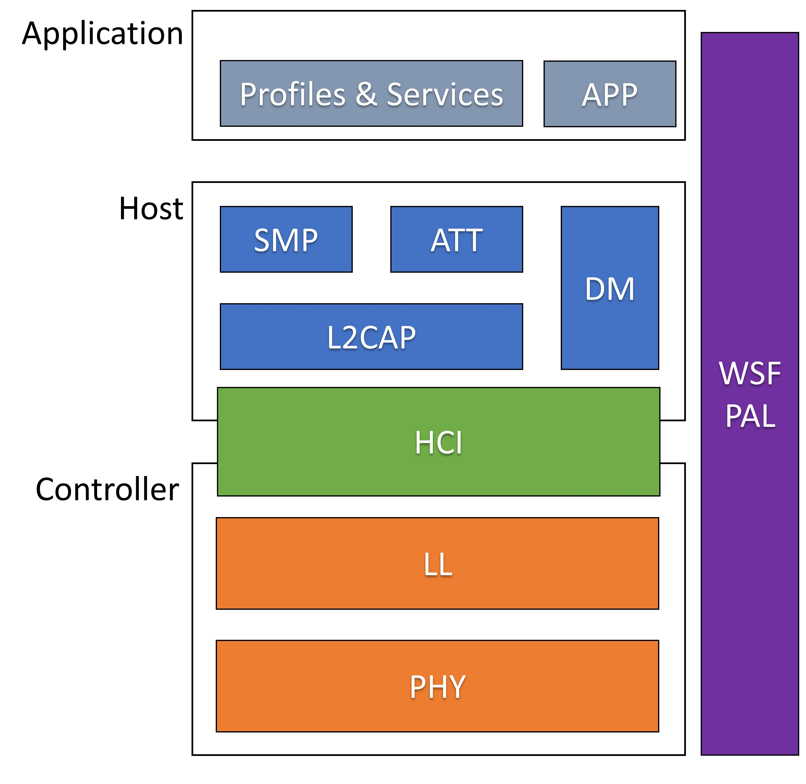
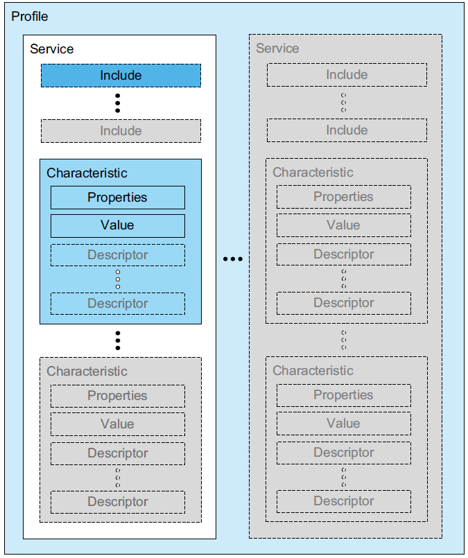

# Architecture

This document describes the Cordio software architecture. Refer to the Bluetooth specificaion Volume 1, Part A for additional information regarding the Bluetooth architecture.

## Application

The App Framework performs many operations common to Bluetooth LE embedded applications, such as:
* Application-level device, connection, and security management.
* Simple user interface abstractions for button press handling, sounds, display, and other user feedback.
* An abstracted device database for storing bonding data and other device parameters.

## Profiles and Services

The GATT Profile specifies the structure in which profile data is exchanged. This structure defines basic elements such as services and characteristics, used in a profile. The top level of the hierarchy is a profile. A profile is composed of one or more services necessary to fulfill a use case. A service is composed of characteristics or references to other services. Each characteristic contains a value and may contain optional information about the value. The service and characteristic and the components of the characteristic (i.e., value and descriptors) contain the profile data and are all stored in Attributes on the server.

## Wireless Stack Framework

The Wireless Software Foundation (WSF) is a simple OS wrapper, porting layer, and general-purpose software service used by the software system. The goal of WSF is to stay small and lean, supporting only the basic services required by the stack. It consists of the following:
* Event handler service with event and message passing.
* Timer service.
* Queue and buffer management service.
* Portable data types.
* Critical sections and task locking.
* Trace and assert diagnostic services.
* Security interfaces for encryption and random number generation.

### Platform Adaption Layer

The Platform Adaption Layer is the abstraction between the software stack and the hardware. It includes APIs for timers, UART, RTC, and various system level functions such as sleep and memory management. 

## Attribute Protocol
The ATT subsystem implements the attribute protocol and generic attribute profile (GATT). It contains two independent subsystems: The attribute protocol client (ATTC) and attribute protocol server (ATTS).

ATTC implements all attribute protocol client features and is designed to meet the client requirements of the generic attribute profile. ATTC can support multiple simultaneous connections to different servers.

ATTS implements all attribute protocol server features and has support for multiple simultaneous client connections. ATTS also implements the server features defined by the generic attribute profile.

## Device Manager

The DM subsystem implements device management procedures required by the stack. These procedures are partitioned by procedure category and device role (master or slave). The following procedures are implemented in DM:

* Advertising and device visibility: Enable/disable advertising, set advertising parameters and data, set connectability and discoverability.
* Scanning and device discovery: Start/stop scanning, set scan parameters, advertising reports, name discovery.
* Connection management: Create/accept/remove connections, set/update connection parameters, read RSSI.
* Security management: Bonding, storage of security parameters, authentication, encryption, authorization, random address management.
* Local device management: Initialization and reset, set local parameters, vendor-specific commands.
DM procedures support the Generic Access Profile (GAP) when applicable.

## Security Manager Protocol
The Security Manager Protocol (SMP) is the peer-to-peer protocol used to generate encryption keys and identity keys. The protocol operates over a dedicated fixed L2CAP channel. The SMP block also manages storage of the encryption keys and identity keys and is responsible for generating random addresses and resolving random addresses to known device identities. The SMP block interfaces directly with the Controller to provide stored keys used for encryption and authentication during the encryption or pairing procedures.

The SMP subsystem implements the security manager protocol. It contains two independent subsystems:
* The initiator (SMPI). SMPI implements the initiator features of the security manager protocol and has support for multiple simultaneous connections.
* The responder (SMPR). SMPR implements the responder features of the security manager protocol and has support for only one connection (by Bluetooth specification design).

SMP also implements the cryptographic toolbox, which uses AES. The interface to AES is asynchronous and abstracted through WSF. SMP also implements functions to support data signing.

## Logical Link Control Adaptation Protocol

The L2CAP (Logical Link Control Adaptation Protocol) resource manager block is responsible for managing the ordering of submission of PDU fragments to the baseband and some relative scheduling between channels to ensure that L2CAP channels with QoS commitments are not denied access to the physical channel due to Controller resource exhaustion. This is required because the architectural model does not assume that a Controller has limitless buffering, or that the HCI is a pipe of infinite bandwidth.

L2CAP Resource Managers may also carry out traffic conformance policing to ensure that applications are submitting L2CAP SDUs within the bounds of their negotiated QoS settings. The general Bluetooth data transport model assumes well-behaved applications, and does not define how an implementation is expected to deal with this problem.

## Host Controller Interface

The HCI subsystem implements the host-controller interface specification. This specification defines commands, events, and data packets sent between a Bluetooth LE protocol stack on a host and a link layer on a controller.
The HCI API is optimized to be a thin interface layer for a single chip system. It is configurable for either a single chip system or traditional system with wired HCI.
This configurability is accomplished through a layered implementation. A core layer can be configured for either a single chip system or wired HCI. A transport and driver layer below the core layer can be configured for different wired transports such as UART.

## Link Layer

The link layer is responsible for the creation, modification and release of logical links (and, if required, their associated logical transports), as well as the update of parameters related to physical links between devices. The link layer achieves this by communicating with the link layer in remote Bluetooth devices using the  Link Layer Protocol (LL) in LE. The LL protocol allows the creation of new logical links and logical transports between devices when required, as well as the general control of link and transport attributes such as the enabling of encryption on the logical transport, and the adapting of transmit power on the physical link.

## Physical Layer

The PHY block is responsible for transmitting and receiving packets of information on the physical channel. A control path between the baseband and the PHY block allows the baseband block to control the timing and frequency carrier of the PHY block. The PHY block transforms a stream of data to and from the physical channel and the baseband into required formats.
