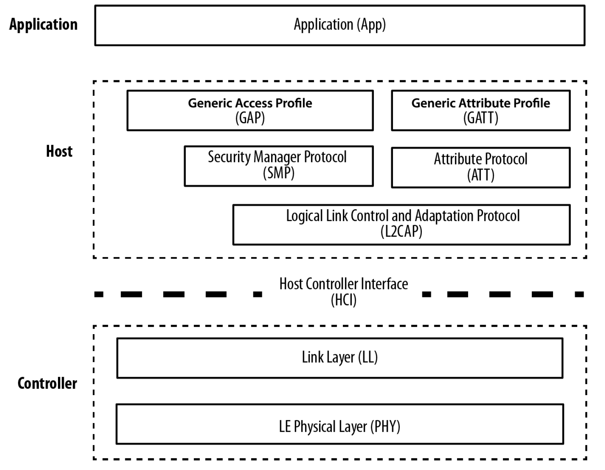
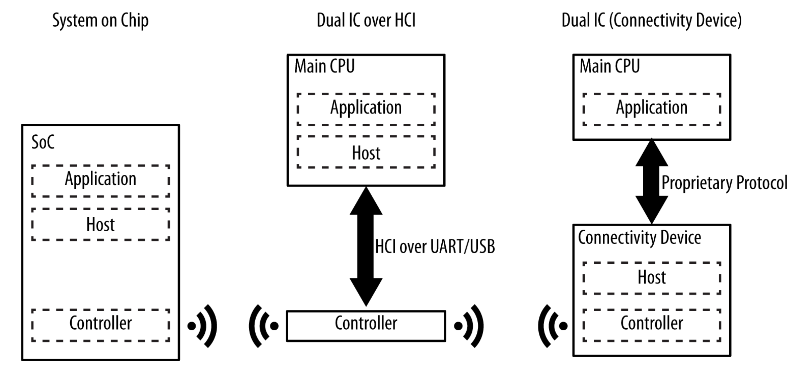
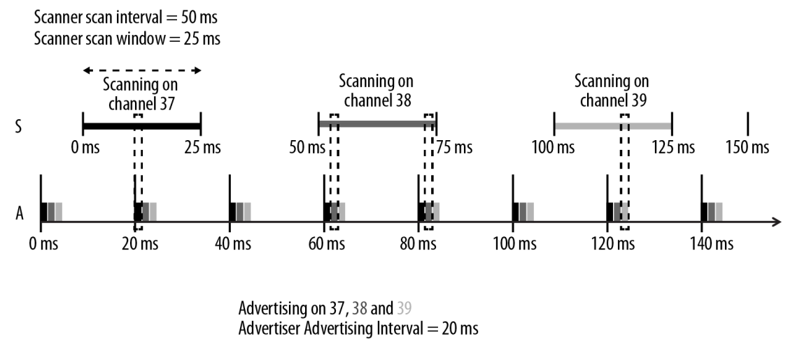
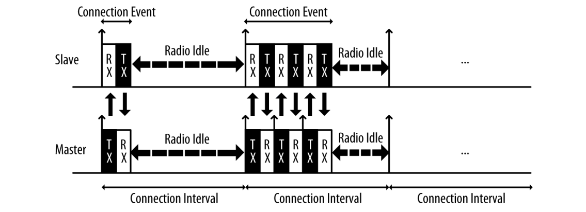

# Bluetooth LE Basics

## References
The Bluetooth Special Interest Group (SIG) has documentation available on their [website](https://www.bluetooth.com/). Refer to the [documentation](https://www.bluetooth.com/specifications/specs/) page to see the latest core specification. This will be your best resource for learning the details of Bluetooth Low Energy.

These books are also excellent references for developers.

* *Getting Started with Bluetooth Low Energy* by O'Reilly
* *Bluetooth Low Energy: The Developer's Handbook* by Robin Heydon

## Architecture
The Bluetooth stack closely resembles the layers of the network stack. We have the application layer at the top and the physical layer at the bottom. Each layer encapsulates the data and passes it to the appropriate section of the upper and lower layers.

The Host Conroller Interface (HCI) is the common point where devices are split. Typically this this interface is over an asynchronous protocol such as UART. Some devices will define proprietary interfaces between the application and host layers. Multi-core SOCs can also use the HCI or proprietay interfaces to split the stack between multiple CPUs.

When testing the Controller layers, test equipment will have a USB interface and act as a Host device. Devices under test will use a USB to UART adapter and act as Controller devices. 

## States
These are the common states used in Bluetooth LE communication. Typically devices will be in only one of these states at a time, but it is possible for devices to be in all simultaneously. 

### Advertising
Devices in this state are broadcasting advertisement packets to scanning/initiating devices. This is an asychronous operation that has no synchronization with peer devices. Advertising devices are transmitting without any previous knowledge of peer devices. Advertising and scanning operations are done on channels 37, 38, and 39. The interval between advertising events is configurable between 20 ms and 10.24 s.

### Scanning / Initiating
Devices in the scanning state listen for advertising devcies and can send scan optionally requests for additional information. The scanning interval and window settings are configurable. 

If a devices is scanning with the intent of connecting to a specific device, that is called the initiating state. The initiating devcies will send a connection indication to the desired advertising device to indicate it's desire to create a connection.

### Connected
Once a initiating devices sends the connection requset and the advertising devices accepts the connection request, the two devices enter the connected state. This is a point to point connection allowing devcies to directly exchange information. 

In order to minimize interference, devices in the connected state will hop between channels 0-36 in a pseudo random order. The channel hopping information is communicated in the connection indication.

Each connection event is separated by the connection interval. This interval is configurable from 7.5 ms to 4 s. The master will always transmit first and receive second. The Slave will always receive first and transmit second. Devices will typically always send and receive at least one packet in each interval, and they can optionally transmit and receive multiple packets in each interval. 

