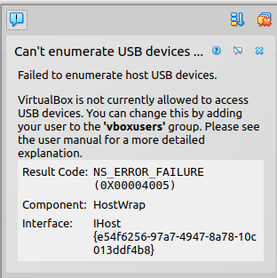
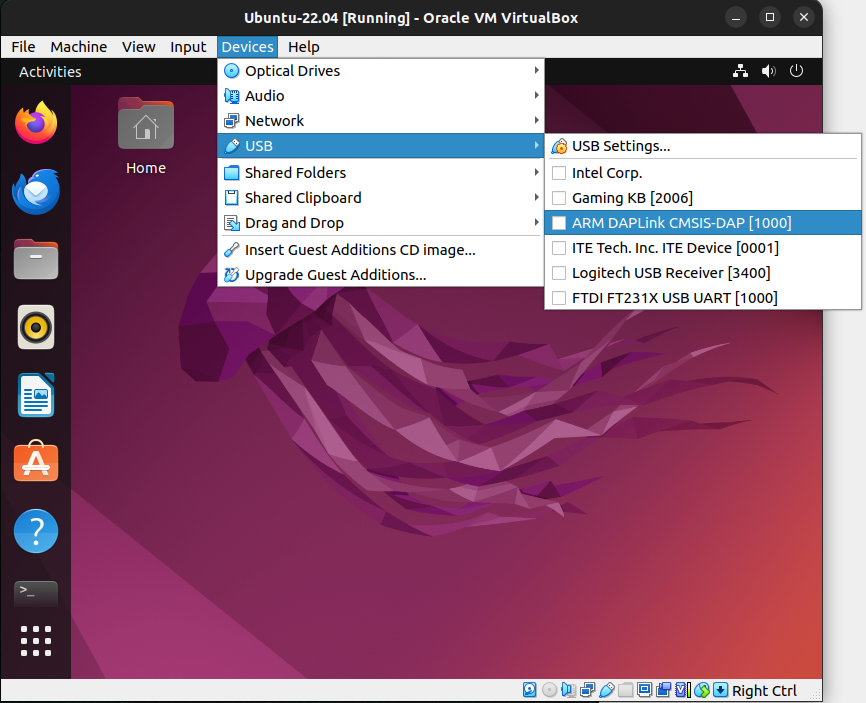
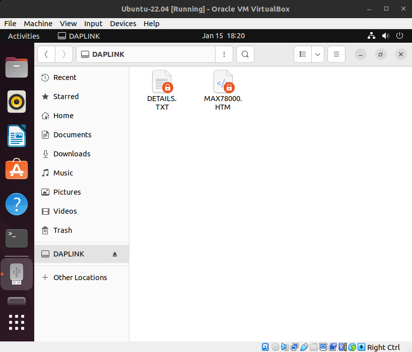

# VirtualBox Setup for MSDK and Micro-ROS

VirtualBox allows for the easy creation and management of Virtual Machines ("VMs"), and is supported across Windows, Linux, and MacOS host machines.  It's a great option for setting up a micro-ROS development environment when a native Linux environment isn't available, or for testing micro-ROS from a clean environment. 

## Installation

1. Download & install [VirtualBox](https://www.virtualbox.org/wiki/Downloads)

2. Download an Ubuntu Desktop 22.04 LTS .ISO image from the official Ubuntu page [here](https://ubuntu.com/download/desktop)

3. Create a new virtual machine using the downloaded .ISO.  [This](https://ubuntu.com/tutorials/how-to-run-ubuntu-desktop-on-a-virtual-machine-using-virtualbox#1-overview) tutorial hosted on the Ubuntu site is a great reference.

## Setting Up USB Passthrough

### Can't Enumerate USB Devices

If you are running an Ubuntu _host_ machine and see the following error when launching VirtualBox, you will need to fix this before being able to connect USB devices to your VM.



1. Close VirtualBox.

2. Open a terminal, and run the following command.

```shell
$ sudo usermod -aG vboxusers $USER
```

3. Log out, and log back in (may require a restart).

4. Open a terminal and verify that the current user is added to the `vboxusers` group with the `group` command.

```shell
$ group
username adm cdrom sudo dip plugdev lpadmin lxd sambashare vboxusers
```

5. Re-launch VirtualBox.  The error should be gone.

### Connecting USB Devices to the VM

1. Launch VirtualBox, and start your Ubuntu 22.04 VM.

2. Navigate to `Devices -> USB` and locate the device you would like to pass through to the VM.



3. Select it.  This will hand over USB control from the host machine to the VM.  For example, if connecting to a PICO debugger a DAPLINK drive should be present.

