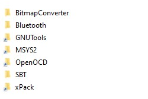

# Analog Devices MSDK

## Introduction

The Maxim Microcontrollers SDK (MSDK), now a part of [Analog Devices](https://www.analog.com/en/index.html), contains the necessary software and tools to develop firmware for the [MAX32xxx and MAX78xxx Microcontrollers](https://www.analog.com/en/parametricsearch/10984).  This includes register files, peripheral drivers, system startup files, documentation, various utilities, third-party libraries, IDE support files, and a toolchain.  Full documentation can be found in the User Guide:

* [MSDK User Guide](https://analog-devices-msdk.github.io/msdk/USERGUIDE/)

**This repository** contains the latest **_source code_** of the MSDK and is used for *development*.  It does _not_ contain the MSDK _toolchain_, which is a separate collection of programs used to build, program, and debug the contents of this repo on hardware.

## Installation

The MSDK is available via an Automatic Installer.  See the ["Installation"](https://analog-devices-msdk.github.io/msdk/USERGUIDE/#installation) in the MSDK User Guide for instructions.

Users who would like to use the latest beeding-edge _development_ resources can follow [Developing from the Repo](#developing-from-the-repo) below, but this should only be done **_after_** installing the release MSDK above.

## Contributing

Contributions to the MSDK are welcome.  See [CONTRIBUTING.md](Documentation/CONTRIBUTING.md) for guidelines.

## Developing from the Repo

This section assumes some familiarity with the MSDK and the standard setup procedure for its supported development environments.  First-time users should work from a standard MSDK installation instead.

### Cloning

This repo can be cloned using [Git](https://git-scm.com/) to obtain the latest development copies of the MSDK source code.  

1. Download and install [Git](https://git-scm.com/downloads).

2. Add an SSH key to your Github account.  See the [Github Docs on SSH](https://docs.github.com/en/authentication/connecting-to-github-with-ssh) for instructions.

3. Open a terminal on your system.

4. `cd` into a directory **_without any spaces in its filepath_**.

5. Clone the repository using the `git clone` command.

    * **SSH clone (recommended)**

      ```bash
      git clone --recurse git@github.com:Analog-Devices-MSDK/msdk.git
      ```

    * **HTTPS Clone**

      ```bash
      git clone --recurse https://github.com/Analog-Devices-MSDK/msdk.git
      ```

      Expected output:

      ```shell
      Cloning into 'msdk'...
      remote: Enumerating objects: 65643, done.
      remote: Counting objects: 100% (8622/8622), done.
      remote: Compressing objects: 100% (4175/4175), done.
      remote: Total 65643 (delta 4472), reused 8166 (delta 4215), pack-reused 57021
      Receiving objects: 100% (65643/65643), 231.23 MiB | 15.51 MiB/s, done.
      Resolving deltas: 100% (48045/48045), done.
      Updating files: 100% (20873/20873), done.
      Submodule 'Libraries/Cordio' (git@github.com:Analog-Devices-MSDK/Libraries-cordio.git) registered for path 'Libraries/Cordio'
      Cloning into '/home/jakecarter/repos/test/msdk/Libraries/Cordio'...
      remote: Enumerating objects: 2905, done.
      remote: Counting objects: 100% (228/228), done.
      remote: Compressing objects: 100% (153/153), done.
      remote: Total 2905 (delta 81), reused 193 (delta 70), pack-reused 2677
      Receiving objects: 100% (2905/2905), 10.10 MiB | 14.53 MiB/s, done.
      Resolving deltas: 100% (1209/1209), done.
      Submodule path 'Libraries/Cordio': checked out '91cef69d49e5db8b32602b089007ab1aafe26900'
      ```

### Toolchain Setup

This repository contains the MSDK's *source code* only.  In order to develop on it directly the toolchain must be made available at the same file-paths as the full MSDK installation.  The easiest way to do this is to retrieve the toolchain with the automatic installer and then create symbolic links.  This section walks through the process.

1. Install the MSDK via the [Automatic Installer](https://analog-devices-msdk.github.io/msdk/USERGUIDE/#installation) for your OS if you haven't already.

    At ***minimum***, install the following components:
    * GNU RISC-V Embedded GCC
    * GNU Tools for ARM Embedded Processors
    * Open On-Chip Debugger
    * MSYS2 (if you're on Windows 10)

2. [Clone](#cloning) the Github repository to an accessible location *without any spaces in its filepath*.

3. Create symbolic directory links to link the toolchain at the expected locations.

    On **Windows**:
    * Open a **command prompt** _as administrator_.

    * `cd` into the cloned location of the Github repo from step 2.

    * Run the following commands.  If you installed the MSDK to a non-default location in step 1, change `C:\MaximSDK` to point to the location you chose.

        ```cmd
        mklink /D Tools\GNUTools C:\MaximSDK\Tools\GNUTools
        ```

        ```cmd
        mklink /D Tools\OpenOCD C:\MaximSDK\Tools\OpenOCD
        ```

        ```cmd
        mklink /D Tools\MSYS2 C:\MaximSDK\Tools\MSYS2
        ```

        ```cmd
        mklink /D Tools\xPack C:\MaximSDK\Tools\xPack
        ```

        Example output:

        ```cmd
        C:\Users\Username\repos\msdk>mklink /D Tools\GNUTools C:\MaximSDK\Tools\GNUTools
        symbolic link created for Tools\GNUTools <<===>> C:\MaximSDK\Tools\GNUTools
        
        C:\Users\Username\repos\msdk>mklink /D Tools\OpenOCD C:\MaximSDK\Tools\OpenOCD
        symbolic link created for Tools\OpenOCD <<===>> C:\MaximSDK\Tools\OpenOCD
        
        C:\Users\Username\repos\msdk>mklink /D Tools\MSYS2 C:\MaximSDK\Tools\MSYS2
        symbolic link created for Tools\MSYS2 <<===>> C:\MaximSDK\Tools\MSYS2
        
        C:\Users\Username\repos\msdk>mklink /D Tools\xPack C:\MaximSDK\Tools\xPack
        symbolic link created for Tools\xPack <<===>> C:\MaximSDK\Tools\xPack
        ```
        
        The [Tools](Tools) directory of the MSDK repo should now contain valid symbolic links to the full installation's toolchain.
        
        

    On **Linux/MacOS**:
    * Open a terminal

    * `cd` into the cloned location of the Github repo from step 2.

    * Run the following commands.  If you installed the MSDK to a non-default location in step 1, change `~\MaximSDK` to point to the location you chose.

        ```shell
        ln -s ~/MaximSDK/Tools/GNUTools Tools/GNUTools
        ```

        ```cmd
        ln -s ~/MaximSDK/Tools/OpenOCD Tools/OpenOCD
        ```

        ```cmd
        ln -s ~/MaximSDK/Tools/xPack Tools/xPack
        ```

        You can use `ls -la Tools` to verify the links have been created successfully.

        Example output:

        ```shell
        username@machine:~/repos/msdk$ ln -s ~/MaximSDK/Tools/GNUTools Tools/GNUTools
        username@machine:~/repos/msdk$ ln -s ~/MaximSDK/Tools/OpenOCD Tools/OpenOCD
        username@machine:~/repos/msdk$ ln -s ~/MaximSDK/Tools/xPack Tools/xPack
        username@machine:~/repos/msdk$ ls -la Tools
        total 20
        drwxr-xr-x 5 username username 4096 Oct  4 16:32 .
        drwxr-xr-x 9 username username 4096 Oct  4 16:29 ..
        drwxr-xr-x 2 username username 4096 Oct  4 16:29 BitmapConverter
        drwxr-xr-x 2 username username 4096 Oct  4 16:29 Bluetooth
        lrwxrwxrwx 1 username username   40 Oct  4 16:32 GNUTools -> /home/username/MaximSDK/Tools/GNUTools
        lrwxrwxrwx 1 username username   39 Oct  4 16:32 OpenOCD -> /home/username/MaximSDK/Tools/OpenOCD
        drwxr-xr-x 6 username username 4096 Oct  4 16:29 SBT
        lrwxrwxrwx 1 username username   37 Oct  4 16:32 xPack -> /home/username/MaximSDK/Tools/xPack
        ```

4. The MSDK now contains a virtual copy of the toolchain at the correct locations.  Some additional setup may be required to use it depending on your chosen development environment.  See [Setup](#setup) below.

### Environment Setup (Visual Studio Code)

If you have not previously configured VS Code, see [Setup (VS Code)](https://analog-devices-msdk.github.io/msdk/USERGUIDE/#setup-vs-code_1) in the User Guide.

To configure Visual Studio Code for the _development repository_ simply set `MAXIM_PATH` to the cloned location of the _development repo_ instead of the release MSDK in your user settings.json file.  After making the change, reload VS Code.  

The `MAXIM_PATH` pointing to the _release_ MSDK can be commented out to easily switch back to it if needed.  For example:

```json
{
    // There may be other settings up here...
    
    // "MAXIM_PATH":"C:/MaximSDK", // Work from the release MSDK
    "MAXIM_PATH":"C:/Users/Username/repos/msdk", // Work from the development MSDK
    "update.mode": "manual",
    "extensions.autoUpdate": false,
    
    // There may be other settings down here...
}
```

### Environment Setup (Eclipse)

There are two options for using Eclipse with the MSDK *development* repository.

#### Option 1 - Project Settings

This option can configure an _individual_ Eclipse project to use the development repo. 

1. Import or open a project in your Eclipse workspace.

2. Right click on the project and select `Properties`.

3. Navigate to `C/C++ Build -> Environment`.

4. Add a _new_ environment variable.  Set:

    * Name: `MAXIM_PATH`

    * Value: Installed location of this repository.  Ex: `C:\Users\JCarter3\repos\msdk`.

    * Select **"Add to all configurations"**

5. Ensure the **"Replace native environment with the specified one"** option is selected.

6. Hit "Apply" -> "Apply and Close".

7. Clean the project.

The project is now configured for use with the MSDK development repo, and subsequent builds will load the latest development resources.

#### Option 2 - Edit setenv

This option can be used to configure _all_ Eclipse projects to use the development repo by default.

1. Locate the `setenv.bat` script that can be found in the root directory of the _release_ MSDK installation.

2. (Optional, recommended) Copy the `setenv.bat` file to a backup called `setenv-release.bat`.  This backup file can be used to revert back to the original if needed.

3. Open the `setenv.bat` script in a text editor.

4. Change the line

    ```bat
    set MAXIM_PATH=%CD%
    ```

    to set `MAXIM_PATH` to the installed location of this repository.  For example:

    ```bat
    set MAXIM_PATH=C:\Users\Username\repos\msdk
    ```

​	**Note:** This will configure _all_ Eclipse sessions to load resources from the development repo.

### Environment Setup (Command-Line)

If you have not previously the command-line, see [Setup (Command-Line)](https://analog-devices-msdk.github.io/msdk/USERGUIDE/#setup-command-line_1) in the User Guide.

To configure the command-line for use with the development repo:

1. Set the `MAXIM_PATH` environment variable to the cloned location of the development repo instead of the release MSDK.

    - Windows:  Edit `Tools/MSYS2/msys.bat`
    - Linux/MacOS:  Edit your shell's profile/startup script
    
2. Restart your shell

## License Agreement

**© Copyright (C) 2022 Maxim Integrated Products, Inc., All rights Reserved.**

This software is protected by copyright laws of the United States and
of foreign countries. This material may also be protected by patent laws
and technology transfer regulations of the United States and of foreign
countries. This software is furnished under a license agreement and/or a
nondisclosure agreement and may only be used or reproduced in accordance
with the terms of those agreements. Dissemination of this information to
any party or parties not specified in the license agreement and/or 
nondisclosure agreement is expressly prohibited.

The above copyright notice and this permission notice shall be included
in all copies or substantial portions of the Software.

**THE SOFTWARE IS PROVIDED "AS IS", WITHOUT WARRANTY OF ANY KIND, EXPRESS
OR IMPLIED, INCLUDING BUT NOT LIMITED TO THE WARRANTIES OF
MERCHANTABILITY, FITNESS FOR A PARTICULAR PURPOSE AND NONINFRINGEMENT.
IN NO EVENT SHALL MAXIM INTEGRATED BE LIABLE FOR ANY CLAIM, DAMAGES
OR OTHER LIABILITY, WHETHER IN AN ACTION OF CONTRACT, TORT OR OTHERWISE,
ARISING FROM, OUT OF OR IN CONNECTION WITH THE SOFTWARE OR THE USE OR
OTHER DEALINGS IN THE SOFTWARE.**

Except as contained in this notice, the name of **Maxim Integrated Products, Inc.**
shall not be used except as stated in the **Maxim Integrated Products, Inc. Branding Policy.**

The mere transfer of this software does not imply any licenses
of trade secrets, proprietary technology, copyrights, patents,
trademarks, maskwork rights, or any other form of intellectual
property whatsoever. **Maxim Integrated Products, Inc.** retains all
ownership rights.

[Final Copyright](https://www.maximintegrated.com/en/aboutus/legal/copyrights/default-copyright.html "Final Copyright")

[Final Software License Agreement](https://www.maximintegrated.com/en/aboutus/legal/sla/no-distribute.html "Final SLA")
