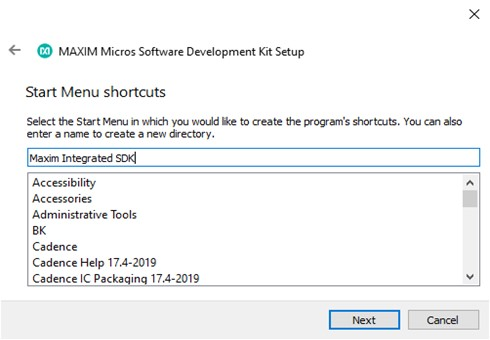
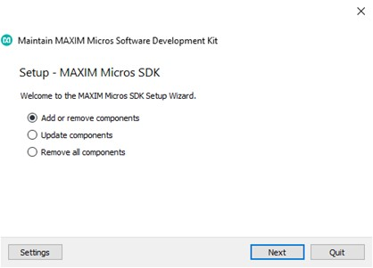

# Analog Devices MSDK User Guide

[TOC]

## Introduction

The Maxim Microcontrollers SDK (MSDK), now a part of [Analog Devices](https://www.analog.com/en/index.html), contains the necessary software and tools to develop firmware for the [MAX-series Microcontrollers](https://www.maximintegrated.com/en/products/microcontrollers.html).  That includes register files and system startup files to enable low-level development for its [supported parts](#supported-parts).  It also provides higher level peripheral driver APIs (written in C) alongside various utilities, third-party libraries, Board Support Packages (BSPs) and a set of example programs for each microcontroller.

Additionally, a GCC-based toolchain is included and builds are managed by a system of [Makefiles](https://www.gnu.org/software/make/manual/).  Flashing and debugging are enabled by a [custom fork of OpenOCD](https://github.com/Analog-Devices-MSDK/openocd).  The MSDK's toolchain and build system offers a Command Line Interface (CLI), and project files for [supported development environments](#supported-development-environments) are maintained that build on top of that CLI.

This document describes the MSDK's installation, setup, and usage.

### Supported Operating Systems

- Windows (Windows 10 only)

- Linux (Ubuntu only)

- MacOS

### Supported Parts

- [MAX32520](https://www.maximintegrated.com/en/products/microcontrollers/MAX32520.html): ChipDNA Secure Microcontroller with Secure Boot for IoT Applications

- [MAX32570](https://www.maximintegrated.com/en/products/microcontrollers/MAX32570.html) **(Available by NDA only**): Low-Power Arm Cortex-M4 Microcontroller with Contactless Radio for Secure Applications

- [MAX32650](https://www.maximintegrated.com/en/products/microcontrollers/MAX32650.html): Ultra-Low-Power Arm Cortex-M4 with FPU-Based Microcontroller (MCU) with 3MB Flash and 1MB SRAM

- [MAX32655](https://www.maximintegrated.com/en/products/microcontrollers/MAX32655.html): Low-Power, Arm Cortex-M4 Processor with FPU-Based Microcontroller and Bluetooth 5.2

- [MAX32660](https://www.maximintegrated.com/en/products/microcontrollers/MAX32660.html): Tiny, Ultra-Low-Power Arm Cortex-M4 Processor with FPU-Based Microcontroller (MCU) with 256KB Flash and 96KB SRAM

- [MAX32665](https://www.maximintegrated.com/en/products/microcontrollers/MAX32665.html): Low-Power ARM Cortex-M4 with FPU-Based Microcontroller with Bluetooth 5 for Wearables

- [MAX32670](https://www.maximintegrated.com/en/products/microcontrollers/MAX32670.html): High-Reliability, Ultra-Low-Power Microcontroller Powered by Arm Cortex-M4 Processor with FPU for Industrial and IoT

- [MAX32672](https://www.maximintegrated.com/en/products/microcontrollers/MAX32672.html): High-Reliability, Tiny, Ultra-Low-Power Arm Cortex-M4F Microcontroller with 12-Bit 1MSPS ADC

- [MAX32675](https://www.maximintegrated.com/en/products/microcontrollers/MAX32675.html): Ultra-Low-Power Arm Cortex-M4F with Precision Analog Front-End for Industrial and Medical Sensors

- [MAX32680](https://www.maximintegrated.com/en/products/microcontrollers/MAX32680.html): Ultra-Low-Power Arm Cortex-M4F with Precision Analog Front-End and Bluetooth LE 5.2

- [MAX78000](https://www.maximintegrated.com/en/products/microcontrollers/MAX78000.html): Artificial Intelligence Microcontroller with Ultra-Low-Power Convolutional Neural Network Accelerator

- [MAX78002](https://www.maximintegrated.com/en/products/microcontrollers/MAX78002.html): Artificial Intelligence Microcontroller with Low-Power Convolutional Neural Network Accelerator

### Supported Development Environments

* Command-line Development
  * Supported shells (Windows):
    * [MSYS2](https://www.msys2.org/)

  * Supported shells (Ubuntu & MacOS):
    * [Bash](https://tiswww.case.edu/php/chet/bash/bashtop.html)
    * [Zsh](https://www.zsh.org/)

* Visual Studio Code
* Eclipse
* IAR
* Keil

### Supported Languages

* C
* Assembly (ARM and/or RISC-V depending on microcontroller)

## Installation

### Prerequisites

- Administrator rights
- (On MacOS) - [Homebrew](https://brew.sh/)


### Download

The MSDK installer is available for supported Operating Systems via the links below.

- [Windows 10](https://www.maximintegrated.com/en/design/software-description.html/swpart=SFW0010820A)

- [Linux (Ubuntu)](https://www.maximintegrated.com/en/design/software-description.html/swpart=SFW0018720A)

  - This file must be made executable before it can be run (`chmod +x MaximMicrosSDK_linux.run`). Alternatively, set `Allow executing as program” in the Ubuntu GUI.  
    
    

- [MacOS](https://www.maximintegrated.com/en/design/software-description.html/swpart=SFW0018610A)

  - On MacOS the installer is distributed inside of a .dmg disk image file. Double click the downloaded file to mount it. Afterwards, the installer executable will be made available inside the mounted drive.

### Setup

1.  [Download](#Download) the installer executable to an accessible location and launch it.

2.  Click **Next** to proceed from the Welcome screen.

3.  Choose the installation location. By default, the MSDK will install to the `MaximSDK` folder off of the root of your filesystem.
    
    

4.  Select the components to install.  It's recommended to install all components.
    
    

	For a minimal command-line development installation, the following components can be selected:  
    - GNU RISC-V Embedded GCC  
    - GNU Tools for Arm Embedded Processors  
    - Minimalist GNU for Windows (Windows only)  
    - Open On-Chip Debugger  
    - MAXIM Microcontrollers \> “MAXxxxxx Resources” for your Microcontroller

5.  Review and accept the license agreements.

    

6.  (Optional) rename the Start Menu shortcut folder that will be created.

    

7.  Click “Install” to begin the installation. The installer will download and install the selected components from step 5.  At any time during this step the installation can be safely cancelled.  Cancellation will undo any changes made on disk.
    
    


8.  Click Finish to complete the installation.
    
    

9. You should now see the contents of the installation directory populated with the MSDK.  
   **Note:** On MacOS, some [additional steps](#completing-the-installation-on-macos) are required.

   

#### Completing the Installation on MacOS

On MacOS, some additional missing packages must be manually installed via [Homebrew](https://brew.sh/).

**For non-M1 platforms:**

1. Follow the instructions on the [Homebrew home page](https://brew.sh/) to install Homebrew on your system.

2. Then, open a terminal and run the command...

    ```shell
    brew install libusb-compat libftdi hidapi libusb
    ```

**For M1 platforms**:

The MSDK's OpenOCD binaries ship pre-compiled for Intel Silicon (i386).  As a result, you should use a [Rosetta](https://developer.apple.com/documentation/apple-silicon/about-the-rosetta-translation-environment) terminal on M1 platforms to install the _i386 version_ of Homebrew and retrieve OpenOCD's dependencies with it. This ensures OpenOCD gets the packages with the architecture it needs.  From there, Rosetta will handle the rest and allow running the binaries on the M1 platform's arm64 architecture.

The i386 version of Homebrew can be installed in parallel with the arm64 version, and typically installs into a separate filesystem.

1. Open a terminal and update Rosetta.

    ```shell
    softwareupdate --install-rosetta --agree-to-license
    ```

2. Close the terminal.

3. Run a new terminal in Rosetta:

    1. Go to Finder > Applications and find your Terminal

    2. Right-Click Terminal and Duplicate it.  Rename it to "Terminal i386".

    3. Rich-Click "Terminal i386" > Get Info > Enable "Open using Rosetta"

    4. Launch the new "Terminal i386" and type `arch` to verify that it says `i386` now.

4. From your Rosetta terminal follow the instructions on the [Homebrew home page](https://brew.sh/) to install Homebrew on your system.

5. Verify the correct version of Homebrew is running from your Rosetta terminal using the `which brew` command.  This should return a path beginning with `/usr/local`.

    **Note:** On systems with multiple or pre-existing Homebrew installations, the arm64 version of Homebrew may still take precendence over the newly installed x86_64 version.  If `which brew` contains `/opt/homebrew` instead, you may need to edit your terminal profile's startup script.  Alternatively, you can run the correct Homebrew binary directly. `/usr/local/homebrew/bin/brew ...`

6. Run the command...

    ```shell
    brew install libusb-compat libftdi hidapi libusb
    ```

    (or, if you need to use the absolute path)

    ```shell
    /usr/local/homebrew/bin/brew install libusb-compat libftdi hidapi libusb
    ```

### Maintenance

An MSDK installation contains a `MaintenanceTool` executable program in the root directory.  This program can be used to retrieve updates, manage components, and uninstall the MSDK.

Updates are typically released on a quarterly basis.  Development copies of the MSDK resources can be obtained via [Github](https://github.com/Analog-Devices-MSDK/msdk), and instructions on how to work from the development copies can be found in the repository's README.



## Usage

#### 


| Version, Date | Change                                                                                                                            | Page(s) |
|---------------|-----------------------------------------------------------------------------------------------------------------------------------|---------|
| 0, 4/20       | Initial release                                                                                                                   | \*      |
| 1, 4/22       | Update to new template, add MacOS Homebrew instructions, add download links for all 3 OS’s, update supported microcontroller list |         |
|               |                                                                                                                                   |         |
