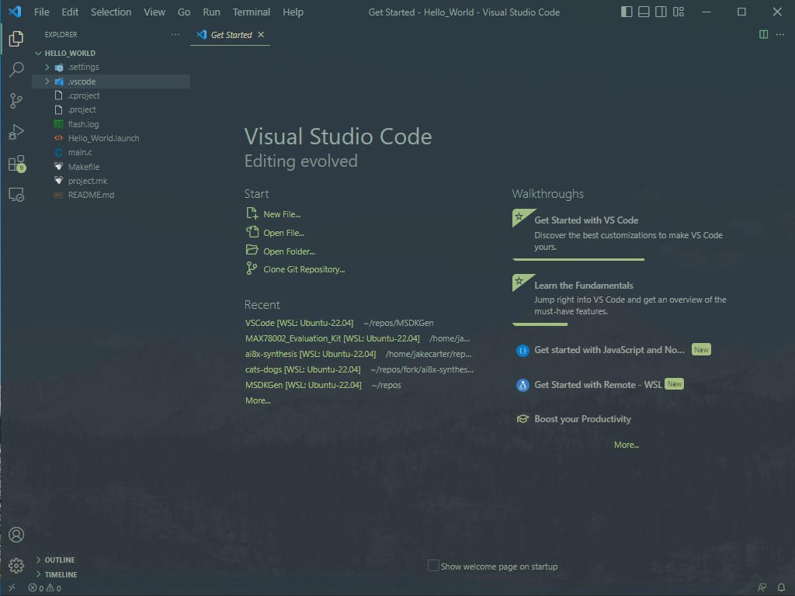
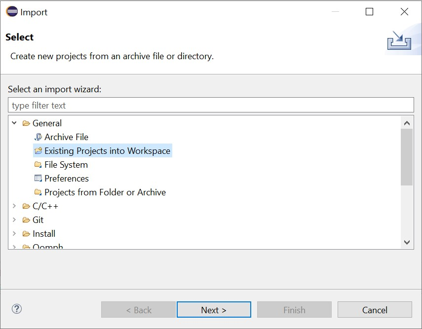
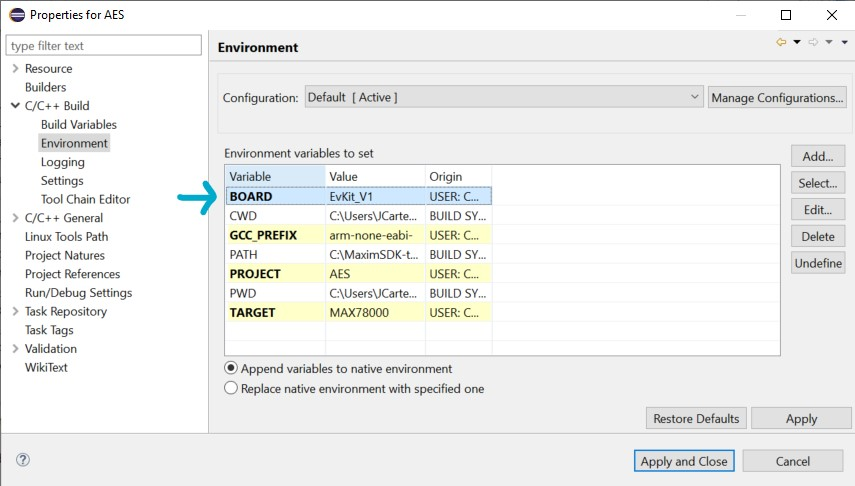
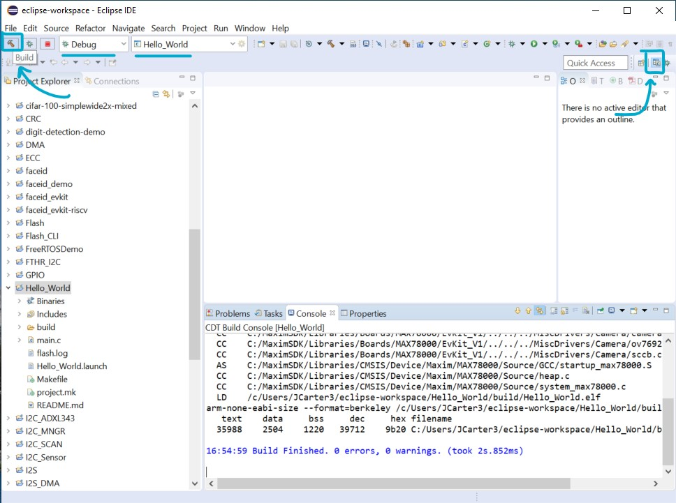
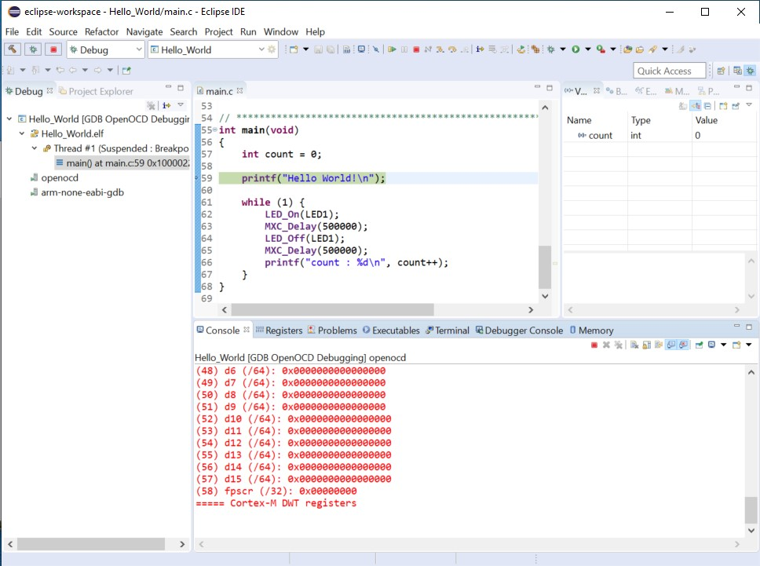
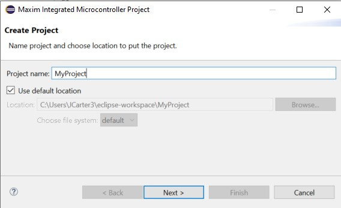
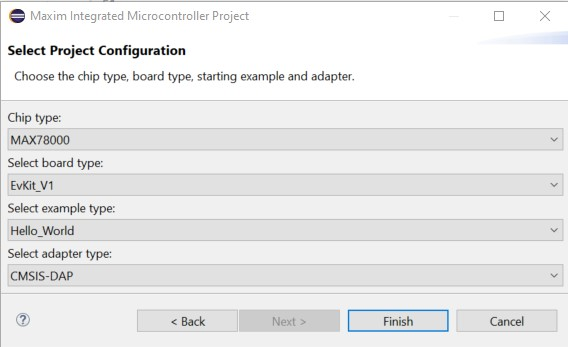

# Analog Devices MSDK User Guide

[TOC]

## Overview

The Maxim Microcontrollers SDK (MSDK), now a part of [Analog Devices](https://www.analog.com/en/index.html), contains the necessary software and tools to develop firmware for the [MAX-series Microcontrollers](https://www.maximintegrated.com/en/products/microcontrollers.html).  That includes register files and system startup files to enable low-level development for its [supported parts](#supported-parts).  It also provides higher level peripheral driver APIs (written in C) alongside various utilities, third-party libraries, Board Support Packages (BSPs) and a set of example programs for each microcontroller.

Additionally, a GCC-based toolchain is included and builds are managed by a system of Makefiles (See [GNU Make](https://www.gnu.org/software/make/manual/)).  Flashing and debugging are enabled by a [custom fork of OpenOCD](https://github.com/Analog-Devices-MSDK/openocd).  The MSDK's toolchain and build system offers a Command Line Interface (CLI), and project files for [supported development environments](#supported-development-environments) are maintained that build on top of that CLI.

This document describes the MSDK's installation, setup, and usage.

### Supported Operating Systems

- Windows (Windows 10 only)

- Linux (Ubuntu only)

- MacOS

### Supported Parts

- [MAX32520](https://www.maximintegrated.com/en/products/microcontrollers/MAX32520.html): ChipDNA Secure Microcontroller with Secure Boot for IoT Applications

- [MAX32570](https://www.maximintegrated.com/en/products/microcontrollers/MAX32570.html) **(Available by NDA only**): Low-Power Arm Cortex-M4 Microcontroller with Contactless Radio for Secure Applications

- [MAX32650](https://www.maximintegrated.com/en/products/microcontrollers/MAX32650.html): Ultra-Low-Power Arm Cortex-M4 with FPU-Based Microcontroller (MCU) with 3MB Flash and 1MB SRAM

- [MAX32655](https://www.maximintegrated.com/en/products/microcontrollers/MAX32655.html): Low-Power, Arm Cortex-M4 Processor with FPU-Based Microcontroller and Bluetooth 5.2

- [MAX32660](https://www.maximintegrated.com/en/products/microcontrollers/MAX32660.html): Tiny, Ultra-Low-Power Arm Cortex-M4 Processor with FPU-Based Microcontroller (MCU) with 256KB Flash and 96KB SRAM

- [MAX32665](https://www.maximintegrated.com/en/products/microcontrollers/MAX32665.html): Low-Power ARM Cortex-M4 with FPU-Based Microcontroller with Bluetooth 5 for Wearables

- [MAX32670](https://www.maximintegrated.com/en/products/microcontrollers/MAX32670.html): High-Reliability, Ultra-Low-Power Microcontroller Powered by Arm Cortex-M4 Processor with FPU for Industrial and IoT

- [MAX32672](https://www.maximintegrated.com/en/products/microcontrollers/MAX32672.html): High-Reliability, Tiny, Ultra-Low-Power Arm Cortex-M4F Microcontroller with 12-Bit 1MSPS ADC

- [MAX32675](https://www.maximintegrated.com/en/products/microcontrollers/MAX32675.html): Ultra-Low-Power Arm Cortex-M4F with Precision Analog Front-End for Industrial and Medical Sensors

- [MAX32680](https://www.maximintegrated.com/en/products/microcontrollers/MAX32680.html): Ultra-Low-Power Arm Cortex-M4F with Precision Analog Front-End and Bluetooth LE 5.2

- [MAX78000](https://www.maximintegrated.com/en/products/microcontrollers/MAX78000.html): Artificial Intelligence Microcontroller with Ultra-Low-Power Convolutional Neural Network Accelerator

- [MAX78002](https://www.maximintegrated.com/en/products/microcontrollers/MAX78002.html): Artificial Intelligence Microcontroller with Low-Power Convolutional Neural Network Accelerator

### Supported Development Environments

* Command-line Development
  * Supported shells (Windows):
    * [MSYS2](https://www.msys2.org/)

  * Supported shells (Ubuntu & MacOS):
    * [Bash](https://tiswww.case.edu/php/chet/bash/bashtop.html)
    * [Zsh](https://www.zsh.org/)

* Visual Studio Code
* Eclipse
* IAR
* Keil

### Supported Languages

* C
* Assembly (ARM and/or RISC-V instruction set depending on microcontroller)

## Installation

### Prerequisites

- Administrator rights
- (On MacOS) - [Homebrew](https://brew.sh/)


### Download

The MSDK installer is available for supported Operating Systems via the links below.

- [Windows 10](https://www.maximintegrated.com/en/design/software-description.html/swpart=SFW0010820A)

- [Linux (Ubuntu)](https://www.maximintegrated.com/en/design/software-description.html/swpart=SFW0018720A)

  - This file must be made executable before it can be run (`chmod +x MaximMicrosSDK_linux.run`). Alternatively, set `Allow executing as program” in the Ubuntu GUI.  
    
    

- [MacOS](https://www.maximintegrated.com/en/design/software-description.html/swpart=SFW0018610A)

  - On MacOS the installer is distributed inside of a .dmg disk image file. Double click the downloaded file to mount it. Afterwards, the installer executable will be made available inside the mounted drive.

### Setup

1.  [Download](#Download) the installer executable to an accessible location and launch it.

2.  Click **Next** to proceed from the Welcome screen.

3.  Choose the installation location. By default, the MSDK will install to the `MaximSDK` folder off of the root of your filesystem.  It's recommended to install to the default location.
    
    

4.  Select the components to install.  It's recommended to install all components.
    
    

	For a minimal _command-line_ installation, the following components can be selected:  
    - GNU RISC-V Embedded GCC
    - GNU Tools for Arm Embedded Processors
    - Minimalist GNU for Windows (Windows only)
    - Open On-Chip Debugger
    - MAXIM Microcontrollers \> “MAXxxxxx Resources” for your Microcontroller

5.  Review and accept the license agreements.

    

6.  (Optional) rename the Start Menu shortcut folder that will be created.

    

7.  Click “Install” to begin the installation. The installer will download and install the selected components from step 5.  At any time during this step the installation can be safely cancelled.  Cancellation will undo any changes made on disk.
    
    


8.  Click Finish to complete the installation.
    
    

9. You should now see the contents of the installation directory populated with the MSDK.  
   **Note:** On MacOS, some [additional steps](#completing-the-installation-on-macos) are required.

   

#### Completing the Installation on MacOS

On MacOS, some additional missing packages must be manually installed via [Homebrew](https://brew.sh/).

**For non-M1 platforms:**

1. Follow the instructions on the [Homebrew home page](https://brew.sh/) to install Homebrew on your system.

2. Then, open a terminal and run the command...

    ```shell
    brew install libusb-compat libftdi hidapi libusb
    ```

**For M1 platforms**:

The MSDK's OpenOCD binaries ship pre-compiled for Intel Silicon (i386).  As a result, you should use a [Rosetta](https://developer.apple.com/documentation/apple-silicon/about-the-rosetta-translation-environment) terminal on M1 platforms to install the _i386 version_ of Homebrew and retrieve OpenOCD's dependencies with it. This ensures OpenOCD gets the packages with the architecture it needs.  From there, Rosetta will handle the rest and allow running the binaries on the M1 platform's arm64 architecture.

The i386 version of Homebrew can be installed in parallel with the arm64 version, and typically installs into a separate filesystem.

1. Open a terminal and update Rosetta.

    ```shell
    softwareupdate --install-rosetta --agree-to-license
    ```

2. Close the terminal.

3. Run a new terminal in Rosetta:

    1. Go to Finder > Applications and find your Terminal

    2. Right-Click Terminal and Duplicate it.  Rename it to "Terminal i386".

    3. Rich-Click "Terminal i386" > Get Info > Enable "Open using Rosetta"

    4. Launch the new "Terminal i386" and type `arch` to verify that it says `i386` now.

4. From your Rosetta terminal follow the instructions on the [Homebrew home page](https://brew.sh/) to install Homebrew on your system.

5. Verify the correct version of Homebrew is running from your Rosetta terminal using the `which brew` command.  This should return a path beginning with `/usr/local`.

    **Note:** On systems with multiple or pre-existing Homebrew installations, the arm64 version of Homebrew may still take precendence over the newly installed x86_64 version.  If `which brew` contains `/opt/homebrew` instead, you may need to edit your terminal profile's startup script.  Alternatively, you can run the correct Homebrew binary directly. `/usr/local/homebrew/bin/brew ...`

6. Run the command...

    ```shell
    brew install libusb-compat libftdi hidapi libusb
    ```

    (or, if you need to use the absolute path)

    ```shell
    /usr/local/homebrew/bin/brew install libusb-compat libftdi hidapi libusb
    ```

### Maintenance

An MSDK installation contains a `MaintenanceTool` executable program in the root directory.  This program can be used to retrieve updates, manage components, and uninstall the MSDK.

Updates are typically released on a quarterly basis.  Development copies of the MSDK resources can be obtained via [Github](https://github.com/Analog-Devices-MSDK/msdk), and instructions on how to work from the development copies can be found in the repository's README.


## Getting Started

The MSDK is designed for both evaluation and end-application development.  The typical **evaluation** cycle usually involves setting up the development environment, running demos, and exercising the peripheral driver API on an _evaluation platform_.  The typical **development** cycle typically involves building a prototype application on an _evaluation platform_ first, then porting the application to a custom board.  This section describes how to get started with the MSDK.

**First**, review the [Key Concepts](#key-concepts) below.  Then, proceed to the section for your preferred IDE:

* [Getting Started with Visual Studio Code](#getting-started-with-visual-studio-code)
* [Getting Started with Eclipse](#getting-started-with-eclipse)
* [Getting Started with Command-Line Development](#getting-started-with-command-line-development)

### Key Concepts

The MSDK offers support for multiple development environments to support the user's preference.  Regardless of which is used, there are a few key concepts to keep in mind.

* **Target Microcontroller**:  The _target microcontroller_ refers to the base part number of the microcontroller being used for development.  The MSDK contains register-level support and startup files for each of its [supported parts](#supported-parts), and it's important to note that support files for a target microcontroller and its _Board Support Packages_ are distinct from each other. 

  For example, if the [MAX78000EVKIT](https://www.maximintegrated.com/en/products/microcontrollers/MAX78000EVKIT.html) _or_ [MAX78000FTHR](https://www.maximintegrated.com/en/products/microcontrollers/MAX78000FTHR.html) is being used, the _Target Microcontroller_ is the MAX78000.

* **Board Support Package (BSP)**:  The MSDK supports evaluation platforms for target microcontrollers via _Board Support Packages_.  For microcontrollers with multiple evaluation platforms, multiple BSPs are available.  These can be found in the [`Libraries/Boards`](Libraries/Boards) folder of the MSDK installation.

  By default, most projects in the MSDK come pre-configured for the "EVKIT"-type BSP, which is generally the largest "traditional" evaluation platform for that device.  It's important to note that the active BSP may need to be reconfigured for a project, and this is done slightly differently for each development environment.  This is covered in more detail below.

* **System Environment**:  Your system's _environment_ is a broad term that encapsulates the programs and variables that are available to your system's shell on the command-line.  It's expected that the user has some basic familiarity with this concept.

* **System Path**:  Your system's _Path_ is a special environment variable that tells it where to search for program binaries.   It's also expected that the user has some familiarity with this concept, and how to modify the system Path if necessary.

* **Build Configuration vs Project Configuration**: An MSDK project is primarily made up of two distinct systems:  The _Build System_ and the _Project Configuration System_.  

  It's important to note that the **Build System** manages the compilation of source code into program binaries and offers a **Command-Line Interface (CLI)** for setting **Build Configuration Variables**.

  Additionally, note the **Project Configuration System** offers a higher level user interface (typically with a GUI) that manages the tools for **editing** source code, **flashing** program binaries, and **debugging** them.  Additionally, the Project Configuration System sits _on top_ of the build system's *CLI*, allowing it to manage fundamental aspects of the build such as:

  * Setting the _Target Microcontroller_
  * Setting the _Board Support Package_
  * Configuring the _Environment_ and _System Path_ for use with the MSDK toolchain

* **Integrated Development Environment (IDE)**:  An IDE combines the _Build Configuration_ and _Project Configuration_ systems and typically features a Graphical User Interface (GUI) and other development features.  The abbreviation is used frequently in the document.

### Getting Started with Visual Studio Code

The MSDK includes Visual Studio Code (“VS Code”) support via the [VSCode-Maxim](https://github.com/MaximIntegratedTechSupport/VSCode-Maxim) project.  This section is also available in video form targeting the MAX78000 in ["Understanding Artificial Intelligence Episode 8.5 - Visual Studio Code"](https://www.maximintegrated.com/en/products/microcontrollers/artificial-intelligence.html/tab4/vd_1_2eaktism#.YyDxHaE8U_Y.mailto).

#### Setup (VS Code)

The setup below only needs to be done once per MSDK [installation](#installation).

1. Download & install Visual Studio Code for your OS [here](https://code.visualstudio.com/Download).

2. Launch Visual Studio Code.

3. Install the Microsoft [C/C++ extension](https://marketplace.visualstudio.com/items?itemName=ms-vscode.cpptools).

4. Use **`CTRL + SHIFT + P`** (or **`COMMAND + SHIFT + P`** on MacOS) to open the developer prompt.

5. Type "open settings json" and select the **"Preferences: Open Settings (JSON)"** option (_not_ "Preferences: Open _Default_ Settings (JSON)").  This will open your **user** settings.json file in VS Code's editor.

    

6. Add the entries below into your user settings.json file.

    ```json
    {
        // There may be other settings up here...
        
        "MAXIM_PATH":"C:/MaximSDK", // Set this to the installed location of the MaximSDK.  Only use forward slashes '/' when setting this path!
        "update.mode": "manual",
        "extensions.autoUpdate": false,
        
        // There may be other settings down here...
    }
    ```

7. Save your changes to the file with **`CTRL + S`** and restart VS Code.

#### Opening Example Projects

Visual Studio Code is built around a "working directory" paradigm.  The editor is always rooted in a working directory, and the main mechanism for changing that directory is **File -> Open Folder...**


As a result, you'll notice that there is no "New Project" mechanism.  A "project" in VS Code is simply a folder.  It will look inside of the opened folder for a `.vscode` *_**sub**_*-folder to load project-specific settings from.


*(Note:  You may need to enable viewing of hidden items in your file explorer to see the .vscode sub-folder).*

To open a project:

1. Launch Visual Studio Code.

2. Select **File -> Open Folder...**

3. Navigate to an example project for the target microcontroller in the MSDK's [Examples folder](Examples) and open it with **Select Folder**.

4. VS Code will prompt for trust the first time.  Select *_**Trust folder and enable all features**_*.

   

5. The opened project should look something like this.

   

6. Set the **Board Support Package** to match your evaluation platform.

   In VS Code, this is done by editing the **`.vscode/settings.json`** file and setting the **`"board"`**  [project configuration](https://github.com/Analog-Devices-MSDK/VSCode-Maxim/tree/main#project-configuration) option.  

   See [Board Support Packages](#board-support-packages) for more details.

   

7. Save your changes to `settings.json` with **`CTRL+S`**.

8. Reload the VS Code window.  A reload is necessary after changing any options in `settings.json` to force it to re-index its Intellisense engine.

   VS Code can be conveniently re-loaded with the **Reload Window** developer command accessed with **`CTRL + SHIFT + P`** (or **`COMMAND + SHIFT + P`** on MacOS).

   

#### Building a Project

Once a project is opened 4 available [build tasks](https://github.com/Analog-Devices-MSDK/VSCode-Maxim#build-tasks) will become available via **Terminal > Run Build task...** or the shortcut **`Ctrl+Shift+B`**.


Run the **"build"** task to compile the project for the configured _Target Microcontroller_ and _BSP_.  Notice the `TARGET` and `BOARD` Build Configuration Variables being set on the command-line, and the program binary successfully compiled into the `.elf` program binary in the **build** sub-folder of the project.


#### Flashing and Debugging

1. Connect a debug adapter between the host PC and the evaluation platform.  For more detailed instructions on this hardware setup refer to the evaluation platforms Datasheet and Quick-Start Guide.

2. Run the **`flash`**  [build task](https://github.com/Analog-Devices-MSDK/VSCode-Maxim#build-tasks).  Running this task will automatically build the project if needed, flash the program binary, and halt the program execution to await a debugger connection.

   

3. Open the **Run and Debug** window (**`CTRL+SHIFT+D`**) and launch the debugger (**`F5`**).  Use the _Arm M4_ profile.  The _RISC-V_ profile is an alternative profile used for simultaneous RISC-V debugging of special dual-core projects.

   

4. Verify the program counter enters `main` successfully.

   

5. Press **Continue** (**`F5`**) to run the program.


```
Continue | Step Over | Step Into | Step Out | Restart | Stop
```

7. Exercise the debugger, and press stop to disconnect when finished.

---

### Getting Started with Eclipse

#### Setup (Eclipse)

The only setup required to use Eclipse is to ensure that the “Eclipse” component has been selected during the [MSDK installation](#installation). If the MSDK is already installed the Eclipse can be retrieved using the [Maintenance Tool](#maintenance).

#### Running Eclipse

Eclipse _must_ be launched via the **Eclipse MaximSDK** shortcut which points to the `Tools/Eclipse/cdt/eclipse(.bat/.sh)` file.  This file can be used directly to launch Eclipse as well.  It calls`setenv(.bat/.sh)` script in the root directory of the MSDK to properly configure Eclipse's system environment for use with the toolchain.


#### Importing Examples

1. [Launch](#running-eclipse) Eclipse.

2. Use **File -> Import** to open the import wizard.

3. Select **General -> Existing Projects into Workspace** and hit **Next**.

    

4. **Browse** to the [`Examples`](Examples) folder in the MSDK installation for your target microcontroller and select the example projects to import into the workspace.

    

5. Ensure that **Copy projects into workspace** is selected. This will copy the projects out of the MSDK, and leave the originals unmodified.

6. Select **Finish** to import the project(s).

7. The projects should now show up in the Project Explorer.

    

8. The Eclipse projects files are configured for the **EVKIT**-type ***BSP*** by default. This can be changed by opening (right click) the **project properties** and navigating to **C/C++ Build -> Environment**.  Set the **`BOARD`** _Build Configuration Variable_ to match the target evaluation platform.  

    See [Board Support Packages](#board-support-packages) for more details.

    

9. The example is now successfully imported. From here, you may edit, build, and debug the project.

#### Building a Project

1. Ensure that the Eclipse is set to the **C/C++ perspective** (top right).  
2. Select the correct project in the **Launch Configuration** dropdown. 
3. Use the **Build** hammer button (top left) to build the project.

   

#### Flashing and Debugging

1. Connect a debug adapter between the host PC and the evaluation platform.  For more detailed instructions on this hardware setup refer to the evaluation platforms Datasheet and Quick-Start Guide.

2. Ensure the correct project in the **Launch Configuration** dropdown is selected in **Debug** mode.

3. Use the **Debug** button (top left) to flash the program binary and connect the debugger.

    

4. The Eclipse view will switch to debug mode, and the debugger will break on entry into main.

   

5. **Resume** the program (**`F8`**) using the top control bar and exercise the debugger.

   

6. **Terminate** the debugger (**`CTRL+F2`**) when finished.

#### Creating a New Project

1. Launch Eclipse

2. Ensure that the Eclipse is set to the **C/C++ perspective** in the top right corner. Otherwise, the new project wizard will not show up.

3. Navigate to **File -> New -> Maxim Microcontrollers**.

   

4. Enter the project name and hit **Next**.

   

5. Follow the new project wizard.

   * Chip type selects the _Target Microcontroller_
   * Board type selects the _Board Support Package (BSP)_
   * Example type selects the example project to be copied as the template for the new project.
   * Adapter type selects the debug adapter to use.

   

6. Select **Finish** to create the new project.

---

### Getting Started with Command-Line Development

This section demonstrates how to build MSDK example projects for on the command line. It also demonstrates how to flash and debug over the command-line.  The [MAX78002EVKIT](https://www.maximintegrated.com/en/products/microcontrollers/MAX78002EVKIT.html) will be used as an example.

#### Setup (Command-Line)

TODO:  Port https://github.com/MaximIntegratedAI/ai8x-synthesis#embedded-software-development-kit-sdk

#### Building Examples

1. First, copy the example project to an accessible directory outside of the SDK. It is strongly recommended to keep the MSDK examples “clean” and unmodified in case they need to be referenced again later.

2. Launch your terminal. On Windows, use the `MaximSDK/Tools/MSYS2/msys.bat` file to launch the MSYS2 terminal, which auto-configures the terminal for the MSDK toolchain. On Linux and MacOS, you should have set up the toolchain for your terminal as part of the setup procedure.

3. `cd` into the location of the copied example project.

4. Run the following command to build the example:

    ```shell
    make -r -j 8
    ```

    * “-r” is an option that improves build speed.
    * “-j 8” enabled parallel execution of the build in 8 threads. In general, this number should be double the number of cores on your machine.
    
5. You’ll see the source code for the project and the MSDK peripheral drivers being compiled on the terminal output. Finally, the compiled source code will be linked into the build output file (`build/max78002.elf`).

6. The example project is now successfully built and ready to flash and debug.

#### Flashing Examples

1. First, build the example project if you have not done so already (See the section above).

2. Connect the PICO debugger to the SWD debugger port (See [Connecting Debug Adapters](#connecting-debug-adapters)).

3. Launch your terminal. On Windows, use the `MaximSDK/Tools/MSYS2/msys.bat` file to launch the MSYS2 terminal.

4. `cd` into the location of the copied example project.

5. Run the one of the following commands to flash the program with OpenOCD.

    * Flash and exit:

        ```shell
        openocd -s $MAXIM_PATH/Tools/OpenOCD/scripts -f interface/cmsis-dap.cfg -f target/max78002.cfg -c "program build/max78002.elf verify exit"
        ```

        Use this command if you just want to flash the program. OpenOCD will exit on completion.

        Expected output:

        ```shell
        Open On-Chip Debugger 0.11.0+dev-g4cdaa275b (2022-03-02-09:57)
        Licensed under GNU GPL v2
        For bug reports, read
            http://openocd.org/doc/doxygen/bugs.html
        DEPRECATED! use 'adapter driver' not 'interface'
        Info : CMSIS-DAP: SWD supported
        Info : CMSIS-DAP: Atomic commands supported
        Info : CMSIS-DAP: Test domain timer supported
        Info : CMSIS-DAP: FW Version = 0256
        Info : CMSIS-DAP: Serial# = 044417016af50c6500000000000000000000000097969906
        Info : CMSIS-DAP: Interface Initialised (SWD)
        Info : SWCLK/TCK = 1 SWDIO/TMS = 1 TDI = 0 TDO = 0 nTRST = 0 nRESET = 1
        Info : CMSIS-DAP: Interface ready
        Info : clock speed 2000 kHz
        Info : SWD DPIDR 0x2ba01477
        Info : max32xxx.cpu: Cortex-M4 r0p1 processor detected
        Info : max32xxx.cpu: target has 6 breakpoints, 4 watchpoints
        Info : starting gdb server for max32xxx.cpu on 3333
        Info : Listening on port 3333 for gdb connections
        Info : SWD DPIDR 0x2ba01477
        target halted due to debug-request, current mode: Thread
        xPSR: 0x81000000 pc: 0x0000fff4 msp: 0x20003ff0
        ** Programming Started **
        ** Programming Finished **
        ** Verify Started **
        ** Verified OK **
        shutdown command invoked
        ```

    * Flash and hold:

        ```shell
        openocd -s $MAXIM_PATH/Tools/OpenOCD/scripts -f interface/cmsis-dap.cfg -f target/max78002.cfg -c "program build/max78002.elf verify; init; reset halt"
        ```

        Use this if you want to also debug the program. OpenOCD will flash the program, reset the MAX78002, and wait for a GDB debugger client connection.

        Expected output:

        ```shell
        Open On-Chip Debugger 0.11.0+dev-g4cdaa275b (2022-03-02-09:57)
        Licensed under GNU GPL v2
        For bug reports, read
            http://openocd.org/doc/doxygen/bugs.html
        DEPRECATED! use 'adapter driver' not 'interface'
        Info : CMSIS-DAP: SWD supported
        Info : CMSIS-DAP: Atomic commands supported
        Info : CMSIS-DAP: Test domain timer supported
        Info : CMSIS-DAP: FW Version = 0256
        Info : CMSIS-DAP: Serial# = 044417016af50c6500000000000000000000000097969906
        Info : CMSIS-DAP: Interface Initialised (SWD)
        Info : SWCLK/TCK = 1 SWDIO/TMS = 1 TDI = 0 TDO = 0 nTRST = 0 nRESET = 1
        Info : CMSIS-DAP: Interface ready
        Info : clock speed 2000 kHz
        Info : SWD DPIDR 0x2ba01477
        Info : max32xxx.cpu: Cortex-M4 r0p1 processor detected
        Info : max32xxx.cpu: target has 6 breakpoints, 4 watchpoints
        Info : starting gdb server for max32xxx.cpu on 3333
        Info : Listening on port 3333 for gdb connections
        Info : SWD DPIDR 0x2ba01477
        target halted due to debug-request, current mode: Thread
        xPSR: 0x81000000 pc: 0x0000fff4 msp: 0x20003ff0
        ** Programming Started **
        ** Programming Finished **
        ** Verify Started **
        ** Verified OK **
        Info : Listening on port 6666 for tcl connections
        Info : Listening on port 4444 for telnet connections <-- Note: OpenOCD is now waiting for a GDB client
        ```

#### Debugging Examples

1. Flash the example program using the “Flash and hold” command above if you have not done so already.

2. Launch a _new_ terminal. On Windows, use the `MaximSDK/Tools/MSYS2/msys.bat` file to launch a new MSYS2 terminal.

3. `cd` into the location of the copied example project. The next steps will use the “Hello World” project as an example.

4. Run the following command to launch a GDB client.

    ```shell
    arm-none-eabi-gdb --se=build/max78002.elf
    ```

    * “--se” sets the symbol and executable file to the compiled program file. If you’ve changed the name of the output file the command above should change accordingly.

    Expected output:

    ```shell
    GNU gdb (GNU Arm Embedded Toolchain 10.3-2021.10) 10.2.90.20210621-git
    Copyright (C) 2021 Free Software Foundation, Inc.
    License GPLv3+: GNU GPL version 3 or later <http://gnu.org/licenses/gpl.html>
    This is free software: you are free to change and redistribute it.
    There is NO WARRANTY, to the extent permitted by law.
    Type "show copying" and "show warranty" for details.
    This GDB was configured as "--host=i686-w64-mingw32 --target=arm-none-eabi".
    Type "show configuration" for configuration details.
    For bug reporting instructions, please see:
    <https://www.gnu.org/software/gdb/bugs/>.
    Find the GDB manual and other documentation resources online at:
      <http://www.gnu.org/software/gdb/documentation/>.

    For help, type "help".
    Type "apropos word" to search for commands related to "word"...
    Reading symbols from build/max78002.elf...
    (gdb)
    ```

5. Next, connect to the OpenOCD server that is running in the other terminal window with the following command.

    ```shell
    target extended-remote localhost:3333
    ```

    Expected output:

    ```shell
    Remote debugging using localhost:3333
    0x0000fff4 in ?? () <-- Note: ?? may be present at this stage, which is OK.
    ```

6. (Optional) Reset the MAX78002.

    ```shell
    monitor reset halt
    ```

    If you have just come from running the “Flash and hold” command, the MAX78002 should already be reset and halted.
    However, it is always good practice to reset and halt the micro core before debugging.

    Expected output:

    ```shell
    SWD DPIDR 0x2ba01477
    target halted due to debug-request, current mode: Thread
    xPSR: 0x81000000 pc: 0x0000fff4 msp: 0x20003ff0
    ```

7. Set a breakpoint on main.

    ```shell
    b main
    ```

    Expected output:

    ```shell
    Breakpoint 1 at 0x10000224: file main.c, line 62.
    Note: automatically using hardware breakpoints for read-only addresses.
    ```

8. Continue the debugger.

    ```shell
    continue
    ```

    Expected output (for the Hello World example):

    ```shell
    Continuing.

    Breakpoint 1, main () at main.c:62
    62     printf("Hello World!\n");
    ```

9. (Optional) Continue debugging.

    At this stage, the debugger is connected properly and the program is halted on the `main` function.
    You can continue debugging freely from here.
    See [Common GDB Commands](#Common GDB Commands) below for a quick reference

10. Quit GDB.

    ```shell
    quit
    ```

    Expected output:

    ```shell
    A debugging session is active.

      Inferior 1 [Remote target] will be detached.

    Quit anyway? (y or n) [answered Y; input not from terminal]
    Detaching from program: C:\Users\Jake.Carter\codespace\Hello_World\build\max78002.elf, Remote target
    [Inferior 1 (Remote target) detached]
    ```

11. Quit OpenOCD. In the terminal window running OpenOCD, press “CTRL + C” to issue the shutdown command.

#### Common GDB Commands

| **Command**                    | **Short Command** | **Description**                                              |
| ------------------------------ | ----------------- | ------------------------------------------------------------ |
| monitor halt                   |                   | Halt the microcontroller.                                    |
| monitor reset halt             |                   | Reset the microcontroller and immediately halt.              |
| monitor max32xxx mass\_erase 0 |                   | Mass erase the flash.                                        |
| file \<filename\>              |                   | Set the program file to debug                                |
| load                           |                   | Flash the current program file                               |
| continue                       | c                 | Continue execution.                                          |
| break \<arg\>                  | b \<arg\>         | Set a breakpoint. Argument can be function\_name, file:line\_number, or \*address. |
| print \<variable\>             | p                 | Print the value of a variable. Variable must be in current scope. |
| backtrace                      | bt                | Print contents of the stack frame.                           |
| step                           | s                 | Execute the next instruction.                                |
| next                           | n                 | Execute the next line of code.                               |
| finish                         | f                 | Continue to the end of the current function.                 |
| info reg                       |                   | Print the values of the ARM registers.                       |
| help                           |                   | Print descriptions for available commands                    |
| help \<cmd\>                   |                   | Print description for given command.                         |
| quit                           | q                 | Quit the GDB client                                          |

## Build System and Project Configuration

As discussed in [Key Concepts](#key-concepts), an MSDK project is primarily made up of two distinct systems:  The **_Build System_** and the _**Project Configuration System**_.  [Getting Started](#getting-started) demonstrates the basic usage and configuration of these systems, while this section offers a detailed reference into the build system's **CLI** and  additional documentation on advanced project configuration options and use-cases.

### Build Configuration

The **Build System** manages the compilation of source code into program binaries and offers a **Command-Line Interface (CLI)** for setting **Build Configuration Variables**.

The Build System is managed by two files found in a project's root directory, one called **Makefile** and one called **project.mk**.  These files are used alongside the [GNU Make](https://www.gnu.org/software/make/) program (which is a part of the MSDK toolchain) to locate and build a project's source code.

* **Makefile** is the "core" file, and should not be edited directly.  Instead, it exposes the **CLI** that can be accessed in the _project.mk_ file, on the command-line, in your system's environment, or via your IDE.  It also comes with a default configuration that is suitable for most projects.
* **project.mk** offers a convenient and stable access point for advanced build configuration, and this is the file that should be edited if necessary.

When the command...

```shell
make
```

... is run from inside of a project folder, the program `make` will resolve any project-specific settings and then build the project's source code.

#### Default Build Behavior

By default, when `make` is run the build system will **auto-search** the **root** project directory for *source code* (**`*.c`**) and *header files* (**`*.h`**) to compile into a program binary.  The *optional* **include** and **src** directories are also searched if they exist.

```shell
Root Project Directory
├─ project.mk
├─ Makefile
├─ *.h
├─ *.c
├─include  # <-- Optional
  └─ *.h
├─src      # <-- Optional
  └─ *.c
```

Additionally, a project's build system will come pre-configured for a specific _Target Microcontroller_ and its primary _BSP_.

The default configuration is suitable for most use-cases, but a system of _Build Configuration Variables_ are available if additional configuration is needed for a project.

#### Build Configuration Variables

A **Build Configuration Variable** is a [Makefile variable](https://www.gnu.org/software/make/manual/make.html#Using-Variables), and therefore follows the same rules.  However, they have been streamlined to be made much easier to use, so most of the [official GNU Make documentation](https://www.gnu.org/software/make/manual/make.html) is only needed for extremely advanced use-cases.

##### How to Set a Build Configuration Variable

To set a **standard** configuration variable, **use the `=` syntax**...

```Makefile
VARIABLE=VALUE
```

The **`=`** operater is used for _most_ configuration variables with a few exceptions (documented in the [reference table](#build-configuration-variables-reference-table)) when a variable should contain a **_list_ of values**.  In such cases, **use `+=` the syntax** to _add_ values to the list.

```Makefile
VARIABLE+=VALUE1
VARIABLE+=VALUE2
```

##### Where to Set a Build Configuration Variable

For most variables, you should set them in the **project.mk** file (exceptions are documented in the [reference table](#build-configuration-variables-reference-table)). 

For example, to enable hardware floating-point acceleration for a project, the **`MFLOAT_ABI`** configuration variable can be used with a value of **`hard`**.  The contents of **project.mk** might then look as follows:

(_Inside project.mk_)

```Makefile
# This file can be used to set build configuration
# variables.  These variables are defined in a file called 
# "Makefile" that is located next to this one.

# For instructions on how to use this system, see
# https://github.com/Analog-Devices-MSDK/VSCode-Maxim/tree/develop#build-configuration

# **********************************************************

MFLOAT_ABI=hard # Enable hardware floating point acceleration
```

It should also be noted that configuration variables can be set on the **command-line** as well.  For example...

```shell
make MFLOAT_ABI=hard
```

... will have the same effect.

Additionally, **environment variables** can be used.  For example (on linux)...

```shell
export MFLOAT_ABI=hard
```

... will set the hardware floating point acceleration as the default for all projects with an environment variable.

However, there is a *precedence hierarchy* that should be taken into consideration.

##### Precedence Hierarchy

The precedence hierarchy for the value of a configuration variable is:

* **IDE/command-line > project.mk > environment variable > default value**

...meaning if a value is set in an IDE _and_ project.mk, the IDE's value will take precedence.  However, the ["override" directive](https://www.gnu.org/software/make/manual/make.html#Override-Directive) can be used in project.mk to give it max precedence.

##### Build Configuration Variables Reference Table

| Category | Configuration Variable | Description | Details |
|--- | --- | --- | --- |
|**Target**||||
|  | `TARGET` | Set the *Target Microcontroller* |**If you are using an IDE, set this variable in the IDE's settings instead of project.mk**|
|  | `BOARD` | Set the *Board Support Package (BSP)* | **If you are using an IDE, set this variable in the IDE's settings instead of project.mk.**  See [Board Support Packages](#board-support-packages) for more details.  When you change this option, it's usually a good idea to fully clean your project, then re-build. |
|**SDK**||||
|  | `MAXIM_PATH` | (Optional) Specify the location of the MSDK | This optional variable can be used to change where the Makefile looks for the MSDK installation.  By default, the build system will attempt to locate the MSDK with a relative path.  If a project is moved _outside_ of the SDK this variable must be set to the absolute path of the MSDK installation. |
|  | `CAMERA` | (Optional) Set the Camera drivers to use | This option is only useful for the MAX78000 and MAX78002, and sets the camera drivers to use for the project.  Permitted values are `HM01B0`, `HM0360_MONO`, `HM0360_COLOR`, `OV5642`, `OV7692` (default), or `PAG7920`.  Camera drivers can be found in the [`Libraries/MiscDrivers/Camera`](Libraries/MiscDrivers/Camera) folder.  Depending on the selected camera, a compiler definition may be added to the build. See the `board.mk` file for the active BSP for more details. |
|**Source Code**||||
|  | `VPATH` | Where to search for source (.c) files | **Use the `+=` operator with this variable**.  This controls where the Makefile will look for **source code** files.  If `AUTOSEARCH` is enabled (which it is by default) this controls which paths will be searched.  If `AUTOSEARCH` is disabled, this tells the Makefile where to look for the files specified by `SRCS`. |
|  | `IPATH` | Where to search for header (.h) files | **Use the `+=` operator with this variable**.  This controls where the Makefile will look for **header** files.  _Unlike_ the `VPATH` option, this is not related to `AUTOSEARCH`.  Individual header files are _not_ ever manually added into the build.  Instead, you only need to specify the _location_ of your header files. |
|  | `AUTOSEARCH` | Automatically search for source (.c) files | Enable or disable the automatic detection of .c files on `VPATH` (enabled by default).  Set to `0` to disable, or `1` to enable.  If auto-search is disabled, source files must be manually added to `SRCS`. |
|  | `SRCS` | List of source (.c) files to add to the build | **Use the `+=` operator with this variable**.  All of the files in this list will be added to the build.  If `AUTOSEARCH` is enabled, this is most useful for adding the full absolute path to a singular source file to selectively add to the build.  If `AUTOSEARCH` is disabled, _all_ of the source files for the project must be added to `SRCS`, and they must also all be located on an entry in `VPATH`.  Otherwise, a full path relative to the Makefile must be used. |
|  | `PROJECT` | Set the output filename | This controls the output filename of the build.  File extensions should _not_ be included in the filename.  **For VS Code, you should use the [project_name](#project_name) advanced config option instead of project.mk.** |
|**Compiler**||||
|  | `MXC_OPTIMIZE_CFLAGS` | Set the optimization level | See [Optimize Options](https://gcc.gnu.org/onlinedocs/gcc/Optimize-Options.html) for more details.  Normal builds will default to `-Og`, which is good for debugging, while release builds will default to `-O2`.|
|  | `PROJ_CFLAGS` | Add a compiler flag to the build | Compiler flags can be added with this option, including compiler definitions.  For each value, the same syntax should be used as if the compiler flag was passed in via the command-line.  These can include standard [GCC options](https://gcc.gnu.org/onlinedocs/gcc-10.4.0/gcc/Option-Summary.html#Option-Summary) and/or [ARM-specific](https://gcc.gnu.org/onlinedocs/gcc/ARM-Options.html) options.|
|  | `MFLOAT_ABI` | Set the floating point acceleration level | Sets the floating-point acceleration level.  Permitted values are `hard`, `soft`, `softfp` (default).  To enable full hardware acceleration instructions use `hard`, but keep in mind that _all_ libraries your source code uses must also be compiled with `hard`.  If there is any conflict, you'll get a linker error.  For more details, see `-mfloat-abi` under [ARM Options](https://gcc.gnu.org/onlinedocs/gcc/ARM-Options.html).|
|**Linker**||||
|  | `LINKERFILE` | Set the linkerfile to use | You can use a different linkerfile with this option.  The file should exists in `Libraries/CMSIS/Device/Maxim/TARGET/Source/GCC` in the MaximSDK, or it should be placed inside the root directory of the project.|
|**Libraries**||||
|  | `LIB_BOARD` | Include the BSP library (enabled by default) | Inclusion of the Board-Support Package (BSP) library, which is enabled by default, can be toggled with this variable.  This library contains important startup code specific to a microcontroller's evaluation platform, such as serial port initialization, power sequencing, external peripheral initalization, etc.  Set to `0` to disable, or `1` to enable.|
|  | `LIB_PERIPHDRIVERS` | Include the peripheral driver library (enabled by default) | The peripheral driver library can be toggled with this option.  If disabled, you'll lose access to the higher-level driver functions but still have access to the register-level files.  Set to `0` to disable, or `1` to enable.|
|  | `LIB_CMSIS_DSP` | Include the CMSIS-DSP library | The [CMSIS-DSP library](https://www.keil.com/pack/doc/CMSIS/DSP/html/index.html) can be enabled with this option.  Set to `0` to disable, or `1` to enable.|
|  | `LIB_CORDIO` | Include the Cordio library | The Cordio BLE library can be included with this option.  This is only applicable towards microcontrollers with an integrated BLE controller.|
|  | `LIB_FCL` | Include the Free Cryptographic Library (FCL) | This option toggles the Free Cryptographic Library (FCL), which is a collection of software-implemented common cryptographic functions can be included with this option.  Set to `0` to disable, or `1` to enable.|
|  | `LIB_FREERTOS` | Include the FreeRTOS library | The [FreeRTOS](https://freertos.org/) library can be enabled with this option, which is an open-source Real-Time Operating System (RTOS).  Set to `0` to disable, or `1` to enable.|
|  | `LIB_LC3` | Include the LC3 codec library | This option enables the inclusion of the Low Complexity Communication Codec (LC3), which is an efficient low latency audio codec.  Set to `0` to disable, or `1` to enable.|
|  | `LIB_LITTLEFS` | Include the littleFS library | This option toggles the ["Little File System"](https://github.com/littlefs-project/littlefs) library - a small filesystem library designed for microcontrollers.  Set to `0` to disable, or `1` to enable.|
|  | `LIB_LWIP` | Include the lwIP library | |
|  | `LIB_MAXUSB` | Include the MaxUSB library | This option toggles the inclusion of the MAXUSB library, which facilitates the use of the native USB peripherals on some microcontrollers.  Set to `0` to disable, or `1` to enable.|
|  | `LIB_SDHC` | Include the SDHC library | This options toggles the Secure Digital High Capacity (SDHC) library, which can be used to interface with SD cards.  Additionally, it enables the [FatFS](http://elm-chan.org/fsw/ff/00index_e.html) library, which implements a generic FAT filesystem.|
|**Secure Boot Tools (SBT)**||||
|  | `SBT` | Toggle SBT integration | Toggles integration with the [Secure Boot Tools (SBTs)](https://www.maximintegrated.com/en/design/technical-documents/userguides-and-manuals/7/7637.html).  These are a suite of applications designed for use with microcontrollers that have secure bootloaders.  When this is enabled, some additional rules become available such as `make sla` and `make scpa`.  Set to `0` to disable or `1` to enable.|
|  | `MAXIM_SBT_DIR` | Where to find the SBTs | This option can be used to manually specify the location of the SBTs.  Usually, this is not necessary.  By default, the `Tools/SBT` directory of the MaximSDK will be searched.  If the [SBT installer](https://www.maximintegrated.com/en/design/software-description.html/swpart=SFW0015360C) is used, it will set the `MAXIM_SBT_DIR` environment variable to point to itself automatically.|
|  | `TARGET_SEC` | Secure part number to use | Some secure microcontrollers have multiple secure variants, and this option can be used to specify the variant to use with the SBTs.  Defaults are intelligently selected, and can be found in `$(MAXIM_SBT_DIR)/SBT-config.mk`|
|  | `SCP_PACKETS` | Where to build the scp_packets folder | Defaults to `build/scp_packets` |
|  | `TEST_KEY` | Which test key to sign applications with | Defaults to `$(MAXIM_SBT_DIR)/devices/$(TARGET_SEC)/keys/maximtestcrk.key`, which is the Maxim test key that can be used for development.|

### Project Configuration

Additionally, note the **Project Configuration System** offers a higher level user interface (typically with a GUI) that manages the tools for **editing** source code, **flashing** program binaries, and **debugging** them.  Additionally, the Project Configuration System sits _on top_ of the build system's *CLI*, allowing it to manage fundamental aspects of development such as:

* Setting the _Target Microcontroller_  (`TARGET` _Build Configuration Variable_)
* Setting the _Board Support Package_ (`BOARD` _Build Configuration Variable_)
* Configuring the _Environment_ and _System Path_ for use with the MSDK toolchain
* Searching the MSDK for relevant source code and function definitions to use for editor look-ups

#### Board Support Packages

The role of a Board Support Package (BSP) is to provide a hardware abstraction layer for board-level initialization code such as initializing and assigning UART instances, pushbuttons, LEDs, external peripheral devices, TFT displays, and other board-specific hardware.  The MSDK's available Board Support Packages (BSPs) can be found in the [`Libraries/Boards`](Libraries/Boards) folder.


The name of the BSP is the name of the folder.  For example, the MAX78000 supports the `Aud01_RevA`, `EvKit_V1`, `FTHR_RevA`, and `MAXREFDES178` BSPS.  However, it is not always clear how these BSP names match the part numbers for different evaluation kits.  The table below can be used to match an external part number with an MSDK BSP.

| External Part Number                                         | Target                    | BSP            |
| ------------------------------------------------------------ | ------------------------- | -------------- |
| [MAX32520-KIT](https://www.maximintegrated.com/en/products/microcontrollers/MAX32520-KIT.html) | `MAX32520`                | `EvKit_V1`     |
| [MAX32520FTHR](https://www.maximintegrated.com/en/products/microcontrollers/MAX32520FTHR.html) | `MAX32520`                | `MAX32520FTHR` |
| [MAX32650-EVKIT](https://www.maximintegrated.com/en/products/microcontrollers/MAX32650-EVKIT.html) | `MAX32650`                | `EvKit_V1`     |
| [MAX32650FTHR](https://www.maximintegrated.com/en/products/microcontrollers/MAX32650FTHR.html) | `MAX32650`                | `FTHR_APPS_A`  |
| [MAX32655EVKIT](https://www.maximintegrated.com/en/products/microcontrollers/MAX32655EVKIT.html) | `MAX32655`                | `EvKit_V1`     |
| [MAX32655FTHR](https://www.maximintegrated.com/en/products/microcontrollers/MAX32655FTHR.html) | `MAX32655`                | `FTHR_Apps_P1` |
| [MAX32660-EVSYS](https://www.maximintegrated.com/en/products/microcontrollers/MAX32660-EVSYS.html) | `MAX32660`                | `EvKit_V1`     |
| MAX32662EVKIT                                                | `MAX32662`                | `EvKit_V1`     |
| [MAX32666EVKIT](https://www.maximintegrated.com/en/products/microcontrollers/MAX32666EVKIT.html) | `MAX32665`                | `EvKit_V1`     |
| [MAX32666FTHR](https://www.maximintegrated.com/en/products/microcontrollers/MAX32666FTHR.html) | `MAX32665`                | `FTHR`         |
| MAX32666FTHR2                                                | `MAX32665`                | `FTHR2`        |
| [MAX32670EVKIT](https://www.maximintegrated.com/en/products/microcontrollers/MAX32670EVKIT.html) | `MAX32670`                | `EvKit_V1`     |
| [MAX32672EVKIT](https://www.maximintegrated.com/en/products/microcontrollers/MAX32672EVKIT.html) | `MAX32672`                | `EvKit_V1`     |
| [MAX32672FTHR](https://www.maximintegrated.com/en/products/microcontrollers/MAX32672FTHR.html) | `MAX32672`                | `FTHR`         |
| [MAX32675EVKIT](https://www.maximintegrated.com/en/products/microcontrollers/MAX32675EVKIT.html) | `MAX32675`                | `EvKit_V1`     |
| MAX32675FTHR                                                 | `MAX32675`                | `FTHR_Apps_B`  |
| [MAX32680EVKIT](https://www.maximintegrated.com/en/products/microcontrollers/MAX32680EVKIT.html) | `MAX32680`                | `EvKit_V1`     |
| MAX32690EVKIT                                                | `MAX32690`                | `EvKit_V1`     |
| [MAX78000EVKIT](https://www.maximintegrated.com/en/products/microcontrollers/MAX78000EVKIT.html) | `MAX78000`                | `EvKit_V1`     |
| [MAX78000FTHR](https://www.maximintegrated.com/en/products/microcontrollers/MAX78000FTHR.html) | `MAX78000`                | `FTHR_RevA`    |
| [MAXREFDES178](https://www.maximintegrated.com/en/design/reference-design-center/system-board/7375.html) | `MAX78000` and `MAX32665` | `MAXREFDES178` |
| [MAX78002EVKIT](https://www.maximintegrated.com/en/products/microcontrollers/MAX78002EVKIT.html) | `MAX78002`                | `EvKit_V1`     |

##### How to Set the BSP

To set the BSP for a project:

* In **VS Code**:  

  * Set the **`"board"`** [project configuration](https://github.com/Analog-Devices-MSDK/VSCode-Maxim/tree/main#project-configuration) option in **`.vscode/settings.json`**

    

  * Reload the VS Code window to re-index its Intellisense engine.

    VS Code can be conveniently re-loaded with the **Reload Window** developer command accessed with **`CTRL + SHIFT + P`** (or **`COMMAND + SHIFT + P`** on MacOS).

    

* In **Eclipse**:  

  * Set the **`BOARD`** *Build Configuration Variable* in the environment with **project properties** (right click) in **C/C++ Build -> Environment**

    

* **Command-Line** Development:  

  * Set the **`BOARD`** *Build Configuration Variable* in **project.mk**

    ```makefile
    # (inside project.mk)
    # This file can be used to set build configuration
    # variables.  These variables are defined in a file called 
    # "Makefile" that is located next to this one.
    
    # For instructions on how to use this system, see
    # https://github.com/Analog-Devices-MSDK/VSCode-Maxim/tree/develop#build-configuration
    
    # **********************************************************
    
    # Add your config here!
    
    BOARD=FTHR_RevA # Set the BSP
    ```

  * Alternatively, set **`BOARD`** on the command-line when building (ie. `make BOARD=FTHR_RevA ...`)

TODO:  Advanced configuration, Dual-core RISC-V debugging, Camera projects, BLE debugging, etc.
